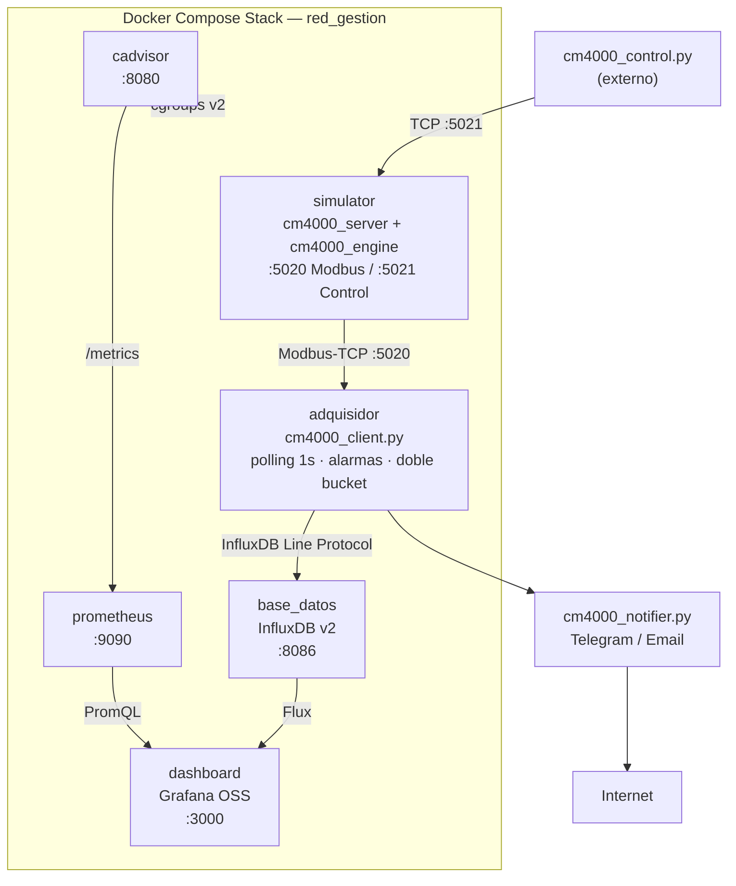
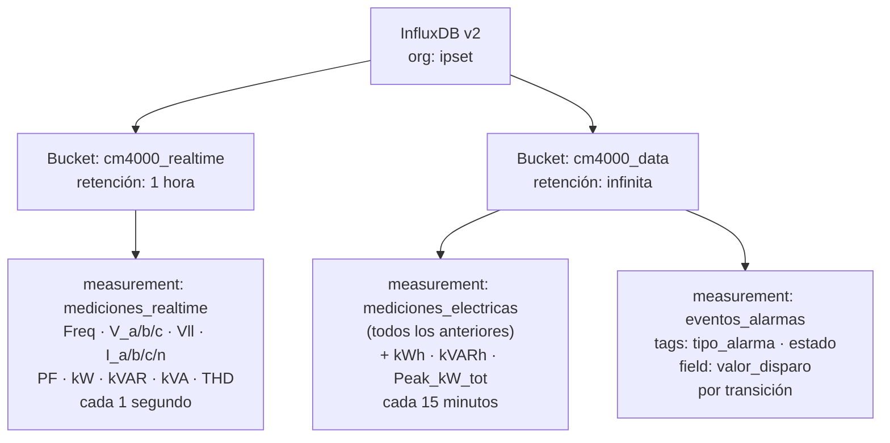
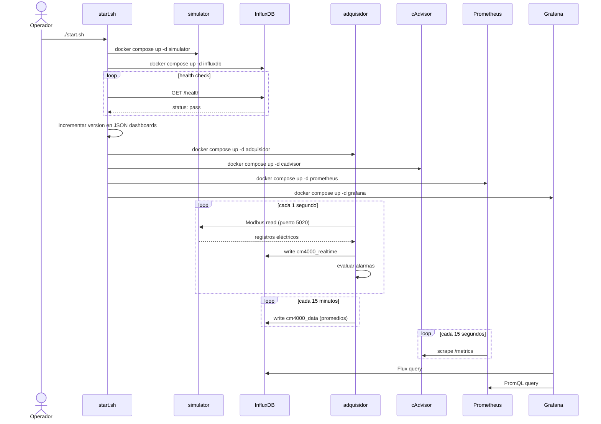
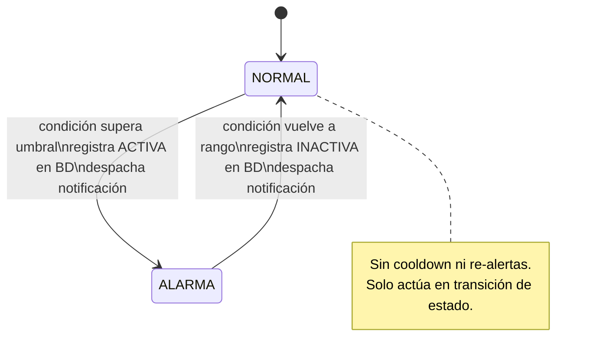

This file is a merged representation of the entire codebase, combined into a single document by Repomix.

# File Summary

## Purpose
This file contains a packed representation of the entire repository's contents.
It is designed to be easily consumable by AI systems for analysis, code review,
or other automated processes.

## File Format
The content is organized as follows:
1. This summary section
2. Repository information
3. Directory structure
4. Repository files (if enabled)
5. Multiple file entries, each consisting of:
  a. A header with the file path (## File: path/to/file)
  b. The full contents of the file in a code block

## Usage Guidelines
- This file should be treated as read-only. Any changes should be made to the
  original repository files, not this packed version.
- When processing this file, use the file path to distinguish
  between different files in the repository.
- Be aware that this file may contain sensitive information. Handle it with
  the same level of security as you would the original repository.

## Notes
- Some files may have been excluded based on .gitignore rules and Repomix's configuration
- Binary files are not included in this packed representation. Please refer to the Repository Structure section for a complete list of file paths, including binary files
- Files matching patterns in .gitignore are excluded
- Files matching default ignore patterns are excluded
- Files are sorted by Git change count (files with more changes are at the bottom)

# Directory Structure
```
provisioning/
  dashboards/
    json/
      dashboard.json
      infra.json
    dashboards.yml
  datasources/
    datasource.yml
    prometheus-datasource.yml
.dockerignore
.gitignore
cm4000_client.py
cm4000_control.py
cm4000_engine.py
cm4000_notifier.py
cm4000_registers.py
cm4000_server.py
docker-compose.yml
Dockerfile
Dockerfile.client
Guia_Uso_CM4000.md
Informe.md
init-influxdb.sh
install_dependencies.sh
prometheus.yml
README.md
start.sh
stop.sh
Walkthrough_CM4000.md
```

# Files

## File: Informe.md
````markdown
# DOCUMENTO DE DISEÑO, IMPLEMENTACIÓN Y PRUEBAS

| | |
|---|---|
| **Cód. Documento:** | IPSET_CM4000_SW_SDITD |
| **Revisión:** | 00 |
| **Fecha:** | 09/06/2026 |

---

## para Aplicaciones TCP/IP 2026
### Parcial Práctico Integrador — Tema 1: Monitoreo CM4000

| Campo | Detalle |
|---|---|
| **Fecha de entrega** | 09/06/2026 |
| **Fecha de inicio** | 13/05/2026 |
| **Duración** | 1 mes |
| **Cliente** | Solivellas y Asociados — Universidad Nacional de Río Cuarto |

**Equipo P.L.A.J.:**

| Apellido | Nombre |
|---|---|
| JUAN | Maximo |
| ARGUELLO | Juan Salvador |
| LUNA | Pablo |
| PEREZ ROSSI | Tomas |

---

### Nivel de Difusión

**CO — Confidencial.** El contenido de este documento es propiedad intelectual de P.L.A.J. y no podrá ser copiado, reproducido ni divulgado a ninguna persona u organización sin el consentimiento previo por escrito del equipo. Dicho consentimiento se otorga automáticamente a Solivellas y Asociados para su uso y distribución en el marco del acuerdo de trabajo.

---

### Sobre este Documento

| Rol | Persona | Fecha |
|---|---|---|
| Preparado por | Equipo P.L.A.J. | 13/05/2026 |
| Responsable | Juan, Maximo | 13/05/2026 |
| Revisado por | Argüello, Juan Salvador | 01/06/2026 |
| Revisado por | Perez Rossi, Tomas | 01/06/2026 |
| Revisado por | Luna, Pablo | 01/06/2026 |
| Aprobado por | Juan, Maximo | 09/06/2026 |
| Aprobado por | Solivellas, Pablo | 09/06/2026 |

---

### Lista de Modificaciones

| Versión | Fecha | Páginas | Cambios | Observaciones |
|---|---|---|---|---|
| 00 | 01/06/2026 | Todas | Revisión inicial | Primera versión del documento |

---

## ÍNDICE

1. [Introducción](#1-introducción)
   - 1.1. [Alcance](#11-alcance)
   - 1.2. [Términos, Definiciones y Abreviaturas](#12-términos-definiciones-y-abreviaturas)
2. [Arquitectura del Sistema](#2-arquitectura-del-sistema)
   - 2.1. [Visión General](#21-visión-general)
   - 2.2. [Diagrama de Componentes](#22-diagrama-de-componentes)
   - 2.3. [Subsistemas y Módulos](#23-subsistemas-y-módulos)
   - 2.4. [Comunicaciones e Integraciones](#24-comunicaciones-e-integraciones)
3. [Diseño de Componentes](#3-diseño-de-componentes)
   - 3.1. [Módulo Simulador](#31-módulo-simulador)
   - 3.2. [Módulo Adquisidor](#32-módulo-adquisidor)
   - 3.3. [Módulo Notificador](#33-módulo-notificador)
   - 3.4. [Módulo Inyector de Fallas](#34-módulo-inyector-de-fallas)
4. [Diseño de Datos](#4-diseño-de-datos)
   - 4.1. [Modelo de Datos](#41-modelo-de-datos)
   - 4.2. [Esquemas de Base de Datos](#42-esquemas-de-base-de-datos)
   - 4.3. [Diccionario de Datos](#43-diccionario-de-datos)
5. [Implementación](#5-implementación)
   - 5.1. [Estructura del Repositorio](#51-estructura-del-repositorio)
   - 5.2. [Convenciones de Codificación](#52-convenciones-de-codificación)
   - 5.3. [Entorno de Desarrollo](#53-entorno-de-desarrollo)
   - 5.4. [Automatización del Ciclo de Vida](#54-automatización-del-ciclo-de-vida)
6. [Pruebas y Calidad](#6-pruebas-y-calidad)
   - 6.1. [Estrategia de Pruebas](#61-estrategia-de-pruebas)
   - 6.2. [Pruebas de Componente](#62-pruebas-de-componente)
   - 6.3. [Pruebas de Integración](#63-pruebas-de-integración)
   - 6.4. [Métricas de Calidad](#64-métricas-de-calidad)
7. [Despliegue y Operación](#7-despliegue-y-operación)
   - 7.1. [Pre-requisitos](#71-pre-requisitos)
   - 7.2. [Procedimiento de Despliegue](#72-procedimiento-de-despliegue)
   - 7.3. [Configuración del Entorno](#73-configuración-del-entorno)
   - 7.4. [Monitoreo y Mantenimiento](#74-monitoreo-y-mantenimiento)
8. [Bibliografía](#8-bibliografía)
9. [Anexos](#9-anexos)
10. [Servicios Profesionales](#10-servicios-profesionales)
    - 10.1. [Servicio de Instalación Inicial](#101-servicio-de-instalación-inicial)
    - 10.2. [Servicio de Mantenimiento Mensual](#102-servicio-de-mantenimiento-mensual)

---

## 1. INTRODUCCIÓN

El presente documento constituye el Documento de Diseño, Implementación y Pruebas de Software (SDITD) correspondiente al proyecto **Aplicaciones TCP/IP 2026 — Parcial Práctico Integrador Tema 1: Monitoreo CM4000**, desarrollado por el equipo P.L.A.J. en el marco de la cátedra y destinado a Solivellas y Asociados de la Universidad Nacional de Río Cuarto.

El proyecto consiste en la construcción de un sistema completo de simulación, adquisición y monitoreo de un medidor eléctrico industrial Schneider Electric PowerLogic CM4000 de media tensión. La solución abarca desde la generación matemática de señales eléctricas realistas hasta su visualización en tiempo real mediante dashboards interactivos, pasando por la adquisición vía protocolo Modbus-TCP, el almacenamiento en base de datos de series temporales y el despacho automático de notificaciones ante eventos de alarma.

El propósito de este documento es presentar de manera sistemática la arquitectura global del sistema y la interacción entre sus módulos, las decisiones tecnológicas adoptadas y los patrones de diseño aplicados, el modelo de datos y los flujos de información, la estructura del código fuente y los estándares de calidad empleados, así como la estrategia de pruebas y el procedimiento de despliegue en los entornos previstos. El documento ha sido producido siguiendo las pautas de los estándares de documentación técnica vigentes y está organizado de modo que cualquier cambio en la arquitectura o el código quede reflejado aquí, garantizando la trazabilidad de las decisiones de diseño y la coherencia entre la documentación y la implementación.

### 1.1. ALCANCE

Este documento abarca las fases de diseño conceptual, diseño detallado e implementación del software del sistema de monitoreo CM4000. El alcance técnico comprende la simulación matemática de un medidor eléctrico industrial de media tensión (13,2 kV), la adquisición periódica de datos mediante el protocolo Modbus-TCP con una frecuencia de muestreo de un segundo, el almacenamiento en una base de datos de series temporales con estrategia de doble bucket diferenciando datos de alta frecuencia de consolidados históricos, la visualización en tiempo real a través de dashboards Grafana aprovisionados de forma declarativa, el sistema de notificaciones automáticas por Telegram y correo electrónico ante transiciones de alarma, la observabilidad de la infraestructura de contenedores mediante Prometheus y cAdvisor, y la orquestación completa del stack mediante Docker Compose con scripts de ciclo de vida automatizados.

El documento aplica a todo el equipo de desarrollo P.L.A.J. y al personal evaluador de Solivellas y Asociados. Cualquier modificación en la arquitectura o el código fuente debe reflejarse en este documento para garantizar la trazabilidad de las decisiones de diseño, la coherencia entre los artefactos de diseño y la implementación, y la interfaz clara entre los stakeholders y el equipo técnico.

### 1.2. TÉRMINOS, DEFINICIONES Y ABREVIATURAS

#### 1.2.1. Términos y Definiciones

A los efectos del presente documento, se adoptan las siguientes definiciones. El **medidor CM4000** es el dispositivo de medición de energía eléctrica industrial Schneider Electric PowerLogic CM4000, diseñado para instalaciones de media tensión y cuyo comportamiento es simulado por este sistema. **Modbus-TCP** es el protocolo de comunicación industrial estándar utilizado para la lectura de registros de dispositivos de campo sobre redes TCP/IP, empleado como interfaz entre el simulador y el adquisidor. Una **serie temporal** es una secuencia de valores numéricos indexados por tiempo, estructura fundamental del modelo de almacenamiento adoptado. Un **bucket** es el contenedor lógico de datos en InfluxDB v2, con política de retención configurable de forma independiente. Un **dashboard** es el panel de visualización interactivo en Grafana, compuesto por múltiples paneles de métricas. Una **alarma** es el evento generado cuando una variable eléctrica supera un umbral normativo predefinido. La **histéresis** es la técnica de control de alarmas adoptada en este sistema, que evita oscilaciones actuando únicamente en transiciones de estado (Normal→Alarma o Alarma→Normal), sin re-alertas mientras el estado permanece sin cambios.

En cuanto a los fenómenos eléctricos simulados y conceptos de medición, se adoptan las siguientes definiciones:

| Término | Definición |
|---|---|
| Sag (Hundimiento) | Reducción temporal del voltaje por debajo del 88% del valor nominal. |
| Swell (Elevación) | Aumento temporal del voltaje por encima del 110% del valor nominal. |
| Outage (Corte) | Pérdida total del suministro eléctrico en una o más fases. |
| THD | Distorsión Armónica Total. Medida de la contaminación armónica de la señal eléctrica. |
| Factor de Potencia (PF) | Relación entre potencia activa (kW) y potencia aparente (kVA). Valor ideal: 1,0. |
| Demanda Máxima (Peak Demand) | Valor más alto de potencia activa registrado en el período de medición. |
| Polling | Técnica de adquisición de datos por consulta periódica al dispositivo fuente. |

#### 1.2.2. Abreviaturas

| Abreviatura | Significado |
|---|---|
| SDITD | Software Design, Implementation and Testing Document |
| TSDB | Time Series Database |
| SCADA | Supervisory Control and Data Acquisition |
| HMI | Human-Machine Interface |
| PromQL | Prometheus Query Language |
| P.L.A.J. | Equipo de desarrollo: Perez Rossi, Luna, Arguello, Juan |
| UNRC | Universidad Nacional de Río Cuarto |
| THD | Total Harmonic Distortion |
| PF | Power Factor (Factor de Potencia) |

---

## 2. ARQUITECTURA DEL SISTEMA

### 2.1. Visión General

El sistema implementa un gemelo digital de un medidor eléctrico industrial Schneider Electric PowerLogic CM4000 de media tensión (13,2 kV / 380 V L-L). La solución está completamente dockerizada y puede desplegarse con un único comando (`./start.sh`) sin necesidad de hardware físico, lo que la hace reproducible en cualquier entorno con Docker instalado.

La arquitectura sigue un pipeline de datos unidireccional: el simulador genera datos eléctricos realistas, el adquisidor los recolecta vía Modbus-TCP, InfluxDB los persiste y Grafana los visualiza. En paralelo, una capa de observabilidad de infraestructura basada en cAdvisor y Prometheus monitorea el estado de los propios contenedores Docker, desacoplada completamente de los datos de negocio.

Las decisiones tecnológicas fundamentales del proyecto fueron las siguientes. Se eligió Python con la biblioteca `pymodbus` para la simulación y adquisición, dado su ecosistema maduro en automatización industrial y la disponibilidad de una implementación completa del protocolo Modbus. InfluxDB v2 fue seleccionado como base de datos de series temporales nativa, con soporte para políticas de retención diferenciadas por bucket y el lenguaje de consulta Flux. Grafana OSS se adoptó para la visualización, aprovechando su sistema de aprovisionamiento declarativo que elimina la configuración manual. Docker Compose garantiza la reproducibilidad total del entorno y el aislamiento entre servicios. Finalmente, Prometheus junto con cAdvisor proveen la capa de observabilidad de infraestructura, con un modelo de datos y lenguaje de consulta (PromQL) independiente del stack de negocio.

### 2.2. Diagrama de Componentes



### 2.3. Subsistemas y Módulos

El sistema se organiza en seis subsistemas con responsabilidades claramente delimitadas. El **Motor de Simulación**, compuesto por `cm4000_engine.py` y `cm4000_registers.py`, es el núcleo matemático que genera datos eléctricos realistas con ruido gaussiano, mantiene los acumuladores de energía y gestiona los eventos de falla. El **Servidor de Protocolo** (`cm4000_server.py`) expone los datos del motor hacia el exterior mediante dos interfaces independientes: el servidor Modbus-TCP en el puerto 5020 y el servidor de control TCP en el puerto 5021. El **Adquisidor SCADA** (`cm4000_client.py`) realiza el polling Modbus cada segundo, escribe en InfluxDB con la estrategia de doble bucket y ejecuta el motor de alarmas con histéresis pura. El **Notificador** (`cm4000_notifier.py`) despacha alertas por Telegram y correo electrónico en hilos daemon ante cada transición de alarma. El **Inyector de Fallas** (`cm4000_control.py`) es un cliente TCP interactivo que permite inyectar eventos de calidad de energía al simulador en tiempo real. Finalmente, la **Infraestructura** (`docker-compose.yml`, `start.sh`, `stop.sh`, `prometheus.yml`) gestiona la orquestación, el ciclo de vida del stack, la observabilidad de contenedores y la persistencia de los dashboards.

### 2.4. Comunicaciones e Integraciones

La comunicación entre el simulador y el adquisidor se realiza mediante el protocolo Modbus-TCP sobre el puerto 5020, con registros de 16 bits en los formatos `int16`, `uint16` y `mod10k`. El canal de inyección de fallas utiliza un socket TCP raw sobre el puerto 5021 con comandos en texto plano ASCII, completamente independiente del canal de adquisición para no interferir con la red industrial. La escritura de datos desde el adquisidor hacia InfluxDB se realiza mediante HTTP REST sobre el puerto 8086, utilizando el InfluxDB Line Protocol. Grafana consulta InfluxDB mediante el lenguaje Flux y consulta Prometheus mediante PromQL, ambos sobre HTTP. La capa de observabilidad opera de forma autónoma: cAdvisor recolecta métricas del kernel Linux a través de cgroups v2 y las expone en formato Prometheus exposition format sobre el puerto 8080; Prometheus las scrapea cada 15 segundos y las persiste en su propia TSDB con retención de 30 días. Las notificaciones de alarma se despachan de forma asíncrona hacia la API de Telegram (HTTPS, puerto 443) y hacia el servidor SMTP configurado (STARTTLS, puerto 587).

---

## 3. DISEÑO DE COMPONENTES

### 3.1. Módulo Simulador

El módulo simulador está compuesto por tres archivos que separan de forma clara el mapa de registros, la lógica física y el servidor de protocolo.

El archivo `cm4000_registers.py` define el mapa completo de registros Modbus del CM4000 según el manual oficial de Schneider Electric (referencia 63230-319-200B2). Cada registro queda descrito por su dirección Modbus, su nombre de variable, su formato de codificación y su factor de escala. El sistema soporta cuatro formatos: `int16` para enteros con signo de 16 bits (por ejemplo, corriente de fase con factor ×10), `uint16` para enteros sin signo (THD con factor ×10), `int16_pf` para el factor de potencia con signo (factor ×100) y `mod10k` para los acumuladores de energía codificados en dos registros consecutivos según el esquema Mod-10000 del fabricante.

El archivo `cm4000_engine.py` constituye el núcleo matemático del sistema. Simula el comportamiento de una celda de alimentación industrial con valores nominales de 380 V L-L y 50 Hz. Para lograr un comportamiento realista, el motor aplica distribuciones gaussianas sobre tensiones y corrientes y superpone oscilaciones senoidales lentas que emulan variaciones naturales de carga. Mantiene en tiempo real los acumuladores de energía activa y reactiva (`kWh_del`, `kWh_rec`, `kVARh_del`, `kVARh_rec`, `kWh_tot`) y registra automáticamente la demanda máxima de potencia activa. La característica más relevante del motor es su capacidad de recibir e integrar eventos de calidad de energía —hundimientos, elevaciones, cortes, pérdida de fase, armónicos, sobrecarga y bajo factor de potencia— alterando matemáticamente las lecturas durante el tiempo que el evento permanece activo.

El archivo `cm4000_server.py` es el proceso principal que agrupa el motor y lo expone al exterior mediante dos servidores independientes. El servidor Modbus-TCP, levantado sobre el puerto 5020 mediante la API `SimDevice` de `pymodbus` en un loop asíncrono, es alimentado por un hilo actualizador en segundo plano que consulta el motor cada segundo, codifica los valores aplicando los factores de escala y actualiza los registros de forma atómica. El servidor de control TCP, sobre el puerto 5021, es un socket asíncrono completamente independiente del protocolo Modbus, dedicado exclusivamente a recibir comandos de inyección de fallas sin interferir con la red industrial.

### 3.2. Módulo Adquisidor

El módulo adquisidor, implementado en `cm4000_client.py`, reemplaza a Telegraf con lógica de negocio propia y constituye el cerebro del sistema de adquisición. Opera en un bucle principal con período estricto de un segundo, en el que lee todos los registros definidos en `cm4000_registers.py`, decodifica los valores crudos aplicando los factores de escala inversos y calcula `Vll_avg` como el promedio aritmético de las tres tensiones línea-línea.

La estrategia de almacenamiento adoptada es el **doble bucket**, que optimiza el balance entre resolución temporal y uso de almacenamiento. Cada segundo, todas las variables analógicas instantáneas —frecuencia, tensiones, corrientes, potencias, factor de potencia y THD— se escriben en el bucket `cm4000_realtime`, que tiene una política de retención de una hora (el mínimo admitido por el motor TSM de InfluxDB v2) y se auto-limpia de forma continua. Los acumuladores de energía codificados en formato `mod10k` quedan excluidos explícitamente de este bucket para evitar redundancia. Cada quince minutos, el adquisidor calcula el promedio matemático de todos los valores acumulados en sus buffers y realiza una escritura consolidada en el bucket `cm4000_data`, de retención infinita, junto con los acumuladores de energía y la demanda máxima registrada.

El motor de alarmas evalúa ocho reglas normativas en cada ciclo de un segundo, implementando histéresis pura: solo actúa en la transición de estado, sin cooldown ni re-alertas mientras la condición permanece sin cambios. Las reglas cubren hundimientos y elevaciones de tensión (±10% de 13,2 kV según umbral de red), tensión de fase anómala (±7% de 7.621 V), corriente de neutro anómala (indicador de desequilibrio de fases), sobrecorriente en cualquier fase (protección ANSI 50/51 con umbral de 120 A), bajo factor de potencia (PF < 0,85, umbral de penalización tarifaria), THD elevado (THD_V > 5,0% según EN 50160), demanda superada respecto al pico histórico y falla de comunicación Modbus. Ante cada transición de estado, el adquisidor registra el evento en el measurement `eventos_alarmas` del bucket histórico y despacha una notificación asíncrona.

### 3.3. Módulo Notificador

El módulo notificador, implementado en `cm4000_notifier.py`, despacha alertas automáticas ante cada transición de alarma, tanto en el flanco de activación (Normal→Alarma) como en el de normalización (Alarma→Normal). Opera en modo fire-and-forget mediante hilos daemon, de modo que el despacho de notificaciones no bloquea en ningún caso el ciclo de adquisición de un segundo.

Los dos canales de notificación —Telegram mediante la Bot API sobre HTTPS y correo electrónico mediante SMTP con STARTTLS— se disparan en paralelo a través de hilos independientes ante cada evento. Las credenciales de ambos canales se leen del archivo `.env` en tiempo de ejecución. Si dicho archivo no existe o las credenciales son inválidas, el sistema continúa operando normalmente sin notificaciones, lo que garantiza que el módulo de notificaciones no constituye un punto de falla crítico para la adquisición de datos.

### 3.4. Módulo Inyector de Fallas

El módulo inyector de fallas, implementado en `cm4000_control.py`, es un cliente TCP interactivo que se conecta al puerto 5021 del simulador y permite al operador estresar el sistema en tiempo real sin interferir con la capa de adquisición Modbus. Expone una consola de comandos (`CM4000>`) desde la que pueden emitirse los siguientes tipos de eventos: hundimiento de tensión (`sag`), elevación de tensión (`swell`), corte total de suministro (`outage`), pérdida de una fase (`phase_loss`), inyección de armónicos (`harmonic`), sobrecarga de corriente (`overload`) y bajo factor de potencia (`low_pf`). Todos los comandos de falla aceptan como parámetros la fase afectada (o `all` para las tres fases simultáneamente), la magnitud del evento y su duración en segundos. Adicionalmente, el comando `pdf` ejecuta un perfil de fallas aleatorio automatizado que inyecta entre uno y tres eventos de tipo y duración aleatorios, útil para pruebas de estrés no supervisadas. Los comandos `snapshot` y `status` permiten inspeccionar el estado interno del motor sin modificarlo.

---

## 4. DISEÑO DE DATOS

### 4.1. Modelo de Datos

El sistema utiliza InfluxDB v2 como base de datos de series temporales. El modelo de datos se organiza en dos buckets con políticas de retención diferenciadas, cuya estructura lógica se presenta a continuación:



El bucket `cm4000_realtime` almacena telemetría instantánea de alta resolución (1 s) destinada a visualizaciones en tiempo real. Su política de retención de una hora garantiza que los datos de alta frecuencia se eliminen automáticamente sin saturar el almacenamiento primario. Los acumuladores de energía quedan excluidos de este bucket porque su naturaleza acumulativa hace redundante su almacenamiento a alta frecuencia. El bucket `cm4000_data` almacena con retención infinita los consolidados de quince minutos en el measurement `mediciones_electricas` y la bitácora completa de eventos de alarma en `eventos_alarmas`.

### 4.2. Esquemas de Base de Datos

El bucket `cm4000_data` es creado automáticamente durante la inicialización del contenedor InfluxDB mediante las variables de entorno de Docker Compose (`DOCKER_INFLUXDB_INIT_BUCKET=cm4000_data`), con retención infinita. El bucket `cm4000_realtime` no puede crearse mediante variables de entorno de inicialización, por lo que su creación se delega al script `init-influxdb.sh`, montado en el directorio `/docker-entrypoint-initdb.d/` del contenedor. Este script ejecuta el siguiente comando una única vez durante el primer arranque:

```bash
influx bucket create \
  --name cm4000_realtime \
  --retention 1h \
  --org ipset \
  --token my-super-secret-auth-token
```

### 4.3. Diccionario de Datos

La tabla siguiente describe los campos del measurement `mediciones_realtime` y `mediciones_electricas`, con sus unidades físicas y los factores de escala aplicados en la codificación Modbus:

| Campo | Unidad | Escala Modbus | Descripción |
|---|---|---|---|
| `Freq` | Hz | ×100 | Frecuencia de red |
| `V_a`, `V_b`, `V_c` | V | ×10 | Tensión fase-neutro por fase |
| `Vll_ab`, `Vll_bc`, `Vll_ca` | V | ×10 | Tensión línea-línea |
| `Vll_avg` | V | calculado | Promedio de las tres tensiones L-L |
| `I_a`, `I_b`, `I_c` | A | ×10 | Corriente por fase |
| `I_n` | A | ×10 | Corriente de neutro |
| `PF_a/b/c/tot` | — | ×100 | Factor de potencia por fase y total |
| `kW_a/b/c/tot` | kW | ×10 | Potencia activa por fase y total |
| `kVAR_tot`, `kVA_tot` | kVAR / kVA | ×10 | Potencia reactiva y aparente totales |
| `THD_V_a/b/c` | % | ×10 | THD de tensión por fase |
| `THD_I_a/b/c` | % | ×10 | THD de corriente por fase |
| `kWh_del`, `kWh_rec`, `kWh_tot` | kWh | mod10k | Energía activa entregada, recibida y total |
| `kVARh_del`, `kVARh_rec` | kVARh | mod10k | Energía reactiva entregada y recibida |
| `Peak_kW_tot` | kW | — | Demanda máxima histórica registrada |

El measurement `eventos_alarmas` utiliza dos tags —`tipo_alarma` e `estado`— y un único field `valor_disparo` de tipo float que registra el valor de la variable eléctrica en el instante exacto de la transición. El tag `estado` toma los valores `ACTIVA` o `INACTIVA` según la dirección de la transición.

---

## 5. IMPLEMENTACIÓN

### 5.1. Estructura del Repositorio

El repositorio del proyecto (`TCP-IP-IPSET`, rama `desarrollo`) organiza el código fuente de la siguiente manera:

```
TCP-IP-IPSET/
├── cm4000_engine.py          # Motor físico de simulación
├── cm4000_registers.py       # Mapa de registros Modbus oficial
├── cm4000_server.py          # Servidor Modbus-TCP + Control TCP
├── cm4000_client.py          # Adquisidor SCADA + motor de alarmas
├── cm4000_control.py         # Cliente inyector de fallas
├── cm4000_notifier.py        # Módulo de notificaciones
├── docker-compose.yml        # Orquestación del stack completo
├── Dockerfile                # Imagen del simulador
├── Dockerfile.client         # Imagen del adquisidor
├── start.sh / stop.sh        # Scripts de ciclo de vida
├── init-influxdb.sh          # Inicialización del bucket realtime
├── prometheus.yml            # Configuración de scraping
├── .env                      # Credenciales (no versionado)
└── provisioning/
    ├── datasources/          # DataSources de Grafana (InfluxDB + Prometheus)
    └── dashboards/json/      # dashboard.json e infra.json
```

Las imágenes Docker del simulador (`maximodockerhub/cm4000-simulator:latest`) y del adquisidor (`maximodockerhub/cm4000-adquisidor:latest`) están publicadas en Docker Hub, de modo que el despliegue no requiere compilación local.

### 5.2. Convenciones de Codificación

Todo el código fuente está escrito en Python 3.13 y sigue las convenciones de estilo PEP 8, con nombres de variables en `snake_case` y constantes en `UPPER_CASE`. Las firmas de funciones públicas incluyen type hints para facilitar la comprensión del contrato de cada interfaz. El sistema de logging utiliza el módulo estándar `logging` con los niveles `DEBUG`, `INFO`, `WARNING` y `ERROR`, complementados con prefijos de emoji que permiten identificar visualmente el tipo de evento en los logs de contenedor sin herramientas adicionales.

La concurrencia se gestiona mediante `asyncio` para los servidores de red, que requieren alta concurrencia con bajo overhead, y mediante `threading.Thread(daemon=True)` para las tareas de fondo de larga duración como el actualizador de registros Modbus y el despacho de notificaciones. El manejo de errores captura las excepciones específicas de `pymodbus` y las registra con nivel `ERROR`; ante una `ModbusException`, el adquisidor activa la alarma `Falla_Comunicacion` e intenta reconectarse de forma automática en el siguiente ciclo.

### 5.3. Entorno de Desarrollo

El entorno de desarrollo requiere Python 3.13 con las bibliotecas `pymodbus` (≥ 3.x) e `influxdb-client` (≥ 1.x), gestionadas mediante un entorno virtual (`venv`) e instaladas a través del script `install_dependencies.sh`. Para el stack de infraestructura se requiere Docker Engine ≥ 24.x con el plugin Docker Compose ≥ 2.x. Los servicios de infraestructura utilizan las versiones InfluxDB 2.7, Grafana OSS latest, Prometheus latest y cAdvisor latest, todas obtenidas directamente de sus repositorios oficiales en Docker Hub.

### 5.4. Automatización del Ciclo de Vida

El ciclo de vida del stack está completamente automatizado mediante dos scripts bash que garantizan la consistencia del entorno en cada arranque y parada.

El script `start.sh` implementa un arranque ordenado en cuatro etapas. En primer lugar, verifica la existencia del archivo `.env` y advierte al usuario si no está presente, sin bloquear la ejecución. A continuación, ejecuta `docker compose pull` para obtener las versiones más recientes de las imágenes del simulador y el adquisidor desde Docker Hub. Luego levanta únicamente el simulador e InfluxDB y ejecuta un bucle de consulta (*polling loop*) que interroga el endpoint `/health` de InfluxDB hasta recibir la respuesta `"status":"pass"`, evitando así condiciones de carrera en las que el adquisidor intentaría conectarse antes de que la base de datos esté lista. Antes de levantar Grafana, el script incrementa el campo `version` en todos los archivos JSON de `provisioning/dashboards/json/`, lo que obliga a Grafana a sobrescribir su base de datos SQLite interna con los archivos del repositorio, garantizando que los cambios persistidos en el código fuente siempre se reflejen en la interfaz. Finalmente, levanta el adquisidor, cAdvisor, Prometheus y Grafana, y abre automáticamente el dashboard eléctrico en el navegador.

El script `stop.sh` implementa una parada con persistencia de dashboards. Antes de detener los contenedores, realiza llamadas HTTP a la API REST de Grafana para exportar la versión activa en memoria de ambos dashboards —`cm4000_mt_dashboard` e `infra-observability`— a sus respectivos archivos JSON en el repositorio. De este modo, cualquier modificación realizada en la interfaz de Grafana durante la sesión queda sincronizada en el código fuente sin intervención manual. Tras la exportación, incrementa la versión de los JSON exportados para el próximo arranque y ejecuta `docker compose down`.

---

## 6. PRUEBAS Y CALIDAD

### 6.1. Estrategia de Pruebas

La estrategia de pruebas del proyecto se organiza en tres niveles complementarios, adaptados a la naturaleza de un sistema de simulación industrial en tiempo real. El primer nivel comprende las **pruebas de componente**, orientadas a verificar la lógica interna de cada módulo Python de forma aislada mediante ejecución directa e inspección de logs. El segundo nivel corresponde a las **pruebas de integración**, que verifican el pipeline completo desde el simulador hasta Grafana ejecutando el stack con `start.sh` y validando los dashboards. El tercer nivel son las **pruebas de inyección de fallas**, que verifican que el motor de alarmas detecta y notifica correctamente cada tipo de evento utilizando `cm4000_control.py` y consultando la bitácora `eventos_alarmas` en InfluxDB.

### 6.2. Pruebas de Componente

Las pruebas de componente sobre el módulo `cm4000_engine.py` cubren seis casos. El caso UT-01 verifica que en reposo, sin eventos activos, el motor produce tensiones de aproximadamente 7.621 V (Vln), corrientes en rango nominal, PF ≈ 0,95 y THD < 5%. Los casos UT-02 a UT-04 verifican la respuesta del motor ante los eventos de sag, swell y outage respectivamente, comprobando que las variables afectadas se desvían en la magnitud y duración indicadas y se recuperan al finalizar el evento. El caso UT-05 verifica que los acumuladores de energía crecen de forma monótona durante la operación continua. El caso UT-06 verifica que la demanda máxima (`Peak_kW_tot`) se actualiza correctamente al inyectar una sobrecarga.

Las pruebas sobre el motor de alarmas de `cm4000_client.py` cubren seis casos adicionales. Los casos UA-01 y UA-02 verifican el ciclo completo de activación y normalización de la alarma `Tension_Sag_Swell` ante un sag, comprobando que se registran los eventos `ACTIVA` e `INACTIVA` en InfluxDB y que se despachan las notificaciones correspondientes. El caso UA-03 verifica la propiedad de histéresis pura: manteniendo la condición de alarma activa durante 60 segundos, debe registrarse un único evento `ACTIVA`, sin duplicados. Los casos UA-04 y UA-05 verifican la detección de `THD_Elevado` y `FP_Bajo` ante los comandos `harmonic` y `low_pf` respectivamente. El caso UA-06 verifica que la alarma `Falla_Comunicacion` se activa al detener el contenedor del simulador y que el adquisidor intenta reconectarse.

### 6.3. Pruebas de Integración

La prueba PI-01 verifica el pipeline completo de datos. Su objetivo es confirmar que una medición generada por el simulador llega correctamente a Grafana con una latencia inferior a 5 segundos. El procedimiento consiste en ejecutar `./start.sh`, esperar que todos los contenedores estén en estado `Up`, acceder al dashboard `CM4000 — Calidad de Energía MT` en `http://localhost:3000` y verificar que los paneles de tensión, corriente y potencia muestran datos actualizándose cada 5 segundos. La verificación se complementa consultando el bucket `cm4000_realtime` directamente en el Data Explorer de InfluxDB.

La prueba PI-02 verifica el ciclo de vida de los dashboards. Su objetivo es confirmar que los cambios realizados en la interfaz de Grafana persisten tras reiniciar el stack sin intervención manual. El procedimiento consiste en modificar un panel, guardarlo con el botón Save de Grafana, ejecutar `./stop.sh` y verificar que el archivo JSON exportado refleja el cambio, y finalmente ejecutar `./start.sh` y confirmar que el dashboard cargado incluye la modificación.

La prueba PI-03 verifica la observabilidad de infraestructura. Su objetivo es confirmar que Prometheus recolecta métricas de cAdvisor y que Grafana las visualiza correctamente. El procedimiento consiste en verificar que el target `cadvisor` aparece como `UP` en `http://localhost:9090/targets` y que los cinco paneles del dashboard `CM4000 — Observabilidad de Infraestructura` —RAM del adquisidor, CPU del adquisidor, escrituras en disco de InfluxDB, reinicios del servidor Modbus y almacenamiento actual de InfluxDB— muestran datos con actualización cada 15 segundos.

### 6.4. Métricas de Calidad

Las métricas de calidad definidas para el sistema son las siguientes. La latencia de adquisición debe ser menor o igual a 1,0 segundo por ciclo, verificable en los logs del adquisidor. La pérdida de muestras debe ser nula en condiciones normales de operación, verificable comparando el conteo de registros en `cm4000_realtime` con el tiempo transcurrido. El tiempo de arranque completo del stack, desde la ejecución de `./start.sh` hasta que Grafana está disponible, debe ser inferior a 60 segundos. La persistencia de dashboards debe ser del 100% de los cambios conservados, verificada mediante la prueba PI-02. La latencia de detección de alarmas debe ser inferior a 2 segundos desde el inicio del evento, verificable comparando el timestamp del evento en `eventos_alarmas` con el instante de activación del sag.

---

## 7. DESPLIEGUE Y OPERACIÓN

### 7.1. Pre-requisitos

Para el despliegue del sistema se requiere un host con Docker Engine versión 24.x o superior y el plugin Docker Compose versión 2.x o superior. Los puertos 3000, 5020, 5021, 8080, 8086 y 9090 deben estar disponibles en el host. Para utilizar el cliente inyector de fallas de forma local (fuera del stack Docker) se requiere Python 3.10 o superior. El host debe contar con acceso a Internet para que `start.sh` pueda descargar las imágenes actualizadas desde Docker Hub.

### 7.2. Procedimiento de Despliegue

El despliegue completo del sistema se realiza mediante los siguientes pasos. En primer lugar, se clona el repositorio y se accede a la rama de desarrollo:

```bash
git clone https://github.com/mjuan-jpg/TCP-IP-IPSET.git
cd TCP-IP-IPSET
git checkout desarrollo
```

A continuación, de forma opcional, se configuran las credenciales de notificaciones copiando la plantilla `.env.template` a `.env` y completando los valores correspondientes. Finalmente, se ejecuta el script de arranque:

```bash
./start.sh
```

El script gestiona automáticamente la descarga de imágenes, el health check de InfluxDB, el versionado de dashboards y el arranque ordenado de todos los servicios. Una vez completado, Grafana está disponible en `http://localhost:3000` con acceso anónimo en rol Administrador, InfluxDB en `http://localhost:8086` con las credenciales `admin` / `adminpassword`, y Prometheus en `http://localhost:9090`. Para detener el stack preservando los cambios en los dashboards se ejecuta `./stop.sh`.

### 7.3. Configuración del Entorno

Las credenciales del sistema de notificaciones se configuran mediante el archivo `.env`, que no se versiona en el repositorio. Las variables requeridas son `TELEGRAM_BOT_TOKEN` y `TELEGRAM_CHAT_ID` para las notificaciones por Telegram, y `SMTP_HOST`, `SMTP_PORT`, `SMTP_USER`, `SMTP_PASSWORD` y `NOTIFY_EMAIL_TO` para las notificaciones por correo electrónico. La ausencia de este archivo no impide el funcionamiento del sistema; únicamente deshabilita el módulo de notificaciones.

Las credenciales de InfluxDB están definidas en `docker-compose.yml` con valores predeterminados para el entorno de desarrollo: usuario `admin`, contraseña `adminpassword`, organización `ipset` y token `my-super-secret-auth-token`. Para entornos de producción real, estos valores deben reemplazarse por credenciales generadas de forma segura.

### 7.4. Monitoreo y Mantenimiento

El estado del stack puede verificarse en cualquier momento mediante `docker compose ps`. Los logs del adquisidor, que incluyen el estado de cada ciclo de adquisición, las alarmas detectadas y los errores de comunicación, pueden consultarse en tiempo real con `docker logs -f adquisidor`. El estado de los targets de Prometheus puede verificarse consultando `http://localhost:9090/targets`; todos los targets deben aparecer en estado `UP` para garantizar la correcta recolección de métricas de infraestructura.

Para consultas directas sobre los datos eléctricos almacenados, el lenguaje Flux permite acceder tanto al bucket de tiempo real como al histórico. La siguiente consulta, por ejemplo, recupera la tensión promedio L-L de las últimas 24 horas:

```flux
from(bucket: "cm4000_data")
  |> range(start: -24h)
  |> filter(fn: (r) => r["_measurement"] == "mediciones_electricas")
  |> filter(fn: (r) => r["_field"] == "Vll_avg")
```

Para consultar el historial de alarmas ordenado cronológicamente de forma descendente:

```flux
from(bucket: "cm4000_data")
  |> range(start: v.timeRangeStart, stop: v.timeRangeStop)
  |> filter(fn: (r) => r["_measurement"] == "eventos_alarmas")
  |> filter(fn: (r) => r["_field"] == "valor_disparo")
  |> group()
  |> sort(columns: ["_time"], desc: true)
```

Para consultas sobre métricas de infraestructura, Prometheus expone una interfaz de consulta PromQL en `http://localhost:9090`. Las consultas más relevantes son el uso de RAM del adquisidor (`container_memory_usage_bytes{container_label_com_docker_compose_service="adquisidor"}`), el porcentaje de CPU (`sum(rate(container_cpu_usage_seconds_total{...}[1m])) * 100`) y el número de reinicios del servidor Modbus en la última hora (`resets(container_start_time_seconds{container_label_com_docker_compose_service="simulator"}[1h])`).

---

## 8. BIBLIOGRAFÍA

1. Schneider Electric. *PowerLogic CM4000 / CM4000T Power Meter — User Guide*. Schneider Electric Industries SAS, 2010. Referencia: 63230-319-200B2.

2. InfluxData. *InfluxDB v2 Documentation — Flux Query Language Reference*. InfluxData Inc., 2024. Disponible en: https://docs.influxdata.com/influxdb/v2/

3. Grafana Labs. *Grafana OSS Documentation — Dashboard Provisioning*. Grafana Labs, 2024. Disponible en: https://grafana.com/docs/grafana/latest/administration/provisioning/

4. Prometheus Authors. *Prometheus Documentation — Configuration Reference*. Cloud Native Computing Foundation, 2024. Disponible en: https://prometheus.io/docs/

5. Google. *cAdvisor — Container Advisor*. Google LLC, 2024. Disponible en: https://github.com/google/cadvisor

6. Gao, S. et al. *pymodbus — A Full Modbus Protocol Implementation in Python*. PyPI, 2024. Disponible en: https://pymodbus.readthedocs.io/

7. CENELEC. *EN 50160:2010 — Voltage Characteristics of Electricity Supplied by Public Electricity Networks*. European Committee for Electrotechnical Standardization, 2010.

8. Docker Inc. *Docker Compose Documentation — Compose File Reference v3*. Docker Inc., 2024. Disponible en: https://docs.docker.com/compose/

---

## 9. ANEXOS

### A. Diagrama del Flujo de Operación



### B. Máquina de Estados del Motor de Alarmas



### C. Manuales de Usuario

La documentación de usuario detallada se encuentra en los archivos `Guia_Uso_CM4000.md` y `Walkthrough_CM4000.md` del repositorio. El primero cubre los comandos de inyección de fallas, el acceso a los dashboards y las consultas Flux y PromQL de referencia. El segundo describe la arquitectura detallada de cada módulo, el flujo de operación completo y la capa de observabilidad de infraestructura.

### D. Minutas de Reuniones

| Reunión | Fecha | Participantes | Temas tratados |
|---|---|---|---|
| Kickoff | 13/05/2026 | Equipo P.L.A.J. | Definición de alcance, asignación de módulos, setup del repositorio |
| Revisión intermedia | 27/05/2026 | Equipo P.L.A.J. | Integración adquisidor-InfluxDB, motor de alarmas, notificaciones |
| Revisión final | 01/06/2026 | Equipo P.L.A.J. + Solivellas | Observabilidad de infraestructura, dashboards, ciclo de vida automatizado |

*(Las minutas firmadas se incorporan como documentos adjuntos una vez disponibles.)*

---

## 10. SERVICIOS PROFESIONALES

El equipo P.L.A.J. ofrece dos modalidades de servicio asociadas al sistema de monitoreo CM4000: un servicio de instalación inicial, que comprende el despliegue completo del stack y la configuración de todos los canales de alerta, y un servicio de mantenimiento mensual, que garantiza la continuidad operativa del sistema a lo largo del tiempo. Ambos servicios se describen a continuación.

### 10.1. Servicio de Instalación Inicial

El servicio de instalación inicial abarca la puesta en marcha completa del sistema en el entorno del cliente. El equipo P.L.A.J. se encarga de verificar que el host cumple los requisitos de hardware y software, instalar Docker Engine y el plugin Docker Compose en la versión requerida, clonar el repositorio en la rama de producción correspondiente y ejecutar el proceso de arranque supervisado mediante `./start.sh`. Durante la instalación se verifica que todos los contenedores alcanzan el estado `Up`, que los dashboards de Grafana se aprovisionan correctamente y que el pipeline de adquisición opera con la latencia esperada.

Una parte esencial de este servicio es la **configuración de credenciales para el sistema de alertas**. El equipo P.L.A.J. asiste al cliente en la creación y configuración de los dos canales de notificación disponibles. Para las alertas por Telegram, se crea un bot mediante @BotFather en la plataforma de Telegram, se obtiene el token de autenticación (`TELEGRAM_BOT_TOKEN`) y se identifica el identificador del chat o grupo receptor (`TELEGRAM_CHAT_ID`). Para las alertas por correo electrónico, se configura la cuenta SMTP del cliente —preferentemente Gmail con una App Password dedicada— y se definen las direcciones de correo destinatarias. Todas las credenciales se registran en el archivo `.env` del servidor y se verifica el correcto funcionamiento de ambos canales mediante la inyección de una falla de prueba con `cm4000_control.py`, confirmando la recepción de la notificación en Telegram y en el correo configurado.

Al finalizar la instalación, el equipo entrega al cliente un acta de puesta en marcha con el estado de todos los servicios, las URLs de acceso a cada interfaz, las credenciales de acceso a InfluxDB y Grafana, y una copia del archivo `.env` configurado para resguardo seguro.

### 10.2. Servicio de Mantenimiento Mensual

El servicio de mantenimiento mensual tiene como objetivo garantizar la disponibilidad continua del sistema, la integridad de los datos históricos y la vigencia de las credenciales de alerta. Se presta con una frecuencia mensual y comprende las siguientes actividades.

En materia de **actualización del sistema**, el equipo P.L.A.J. ejecuta `docker compose pull` para obtener las versiones más recientes de las imágenes del simulador y el adquisidor publicadas en Docker Hub, reinicia el stack de forma controlada mediante `./stop.sh` y `./start.sh`, y verifica que todos los servicios retoman la operación normal tras el reinicio.

En materia de **verificación de la integridad de datos**, se consulta el bucket `cm4000_data` en InfluxDB para confirmar que los consolidados de quince minutos se están escribiendo sin interrupciones, se revisa la bitácora `eventos_alarmas` para identificar patrones de alarma recurrentes que pudieran indicar problemas en la instalación eléctrica monitoreada, y se verifica que el bucket `cm4000_realtime` está rotando correctamente dentro de su política de retención de una hora.

En materia de **verificación del sistema de alertas**, se comprueba que las credenciales de Telegram y SMTP siguen siendo válidas inyectando una falla de prueba controlada y confirmando la recepción de la notificación. En caso de que el cliente haya rotado contraseñas o tokens, el equipo P.L.A.J. actualiza el archivo `.env` y reinicia el adquisidor para aplicar los nuevos valores.

En materia de **observabilidad de infraestructura**, se revisan los paneles del dashboard `infra-observability` en Grafana para detectar tendencias anómalas en el consumo de RAM y CPU del adquisidor, el crecimiento del volumen de InfluxDB y eventuales reinicios del servidor Modbus. De identificarse alguna anomalía, el equipo emite un informe de incidencia con la causa raíz y las acciones correctivas aplicadas.

Al término de cada visita mensual, el equipo entrega un informe de mantenimiento que documenta las actividades realizadas, el estado de cada servicio verificado, los valores de las métricas de infraestructura relevantes y cualquier recomendación para el período siguiente.
````

## File: provisioning/dashboards/dashboards.yml
````yaml
apiVersion: 1

providers:
  - name: 'CM4000 Dashboards'
    orgId: 1
    folder: ''
    type: file
    disableDeletion: false
    updateIntervalSeconds: 10
    allowUiUpdates: true
    editable: true
    options:
      path: /etc/grafana/provisioning/dashboards/json
````

## File: provisioning/datasources/prometheus-datasource.yml
````yaml
apiVersion: 1

datasources:
  - name: Prometheus
    uid: prometheus
    type: prometheus
    access: proxy
    url: http://prometheus:9090
    isDefault: false
    jsonData:
      httpMethod: POST
      timeInterval: "15s"
    editable: false
````

## File: .dockerignore
````
# Excluir datos persistentes y directorios pesados del contexto de Docker
grafana_data/
.venv/
__pycache__/
.git/
*.md
repomix-output.md
````

## File: cm4000_control.py
````python
#!/usr/bin/env python3
"""
CM4000 Remote Control Client
Connects to the CM4000 simulator's control port to inject faults and monitor status remotely.
"""

import socket
import threading
import sys
import argparse
import time
import random

def receive_data(sock):
    """Continuously receive data from the control server and print it."""
    try:
        while True:
            data = sock.recv(4096)
            if not data:
                break
            # Print without extra newlines since the server formats it
            sys.stdout.write(data.decode('utf-8'))
            sys.stdout.flush()
    except Exception:
        pass
    finally:
        print("\n⏻  Connection closed by server.")
        import os
        os._exit(0)

def run_pdf(sock, freq, total_time):
    print(f"\n🚀 Iniciando Perfil de Fallas Automático (PDF)\n   Frecuencia: cada {freq}s | Duración Total: {total_time}s\n")
    start_time = time.time()
    
    event_types = ['sag', 'swell', 'overload', 'harmonic', 'phase_loss', 'low_pf']
    phases = ['a', 'b', 'c', 'all']

    while (time.time() - start_time) < total_time:
        num_faults = random.randint(1, 3)
        for _ in range(num_faults):
            ev = random.choice(event_types)
            ph = random.choice(phases)
            dur = random.randint(5, 30)
            
            if ev == 'sag':
                val = random.randint(10, 80)
                cmd = f"sag {ph} {val} {dur}"
            elif ev == 'swell':
                val = random.randint(10, 40)
                cmd = f"swell {ph} {val} {dur}"
            elif ev == 'overload':
                val = round(random.uniform(1.2, 3.0), 1)
                cmd = f"overload {ph} {val} {dur}"
            elif ev == 'harmonic':
                val = random.randint(10, 40)
                cmd = f"harmonic {ph} {val} {dur}"
            elif ev == 'phase_loss':
                cmd = f"phase_loss {ph} {dur}"
            elif ev == 'low_pf':
                val = round(random.uniform(0.3, 0.7), 2)
                cmd = f"low_pf {val} {dur}"
            
            # Send the command to the server
            sock.sendall((cmd + "\n").encode('utf-8'))
            time.sleep(0.3)
            
        # Esperamos el tiempo de frecuencia o hasta que se acabe el tiempo total
        time_to_wait = freq
        while time_to_wait > 0:
            step = min(1.0, time_to_wait)
            time.sleep(step)
            time_to_wait -= step
            if (time.time() - start_time) >= total_time:
                break
        
    print("\n✅ Perfil de Fallas (PDF) Finalizado. El sistema retornará a la normalidad al expirar las últimas fallas.")
    print("CM4000> ", end="", flush=True)

def main():
    parser = argparse.ArgumentParser(description="CM4000 Remote Control Interface")
    parser.add_argument("--host", default="localhost", help="Control server host")
    parser.add_argument("--port", type=int, default=5021, help="Control server port")
    args = parser.parse_args()

    sock = socket.socket(socket.AF_INET, socket.SOCK_STREAM)
    try:
        sock.connect((args.host, args.port))
    except Exception as e:
        print(f"❌ Cannot connect to {args.host}:{args.port} - {e}")
        return

    # Start a background thread to listen to server responses
    t = threading.Thread(target=receive_data, args=(sock,), daemon=True)
    t.start()

    # The main thread blocks on stdin waiting for user commands
    try:
        while True:
            cmd = sys.stdin.readline()
            if not cmd:
                break
            
            cmd_lower = cmd.strip().lower()
            
            # Intercept PDF command locally
            if cmd_lower == 'pdf':
                try:
                    freq = float(input("➤ Ingrese la frecuencia de inyección de fallas (segundos): "))
                    total = float(input("➤ Ingrese el tiempo total de la prueba (segundos): "))
                    # Run in a background thread so the client CLI remains responsive
                    threading.Thread(target=run_pdf, args=(sock, freq, total), daemon=True).start()
                except ValueError:
                    print("❌ Error: Debe ingresar valores numéricos.")
                    print("CM4000> ", end="", flush=True)
                continue

            sock.sendall(cmd.encode('utf-8'))
            
            # If the user types quit, exit, or shutdown, we break the local loop
            if cmd_lower in ('quit', 'exit', 'shutdown'):
                break
    except KeyboardInterrupt:
        print("\n⏻  Exiting control client.")
    finally:
        sock.close()

if __name__ == "__main__":
    main()
````

## File: cm4000_notifier.py
````python
#!/usr/bin/env python3
"""
CM4000 Notifier — Módulo de Notificaciones Asíncronas
======================================================
Expone una única API pública: dispatch_alert_async(subject, body)

Despacha en paralelo notificaciones por Telegram y Email usando hilos
daemon en modo fire-and-forget. Nunca bloquea el hilo del SCADA.

Credenciales exclusivamente desde variables de entorno (archivo .env).
"""

import os
import logging
import smtplib
import threading
from email.mime.text import MIMEText
from email.mime.multipart import MIMEMultipart

import requests

log = logging.getLogger("CM4000-Notifier")

# ─────────────────────────────────────────────────────────────
# Lectura de credenciales desde variables de entorno
# ─────────────────────────────────────────────────────────────

# — Telegram —
_TG_TOKEN   = os.environ.get("TELEGRAM_BOT_TOKEN", "")
_TG_CHAT_ID = os.environ.get("TELEGRAM_CHAT_ID", "")

# — Email (SMTP) —
_SMTP_HOST     = os.environ.get("SMTP_HOST", "smtp.gmail.com")
_SMTP_PORT     = int(os.environ.get("SMTP_PORT", "587"))
_SMTP_USER     = os.environ.get("SMTP_USER", "")
_SMTP_PASSWORD = os.environ.get("SMTP_PASSWORD", "")
# EMAIL_FROM cae back al usuario SMTP si no se define explícitamente
_EMAIL_FROM    = os.environ.get("EMAIL_FROM", "") or _SMTP_USER
# Soporta tanto EMAIL_TO (genérico) como NOTIFY_EMAIL_TO (nombre del .env del proyecto)
_EMAIL_TO      = os.environ.get("EMAIL_TO", "") or os.environ.get("NOTIFY_EMAIL_TO", "")


# ─────────────────────────────────────────────────────────────
# Backends privados
# ─────────────────────────────────────────────────────────────

def _send_telegram(subject: str, body: str) -> None:
    """Envía un mensaje de Telegram al chat configurado. Silencia errores."""
    if not _TG_TOKEN or not _TG_CHAT_ID:
        log.debug("Telegram no configurado — omitiendo.")
        return

    # Texto plano: evita errores 400 por caracteres especiales de Markdown
    # (guiones bajos en nombres de alarma, paréntesis, etc.)
    text = f"{subject}\n\n{body}"
    url  = f"https://api.telegram.org/bot{_TG_TOKEN}/sendMessage"
    payload = {
        "chat_id": _TG_CHAT_ID,
        "text":    text,
    }
    try:
        resp = requests.post(url, json=payload, timeout=10)
        if resp.ok:
            log.info(f"✈️  Telegram enviado: {subject}")
        else:
            log.warning(f"Telegram respondió {resp.status_code}: {resp.text[:120]}")
    except Exception as exc:
        log.error(f"❌ Error enviando Telegram: {exc}")


def _send_email(subject: str, body: str) -> None:
    """Envía un email via SMTP TLS. Silencia errores para no bloquear el SCADA."""
    if not _SMTP_USER or not _SMTP_PASSWORD or not _EMAIL_TO:
        log.debug(f"Email SMTP no configurado — omitiendo. USER={bool(_SMTP_USER)} PASS={bool(_SMTP_PASSWORD)} TO={bool(_EMAIL_TO)}")
        return

    msg = MIMEMultipart("alternative")
    msg["Subject"] = subject
    msg["From"]    = _EMAIL_FROM
    msg["To"]      = _EMAIL_TO
    msg.attach(MIMEText(body, "plain", "utf-8"))

    try:
        with smtplib.SMTP(_SMTP_HOST, _SMTP_PORT, timeout=15) as server:
            server.ehlo()
            server.starttls()
            server.login(_SMTP_USER, _SMTP_PASSWORD)
            server.sendmail(_EMAIL_FROM, _EMAIL_TO.split(","), msg.as_string())
        log.info(f"📧 Email enviado: {subject}")
    except Exception as exc:
        log.error(f"❌ Error enviando Email: {exc}")


# ─────────────────────────────────────────────────────────────
# API Pública
# ─────────────────────────────────────────────────────────────

def dispatch_alert_async(subject: str, body: str) -> None:
    """
    Despacha las notificaciones de Telegram y Email en hilos daemon
    independientes (fire-and-forget). Retorna inmediatamente sin bloquear
    el hilo del SCADA.

    Args:
        subject: Asunto/título del mensaje (p. ej. "🚨 ALARMA ACTIVA: FP_Bajo").
        body:    Cuerpo detallado del mensaje.
    """
    for target, name in [(_send_telegram, "telegram"), (_send_email, "email")]:
        t = threading.Thread(
            target=target,
            args=(subject, body),
            name=f"notifier-{name}",
            daemon=True,
        )
        t.start()
````

## File: cm4000_registers.py
````python
#!/usr/bin/env python3
"""
CM4000 Register Map — Schneider Electric PowerLogic CM4000
Map updated to match the official Reference Manual (Scale Factors applied).
"""

from dataclasses import dataclass
from typing import Dict, List, Tuple

# ─────────────────────────────────────────────────────────────
# Encoding Utilities
# ─────────────────────────────────────────────────────────────

def float_to_int16(value: float, scale: float, signed: bool = False) -> int:
    """Encode a float to a 16-bit int using a scale factor."""
    val = int(round(value * scale))
    if signed:
        # Convert to 16-bit two's complement
        if val < 0:
            val = (abs(val) ^ 0xFFFF) + 1
        return val & 0xFFFF
    else:
        return max(0, val) & 0xFFFF

def int16_to_float(val: int, scale: float, signed: bool = False) -> float:
    """Decode a 16-bit int to a float using a scale factor."""
    if signed and (val & 0x8000):
        # Decode two's complement
        val = -((val ^ 0xFFFF) + 1)
    return val / scale

def pf_to_int16(value: float) -> int:
    """Encode Power Factor to 16-bit (Bit 15 is sign/lead)."""
    val = int(round(abs(value) * 1000)) & 0x7FFF
    if value < 0:
        val |= 0x8000
    return val

def int16_to_pf(val: int) -> float:
    """Decode Power Factor from 16-bit."""
    is_neg = bool(val & 0x8000)
    mag = val & 0x7FFF
    pf = mag / 1000.0
    return -pf if is_neg else pf

def mod10k_to_registers(value: float) -> Tuple[int, int, int, int]:
    """Encode energy value into 4x16-bit Mod-10000 format."""
    val = int(round(value))
    r1 = val % 10000
    val //= 10000
    r2 = val % 10000
    val //= 10000
    r3 = val % 10000
    r4 = val // 10000
    return r1, r2, r3, r4

# ─────────────────────────────────────────────────────────────
# Register Map Definition
# ─────────────────────────────────────────────────────────────

@dataclass
class RegisterDef:
    address: int
    name: str
    unit: str
    size: int = 1
    fmt: str = 'uint16'  # 'uint16', 'int16', 'int16_pf', 'mod10k'
    scale: float = 1.0


# Addresses based on official manual (with scale factors)
REGISTER_MAP: List[RegisterDef] = [
    # ── Currents (A) ──
    RegisterDef(1100, "I_a", "A", scale=10),
    RegisterDef(1101, "I_b", "A", scale=10),
    RegisterDef(1102, "I_c", "A", scale=10),
    RegisterDef(1103, "I_n", "A", scale=10),
    RegisterDef(1105, "I_avg", "A", scale=10),

    # ── Voltages L-L (V) ──
    RegisterDef(1120, "Vll_ab", "V", scale=1),
    RegisterDef(1121, "Vll_bc", "V", scale=1),
    RegisterDef(1122, "Vll_ca", "V", scale=1),

    # ── Voltages L-N (V) ──
    RegisterDef(1124, "Vln_a", "V", scale=1),
    RegisterDef(1125, "Vln_b", "V", scale=1),
    RegisterDef(1126, "Vln_c", "V", scale=1),
    RegisterDef(1128, "Vln_avg", "V", scale=1),

    # ── Active Power (kW) ──
    RegisterDef(1140, "kW_a", "kW", fmt='int16', scale=1),
    RegisterDef(1141, "kW_b", "kW", fmt='int16', scale=1),
    RegisterDef(1142, "kW_c", "kW", fmt='int16', scale=1),
    RegisterDef(1143, "kW_tot", "kW", fmt='int16', scale=1),

    # ── Reactive Power (kVAR) ──
    RegisterDef(1144, "kVAR_a", "kVAR", fmt='int16', scale=1),
    RegisterDef(1145, "kVAR_b", "kVAR", fmt='int16', scale=1),
    RegisterDef(1146, "kVAR_c", "kVAR", fmt='int16', scale=1),
    RegisterDef(1147, "kVAR_tot", "kVAR", fmt='int16', scale=1),

    # ── Apparent Power (kVA) ──
    RegisterDef(1148, "kVA_a", "kVA", fmt='int16', scale=1),
    RegisterDef(1149, "kVA_b", "kVA", fmt='int16', scale=1),
    RegisterDef(1150, "kVA_c", "kVA", fmt='int16', scale=1),
    RegisterDef(1151, "kVA_tot", "kVA", fmt='int16', scale=1),

    # ── Power Factor (PF) ──
    RegisterDef(1160, "PF_a", "", fmt='int16_pf'),
    RegisterDef(1161, "PF_b", "", fmt='int16_pf'),
    RegisterDef(1162, "PF_c", "", fmt='int16_pf'),
    RegisterDef(1163, "PF_tot", "", fmt='int16_pf'),

    # ── Frequency (Hz) ──
    RegisterDef(1180, "Freq", "Hz", scale=100),

    # ── THD Current (%) ──
    RegisterDef(1190, "THD_I_a", "%", scale=10),
    RegisterDef(1191, "THD_I_b", "%", scale=10),
    RegisterDef(1192, "THD_I_c", "%", scale=10),
    RegisterDef(1193, "THD_I_n", "%", scale=10),

    # ── THD Voltage (%) ──
    RegisterDef(1200, "THD_V_a", "%", scale=10),
    RegisterDef(1201, "THD_V_b", "%", scale=10),
    RegisterDef(1202, "THD_V_c", "%", scale=10),

    # ── Peak Demand ──
    RegisterDef(2154, "Peak_kW_tot", "kW", fmt='int16', scale=1),
    RegisterDef(2169, "Peak_kVAR_tot", "kVAR", fmt='int16', scale=1),
    RegisterDef(2184, "Peak_kVA_tot", "kVA", fmt='int16', scale=1),

    # ── Energy Accumulators (Mod-10000) ──
    RegisterDef(1700, "kWh_rec", "kWh", size=4, fmt='mod10k'),
    RegisterDef(1704, "kVARh_rec", "kVARh", size=4, fmt='mod10k'),
    RegisterDef(1708, "kWh_del", "kWh", size=4, fmt='mod10k'),
    RegisterDef(1712, "kVARh_del", "kVARh", size=4, fmt='mod10k'),
    RegisterDef(1716, "kWh_tot", "kWh", size=4, fmt='mod10k'),
]

REG_BY_ADDR: Dict[int, RegisterDef] = {r.address: r for r in REGISTER_MAP}
REG_BY_NAME: Dict[str, RegisterDef] = {r.name: r for r in REGISTER_MAP}

MAX_REGISTER = max(r.address + r.size for r in REGISTER_MAP)
````

## File: cm4000_server.py
````python
#!/usr/bin/env python3
"""
CM4000 Modbus-TCP Simulator — Main Server
Schneider Electric PowerLogic CM4000 Power Meter Emulator

Usage:
    source .venv/bin/activate
    python cm4000_server.py [--host 0.0.0.0] [--port 5020] [--control-port 5021]

Features:
    • Full register map with Float32 and Mod-10000 encoding
    • Dynamic data with Gaussian noise and load cycling
    • Dedicated Control Port (TCP) for remote event injection
    • Uses pymodbus 3.13 SimDevice API
"""

import sys
import time
import struct
import logging
import asyncio
import argparse
import threading
from typing import Optional

from pymodbus.simulator.simdevice import SimDevice
from pymodbus.simulator.simdata import SimData, DataType
from pymodbus.server import ModbusTcpServer

from cm4000_registers import (
    REGISTER_MAP, REG_BY_NAME, MAX_REGISTER,
    float_to_int16, pf_to_int16, mod10k_to_registers,
)
from cm4000_engine import DataEngine, BaselineProfile, PowerEvent

# ─────────────────────────────────────────────────────────────
# Logging
# ─────────────────────────────────────────────────────────────

logging.basicConfig(
    level=logging.INFO,
    format="%(asctime)s │ %(levelname)-7s │ %(message)s",
    datefmt="%H:%M:%S",
)
log = logging.getLogger("CM4000")

# ─────────────────────────────────────────────────────────────
# Banner
# ─────────────────────────────────────────────────────────────

BANNER = r"""
╔══════════════════════════════════════════════════════════════╗
║       ⚡  SCHNEIDER ELECTRIC  PowerLogic CM4000  ⚡         ║
║              Modbus-TCP Protocol Simulator                   ║
║                      v1.1.0                                  ║
╠══════════════════════════════════════════════════════════════╣
║  Registers : {reg_count:>4} parameters mapped                       ║
║  Address   : {host}:{port:<5}                                  ║
║  Control   : {host}:{c_port:<5} (Remote Event Injection)       ║
║  Unit ID   : {unit_id:<3}                                            ║
║  Update    : {rate}s cycle                                      ║
╚══════════════════════════════════════════════════════════════╝
"""

# ─────────────────────────────────────────────────────────────
# Shared Register Store (thread-safe)
# ─────────────────────────────────────────────────────────────

class SharedRegisterStore:
    """Thread-safe dict of register address → 16-bit value."""

    def __init__(self):
        self._lock = threading.Lock()
        self._regs: dict[int, int] = {}

    def bulk_update(self, updates: dict[int, int]):
        """Atomically update multiple registers."""
        with self._lock:
            self._regs.update(updates)

    def get_all(self) -> dict[int, int]:
        with self._lock:
            return dict(self._regs)


# Global store — shared between updater thread and async action callback
_store = SharedRegisterStore()


async def _register_action(
    function_code: int,
    start_address: int,
    address: int,
    count: int,
    current_registers: list[int],
    set_values,
):
    """SimDevice action callback — injects live data into every read response."""
    regs = _store.get_all()
    for reg_addr, val in regs.items():
        idx = reg_addr - start_address
        if 0 <= idx < len(current_registers):
            current_registers[idx] = val


# ─────────────────────────────────────────────────────────────
# Register Updater (background thread)
# ─────────────────────────────────────────────────────────────

class RegisterUpdater:
    """Periodically writes DataEngine snapshots into the shared store."""

    def __init__(self, engine: DataEngine, update_rate: float = 1.0):
        self.engine = engine
        self.update_rate = update_rate
        self._running = False
        self._thread: Optional[threading.Thread] = None

    def start(self):
        self._running = True
        self._thread = threading.Thread(
            target=self._loop, daemon=True, name="RegisterUpdater"
        )
        self._thread.start()

    def stop(self):
        self._running = False
        if self._thread:
            self._thread.join(timeout=3)

    def _loop(self):
        cycle = 0
        while self._running:
            try:
                snapshot = self.engine.snapshot()
                updates = self._encode_snapshot(snapshot)
                _store.bulk_update(updates)

                cycle += 1
                if cycle % 10 == 0:
                    kw = snapshot.get('kW_tot', 0)
                    va = snapshot.get('Vln_avg', 0)
                    ia = snapshot.get('I_avg', 0)
                    freq = snapshot.get('Freq', 0)
                    events = len(self.engine.active_events)
                    log.info(
                        f"Cycle {cycle:>5d} │ "
                        f"V={va:>7.1f}V │ I={ia:>7.1f}A │ "
                        f"P={kw:>7.1f}kW │ f={freq:>5.2f}Hz │ "
                        f"Events={events}"
                    )
            except Exception as e:
                log.error(f"Update error: {e}")
            time.sleep(self.update_rate)

    @staticmethod
    def _encode_snapshot(snapshot: dict) -> dict[int, int]:
        """Convert a snapshot dict into address→u16 register pairs."""
        updates = {}
        for reg_def in REGISTER_MAP:
            value = snapshot.get(reg_def.name)
            if value is None:
                continue
            if reg_def.fmt in ('uint16', 'int16'):
                signed = (reg_def.fmt == 'int16')
                updates[reg_def.address] = float_to_int16(float(value), reg_def.scale, signed)
            elif reg_def.fmt == 'int16_pf':
                updates[reg_def.address] = pf_to_int16(float(value))
            elif reg_def.fmt == 'mod10k':
                regs = mod10k_to_registers(float(value))
                for i, r in enumerate(regs):
                    updates[reg_def.address + i] = r
        return updates


# ─────────────────────────────────────────────────────────────
# Control Server (TCP Event Injection)
# ─────────────────────────────────────────────────────────────

class ControlServer:
    """TCP Server for remote event injection and monitoring."""

    HELP_TEXT = """
┌─────────────────────────────────────────────────────────┐
│  CM4000 Simulator — Remote Control Interface            │
├─────────────────────────────────────────────────────────┤
│  sag <phase> <depth%> <duration_s>                      │
│     → Inject voltage sag (e.g., sag a 30 5)             │
│  swell <phase> <rise%> <duration_s>                     │
│     → Inject voltage swell (e.g., swell b 15 3)         │
│  outage <duration_s>                                    │
│     → Inject full power outage (e.g., outage 10)        │
│  phase_loss <phase> <duration_s>                        │
│     → Drop voltage/current on phase (e.g., phase_loss c 5)│
│  overload <phase> <factor> <duration_s>                 │
│     → Inject current overload (e.g., overload all 1.8 10) │
│  harmonic <phase> <thd_boost%> <duration_s>             │
│     → Inject harmonic spike (e.g., harmonic c 15 5)     │
│  low_pf <pf_value> <duration_s>                         │
│     → Drop power factor (e.g., low_pf 0.50 15)          │
│  pdf                                                    │
│     → (Client) Perfil dinámico de fallas automático     │
│  status                                                 │
│     → Show active events                                │
│  snapshot                                               │
│     → Print current measurements                        │
│  help                                                   │
│     → Show this help                                    │
│  quit / exit                                            │
│     → Close this control session                        │
│  shutdown                                               │
│     → Stop the entire simulator                         │
└─────────────────────────────────────────────────────────┘
"""

    def __init__(self, engine: DataEngine, shutdown_event: threading.Event, host: str, port: int):
        self.engine = engine
        self.shutdown_event = shutdown_event
        self.host = host
        self.port = port
        self.server: Optional[asyncio.AbstractServer] = None

    async def start(self):
        self.server = await asyncio.start_server(
            self.handle_client, self.host, self.port
        )
        log.info(f"✅ Control server listening on {self.host}:{self.port}")

    async def stop(self):
        if self.server:
            self.server.close()
            await self.server.wait_closed()

    async def handle_client(self, reader: asyncio.StreamReader, writer: asyncio.StreamWriter):
        addr = writer.get_extra_info('peername')
        log.info(f"Control client connected from {addr}")
        
        def reply(msg: str):
            writer.write((msg + "\n").encode('utf-8'))

        reply(self.HELP_TEXT)
        await writer.drain()
        
        while not self.shutdown_event.is_set():
            writer.write(b"CM4000> ")
            await writer.drain()
            
            try:
                line = await reader.readline()
                if not line:
                    break
                cmd = line.decode('utf-8').strip().lower()
                if not cmd:
                    continue
                parts = cmd.split()
                action = parts[0]
                
                if action in ('quit', 'exit'):
                    reply("  Closing connection...")
                    break
                elif action == 'shutdown':
                    reply("⏻  Shutting down simulator...")
                    self.shutdown_event.set()
                    break
                elif action == 'help':
                    reply(self.HELP_TEXT)
                elif action == 'status':
                    reply(self._cmd_status())
                elif action == 'snapshot':
                    reply(self._cmd_snapshot())
                elif action in ('sag', 'swell', 'overload', 'harmonic', 'phase_loss'):
                    reply(self._cmd_event(action, parts[1:]))
                elif action == 'outage':
                    reply(self._cmd_outage(parts[1:]))
                elif action == 'low_pf':
                    reply(self._cmd_low_pf(parts[1:]))
                else:
                    reply(f"  ❌ Unknown command: {action}. Type 'help'.")
                
                await writer.drain()
                
            except ConnectionResetError:
                break
            except Exception as e:
                log.error(f"Error handling control client {addr}: {e}")
                break

        log.info(f"Control client disconnected from {addr}")
        writer.close()
        try:
            await writer.wait_closed()
        except Exception:
            pass

    def _cmd_event(self, action: str, args: list) -> str:
        if len(args) < 3 and action != 'phase_loss':
            if not (action == 'phase_loss' and len(args) >= 2):
                return f"  ❌ Usage: {action} <phase|all> <value> <duration_s>"
                
        phase = args[0]
        if phase not in ('a', 'b', 'c', 'all'):
            return "  ❌ Phase must be: a, b, c, or all"

        try:
            if action == 'phase_loss':
                duration = float(args[1])
                value = 0.0
            else:
                value = float(args[1])
                duration = float(args[2])
        except ValueError:
            return "  ❌ Value and duration must be numbers"

        if action == 'sag':
            mag = 1.0 - (value / 100.0)
            event = PowerEvent('sag', phase, mag, duration)
            label = f"Voltage SAG -{value}%"
        elif action == 'swell':
            mag = 1.0 + (value / 100.0)
            event = PowerEvent('swell', phase, mag, duration)
            label = f"Voltage SWELL +{value}%"
        elif action == 'overload':
            event = PowerEvent('overload', phase, value, duration)
            label = f"Current OVERLOAD x{value}"
        elif action == 'harmonic':
            event = PowerEvent('harmonic_spike', phase, value, duration)
            label = f"Harmonic SPIKE +{value}% THD"
        elif action == 'phase_loss':
            event = PowerEvent('phase_loss', phase, 0.0, duration)
            label = f"PHASE LOSS"
        else:
            return ""

        self.engine.inject_event(event)
        return f"  ⚡ Injected: {label} on phase {phase.upper()} for {duration}s"

    def _cmd_outage(self, args: list) -> str:
        if len(args) < 1:
            return "  ❌ Usage: outage <duration_s>"
        try:
            duration = float(args[0])
            event = PowerEvent('outage', 'all', 0.0, duration)
            self.engine.inject_event(event)
            return f"  ⚡ Injected: FULL OUTAGE for {duration}s"
        except ValueError:
            return "  ❌ Duration must be a number"

    def _cmd_low_pf(self, args: list) -> str:
        if len(args) < 2:
            return "  ❌ Usage: low_pf <pf_value> <duration_s>"
        try:
            value = float(args[0])
            duration = float(args[1])
            event = PowerEvent('low_pf', 'all', value, duration)
            self.engine.inject_event(event)
            return f"  ⚡ Injected: LOW PF ({value}) for {duration}s"
        except ValueError:
            return "  ❌ Value and duration must be numbers"

    def _cmd_status(self) -> str:
        events = self.engine.active_events
        if not events:
            return "  ✅ No active events"
        lines = [f"  📊 Active events ({len(events)}):"]
        for e in events:
            lines.append(f"     • {e.event_type.upper()} phase={e.phase.upper()} "
                         f"mag={e.magnitude:.2f} remaining={e.remaining_s:.1f}s")
        return "\n".join(lines)

    def _cmd_snapshot(self) -> str:
        snap = self.engine.snapshot()
        return (
            "\n  ╔══════════════════════════════════════════╗\n"
            "  ║         Current Measurements             ║\n"
            "  ╠══════════════════════════════════════════╣\n"
            f"  ║  Vln:  {snap['Vln_a']:>7.1f} │ {snap['Vln_b']:>7.1f} │ {snap['Vln_c']:>7.1f} V   ║\n"
            f"  ║  Vll:  {snap['Vll_ab']:>7.1f} │ {snap['Vll_bc']:>7.1f} │ {snap['Vll_ca']:>7.1f} V   ║\n"
            f"  ║  I:    {snap['I_a']:>7.1f} │ {snap['I_b']:>7.1f} │ {snap['I_c']:>7.1f} A   ║\n"
            f"  ║  kW:   {snap['kW_a']:>7.1f} │ {snap['kW_b']:>7.1f} │ {snap['kW_c']:>7.1f} kW  ║\n"
            f"  ║  PF:   {snap['PF_a']:>7.3f} │ {snap['PF_b']:>7.3f} │ {snap['PF_c']:>7.3f}     ║\n"
            f"  ║  Freq: {snap['Freq']:>7.2f} Hz                        ║\n"
            f"  ║  THDv: {snap['THD_V_a']:>5.1f}% │ {snap['THD_V_b']:>5.1f}% │ {snap['THD_V_c']:>5.1f}%       ║\n"
            f"  ║  THDi: {snap['THD_I_a']:>5.1f}% │ {snap['THD_I_b']:>5.1f}% │ {snap['THD_I_c']:>5.1f}%       ║\n"
            f"  ║  kWh:  {snap['kWh_del']:>10.1f} delivered             ║\n"
            f"  ║  kVARh:{snap['kVARh_del']:>10.1f} delivered             ║\n"
            "  ╚══════════════════════════════════════════╝\n"
        )


# ─────────────────────────────────────────────────────────────
# Main Server
# ─────────────────────────────────────────────────────────────

def parse_args():
    parser = argparse.ArgumentParser(
        description="CM4000 Modbus-TCP Simulator — Schneider Electric PowerLogic"
    )
    parser.add_argument("--host", default="0.0.0.0",
                        help="Bind address (default: 0.0.0.0)")
    parser.add_argument("--port", type=int, default=5020,
                        help="TCP port (default: 5020, use 502 for standard)")
    parser.add_argument("--control-port", type=int, default=5021,
                        help="TCP port for remote control CLI (default: 5021)")
    parser.add_argument("--unit-id", type=int, default=1,
                        help="Modbus Unit ID / Device ID (default: 1)")
    parser.add_argument("--update-rate", type=float, default=1.0,
                        help="Data update interval in seconds (default: 1.0)")
    parser.add_argument("--v-nominal", type=float, default=7620.0,
                        help="Nominal Vln voltage (default: 7620V for 13.2kV MT)")
    parser.add_argument("--current", type=float, default=100.0,
                        help="Nominal phase current (default: 100A)")
    parser.add_argument("--freq", type=float, default=50.0,
                        help="Nominal frequency (default: 50Hz)")
    parser.add_argument("--pf", type=float, default=0.92,
                        help="Nominal power factor (default: 0.92)")
    return parser.parse_args()


async def run_server(args):
    """Initialize and run the Modbus TCP server with dynamic data updates."""

    # ── Profile ──
    profile = BaselineProfile(
        v_ln=args.v_nominal,
        v_ll=args.v_nominal * 1.732,
        current=args.current,
        freq=args.freq,
        pf=args.pf,
    )

    # ── Data Engine ──
    engine = DataEngine(profile)

    # ── SimDevice (pymodbus 3.13 native API) ──
    block_size = MAX_REGISTER + 100
    sim_data = [
        SimData(
            address=1,
            count=block_size,
            values=0,
            datatype=DataType.REGISTERS,
        )
    ]
    device = SimDevice(
        id=args.unit_id,
        simdata=sim_data,
        action=_register_action,
    )

    # ── Shutdown Coordination ──
    shutdown_event = threading.Event()

    # ── Banner ──
    print(BANNER.format(
        reg_count=len(REGISTER_MAP),
        host=args.host, port=args.port,
        c_port=args.control_port,
        unit_id=args.unit_id,
        rate=args.update_rate,
    ))

    # ── Register Updater Thread ──
    updater = RegisterUpdater(engine, args.update_rate)
    updater.start()
    log.info("✅ Register updater started")

    # ── Control Server (TCP) ──
    control_server = ControlServer(engine, shutdown_event, args.host, args.control_port)
    await control_server.start()

    # ── Start Modbus TCP Server ──
    log.info(f"🔌 Starting Modbus-TCP server on {args.host}:{args.port}")

    try:
        server = ModbusTcpServer(device, address=(args.host, args.port))
        serve_task = asyncio.create_task(server.serve_forever())

        # Poll shutdown event
        while not shutdown_event.is_set():
            await asyncio.sleep(0.5)

        await server.shutdown()
        log.info("Server stopped.")
    except OSError as e:
        if e.errno == 98:
            log.error(f"❌ Port {args.port} or {args.control_port} already in use.")
            sys.exit(1)
        raise
    finally:
        await control_server.stop()
        updater.stop()


def main():
    args = parse_args()
    try:
        asyncio.run(run_server(args))
    except KeyboardInterrupt:
        log.info("\n⏻  Simulator stopped by user (Ctrl+C)")
        sys.exit(0)


if __name__ == "__main__":
    main()
````

## File: Dockerfile
````dockerfile
FROM python:3.11-slim

WORKDIR /app

# Instalar dependencias
RUN pip install --no-cache-dir pymodbus

# Copiar archivos fuente
COPY *.py ./
COPY *.md ./

# Exponer puertos Modbus y Control TCP
EXPOSE 5020 5021

# Configurar el punto de entrada
ENTRYPOINT ["python", "cm4000_server.py", "--host", "0.0.0.0", "--port", "5020", "--control-port", "5021"]
````

## File: init-influxdb.sh
````bash
#!/bin/bash
set -e

# Crear el bucket secundario de tiempo real.
# NOTA: Aunque el requerimiento especifica una retención de 5m (300s), InfluxDB v2 
# impone un límite mínimo estricto de 1 hora (1h o 3600s) para la política de retención.
# Cualquier valor inferior causa un error 500: "retention policy duration must be at least 1h0m0s".
# Configurado a 1h para evitar fallos de inicialización.
influx bucket create \
  -n cm4000_realtime \
  -o "${DOCKER_INFLUXDB_INIT_ORG}" \
  -r 1h
````

## File: install_dependencies.sh
````bash
#!/bin/bash
# Este script instala Docker y Docker Compose.
# Debes ejecutarlo con permisos de administrador (sudo).

echo "1. Limpiando el repositorio problemático de InfluxData que causó el error..."
rm -f /etc/apt/sources.list.d/influxdata.list
apt-get update

echo "2. Instalando Docker y Docker Compose..."
# Usamos el script oficial de instalación de Docker que funciona en todas las versiones de Debian
curl -fsSL https://get.docker.com -o get-docker.sh
sh get-docker.sh

echo "3. Limpiando archivos temporales..."
rm -f get-docker.sh

echo "======================================================"
echo "Dependencias instaladas exitosamente."
echo "Ahora puedes levantar la infraestructura ejecutando:"
echo "sudo docker compose up -d"
echo "======================================================"
````

## File: provisioning/datasources/datasource.yml
````yaml
apiVersion: 1

datasources:
  - name: InfluxDB_v2_Flux
    uid: InfluxDB_v2_Flux
    type: influxdb
    access: proxy
    url: http://influxdb:8086
    isDefault: true
    jsonData:
      version: Flux
      organization: ipset
      defaultBucket: cm4000_data
      tlsSkipVerify: false
    secureJsonData:
      token: my-super-secret-auth-token
````

## File: cm4000_engine.py
````python
#!/usr/bin/env python3
"""
CM4000 Dynamic Data Engine
Generates realistic, fluctuating electrical values with statistical noise
and supports event injection (sags, swells, alarms).
"""

import math
import time
import random
import threading
from dataclasses import dataclass, field
from typing import Optional, Dict

# ─────────────────────────────────────────────────────────────
# Baseline Electrical Profile (13200 / 50Hz industrial network)
# ─────────────────────────────────────────────────────────────

@dataclass
class BaselineProfile:
    """Nominal electrical parameters for a 3-phase industrial network (13.2 kV MT)."""
    v_ln: float = 7621.02     # Phase-Neutral voltage (V) -> 13200 / sqrt(3)
    v_ll: float = 13200.0     # Phase-Phase voltage (V)
    current: float = 100.0    # Phase current (A)
    pf: float = 0.92          # Power factor (lagging)
    freq: float = 50.0        # Frequency (Hz)
    thd_v: float = 2.5        # THD voltage (%)
    thd_i: float = 8.0        # THD current (%)
    kwh_initial: float = 125000.0   # Initial energy (kWh)
    kvarh_initial: float = 45000.0  # Initial reactive energy


# ─────────────────────────────────────────────────────────────
# Event Types for Injection
# ─────────────────────────────────────────────────────────────

@dataclass
class PowerEvent:
    """Represents an injected power quality event."""
    event_type: str       # 'sag', 'swell', 'overload', 'harmonic_spike'
    phase: str            # 'a', 'b', 'c', or 'all'
    magnitude: float      # Multiplier (e.g., 0.7 for 30% sag, 1.15 for 15% swell)
    duration_s: float     # Duration in seconds
    start_time: float = field(default_factory=time.time)

    @property
    def is_active(self) -> bool:
        return (time.time() - self.start_time) < self.duration_s

    @property
    def remaining_s(self) -> float:
        return max(0, self.duration_s - (time.time() - self.start_time))


class DataEngine:
    """
    Generates realistic electrical measurement data with:
    - Gaussian noise for natural fluctuation
    - Phase angle offsets (120° separation)
    - Slow sinusoidal drift (load cycling)
    - Event injection support
    """

    def __init__(self, profile: Optional[BaselineProfile] = None):
        self.profile = profile or BaselineProfile()
        self._lock = threading.Lock()
        self._events: list[PowerEvent] = []
        self._start_time = time.time()

        # Energy accumulators
        self._kwh_del = self.profile.kwh_initial
        self._kwh_rec = 0.0
        self._kvarh_del = self.profile.kvarh_initial
        self._kvarh_rec = 0.0
        self._kvah_del = self.profile.kwh_initial * 1.08
        self._last_energy_update = time.time()

        # Peak demands
        self._peak_kw = 0.0
        self._peak_kvar = 0.0
        self._peak_kva = 0.0

    # ── Event Injection ──

    def inject_event(self, event: PowerEvent):
        """Add a power quality event to the simulation."""
        with self._lock:
            self._events.append(event)

    def _get_phase_event_multiplier(self, phase: str) -> float:
        """Get combined multiplier from all active events for a phase."""
        mult = 1.0
        with self._lock:
            self._events = [e for e in self._events if e.is_active]
            for e in self._events:
                if e.phase == phase or e.phase == 'all':
                    if e.event_type in ('sag', 'swell'):
                        mult *= e.magnitude
                    elif e.event_type == 'outage':
                        mult *= 0.005  # Drops voltage/current to 0.5%
                    elif e.event_type == 'phase_loss':
                        mult *= 0.0  # Total loss
        return mult

    def _get_harmonic_event_boost(self, phase: str) -> float:
        """Get additive THD boost from harmonic spike events."""
        boost = 0.0
        with self._lock:
            for e in self._events:
                if e.is_active and e.event_type == 'harmonic_spike':
                    if e.phase == phase or e.phase == 'all':
                        boost += e.magnitude
        return boost

    # ── Noise & Drift Generators ──

    @staticmethod
    def _gaussian(mean: float, std_pct: float) -> float:
        """Generate a value with Gaussian noise (std_pct = % of mean)."""
        return random.gauss(mean, mean * std_pct / 100.0)

    def _load_drift(self) -> float:
        """Slow sinusoidal drift simulating load cycling (±5% over ~120s)."""
        elapsed = time.time() - self._start_time
        return 1.0 + 0.05 * math.sin(2 * math.pi * elapsed / 120.0)

    def _phase_offset(self, phase: str) -> float:
        """Small static offset per phase to simulate imbalance (±1–2%)."""
        offsets = {'a': 1.005, 'b': 0.998, 'c': 1.002}
        return offsets.get(phase, 1.0)

    # ── Measurement Generators ──

    def get_voltage_ln(self, phase: str) -> float:
        base = self.profile.v_ln * self._phase_offset(phase) * self._load_drift()
        base *= self._get_phase_event_multiplier(phase)
        return self._gaussian(base, 0.3)

    def get_voltage_ll(self, phase_pair: str) -> float:
        base = self.profile.v_ll * self._load_drift()
        # Derive from phase voltages for realism
        if phase_pair == 'ab':
            v = (self.get_voltage_ln('a') + self.get_voltage_ln('b')) / 2 * math.sqrt(3)
        elif phase_pair == 'bc':
            v = (self.get_voltage_ln('b') + self.get_voltage_ln('c')) / 2 * math.sqrt(3)
        else:
            v = (self.get_voltage_ln('c') + self.get_voltage_ln('a')) / 2 * math.sqrt(3)
        return v

    def get_current(self, phase: str) -> float:
        base = self.profile.current * self._phase_offset(phase) * self._load_drift()
        event_mult = self._get_phase_event_multiplier(phase)
        # Overload events
        with self._lock:
            for e in self._events:
                if e.is_active and e.event_type == 'overload':
                    if e.phase == phase or e.phase == 'all':
                        base *= e.magnitude
        base *= event_mult
        return max(0, self._gaussian(base, 1.5))

    def get_power_factor(self, phase: str) -> float:
        pf = self.profile.pf
        with self._lock:
            for e in self._events:
                if e.is_active and e.event_type == 'low_pf':
                    if e.phase == phase or e.phase == 'all':
                        pf = e.magnitude
        return max(0.0, min(1.0, self._gaussian(pf, 0.8)))

    def get_frequency(self) -> float:
        # Frecuencia estricta entre 49.9 y 50.1 Hz
        val = self._gaussian(self.profile.freq, 0.05)
        return max(49.9, min(50.1, val))

    def get_thd_v(self, phase: str) -> float:
        base = self.profile.thd_v + self._get_harmonic_event_boost(phase)
        # Restricción normativa: THD_v NUNCA debe superar el 5.0% en estado estacionario
        return max(0.0, min(5.0, self._gaussian(base, 5.0)))

    def get_thd_i(self, phase: str) -> float:
        base = self.profile.thd_i + self._get_harmonic_event_boost(phase)
        # Restricción: THD_i entre 5% y 20%
        return max(5.0, min(20.0, self._gaussian(base, 8.0)))

    def get_harmonic_v(self, phase: str, order: int) -> float:
        """Individual voltage harmonic magnitude (% of fundamental). Priorities: 5, 7, 11, 13"""
        if order not in [5, 7, 11, 13]: return 0.0
        base_pct = (100.0 / (order ** 1.8)) * (self.profile.thd_v / 5.0)
        base_pct += self._get_harmonic_event_boost(phase) * (0.5 / order)
        return max(0, self._gaussian(base_pct, 10.0))

    def get_harmonic_i(self, phase: str, order: int) -> float:
        """Individual current harmonic magnitude (% of fundamental)."""
        if order not in [5, 7, 11, 13]: return 0.0
        base_pct = (100.0 / (order ** 1.5)) * (self.profile.thd_i / 8.0)
        base_pct += self._get_harmonic_event_boost(phase) * (1.0 / order)
        return max(0, self._gaussian(base_pct, 12.0))

    # ── Energy Accumulators ──

    def _update_energy(self, kw_total: float, kvar_total: float, kva_total: float):
        """Update energy counters based on power and elapsed time."""
        now = time.time()
        dt_h = (now - self._last_energy_update) / 3600.0
        self._last_energy_update = now

        if kw_total >= 0:
            self._kwh_del += kw_total * dt_h
        else:
            self._kwh_rec += abs(kw_total) * dt_h

        if kvar_total >= 0:
            self._kvarh_del += kvar_total * dt_h
        else:
            self._kvarh_rec += abs(kvar_total) * dt_h

        self._kvah_del += abs(kva_total) * dt_h

        # Update peak demands
        self._peak_kw = max(self._peak_kw, abs(kw_total))
        self._peak_kvar = max(self._peak_kvar, abs(kvar_total))
        self._peak_kva = max(self._peak_kva, abs(kva_total))

    # ── Full Snapshot ──

    def snapshot(self) -> Dict[str, float]:
        """Generate a complete snapshot enforcing strict MT physical relationships."""
        data = {}
        phases = ['a', 'b', 'c']

        # Voltages L-N
        for p in phases:
            v_ln = self.get_voltage_ln(p)
            # Acotar voltaje en estado estable (-5% a +5%)
            if not self.active_events:
                v_ln = max(self.profile.v_ln * 0.95, min(self.profile.v_ln * 1.05, v_ln))
            data[f'Vln_{p}'] = v_ln
        data['Vln_avg'] = sum(data[f'Vln_{p}'] for p in phases) / 3.0

        # Voltages L-L (Relación ideal estricta: VL = √3 * VF)
        data['Vll_ab'] = data['Vln_a'] * math.sqrt(3)
        data['Vll_bc'] = data['Vln_b'] * math.sqrt(3)
        data['Vll_ca'] = data['Vln_c'] * math.sqrt(3)
        data['Vll_avg'] = sum(data[k] for k in ['Vll_ab', 'Vll_bc', 'Vll_ca']) / 3.0

        # Currents
        for p in phases:
            data[f'I_{p}'] = self.get_current(p)
        # Restricción estricta MT Delta: I_n = 0.0A
        data['I_n'] = 0.0
        data['I_avg'] = sum(data[f'I_{p}'] for p in phases) / 3.0

        # Power Factor (Rango estricto 0.85 a 1.00 en estado estable)
        for p in phases:
            pf = self.get_power_factor(p)
            if not self.active_events:
                pf = max(0.85, min(1.00, pf))
            data[f'PF_{p}'] = pf
        data['PF_tot'] = sum(data[f'PF_{p}'] for p in phases) / 3.0

        # Potencia Total Trifásica (S = √3 * VL_avg * IL_avg)
        data['kVA_tot'] = (math.sqrt(3) * data['Vll_avg'] * data['I_avg']) / 1000.0
        data['kW_tot'] = data['kVA_tot'] * data['PF_tot']
        # Triángulo cerrado: S = sqrt(P^2 + Q^2) -> Q = sqrt(S^2 - P^2)
        data['kVAR_tot'] = math.sqrt(abs(data['kVA_tot']**2 - data['kW_tot']**2))

        # Potencia por fase (Distribuida perfectamente para no romper las sumas)
        for p in phases:
            data[f'kVA_{p}'] = data['kVA_tot'] / 3.0
            data[f'kW_{p}'] = data['kW_tot'] / 3.0
            data[f'kVAR_{p}'] = data['kVAR_tot'] / 3.0

        # Frequency
        data['Freq'] = self.get_frequency()

        # THD
        for p in phases:
            data[f'THD_V_{p}'] = self.get_thd_v(p)
            data[f'THD_I_{p}'] = self.get_thd_i(p)
        data['THD_I_n'] = 0.0  # Assumed 0 for simulation

        # Individual harmonics (3rd–15th)
        for p in phases:
            for h in range(3, 16):
                data[f'V_H{h}_{p}'] = self.get_harmonic_v(p, h)
                data[f'I_H{h}_{p}'] = self.get_harmonic_i(p, h)

        # Energy update
        self._update_energy(data['kW_tot'], data['kVAR_tot'], data['kVA_tot'])
        data['kWh_del'] = self._kwh_del
        data['kWh_rec'] = self._kwh_rec
        data['kVARh_del'] = self._kvarh_del
        data['kVARh_rec'] = self._kvarh_rec
        data['kVAh_del'] = self._kvah_del
        data['kWh_tot'] = self._kwh_del + self._kwh_rec
        
        # Peaks
        data['Peak_kW_tot'] = self._peak_kw
        data['Peak_kVAR_tot'] = self._peak_kvar
        data['Peak_kVA_tot'] = self._peak_kva

        return data

    @property
    def active_events(self) -> list[PowerEvent]:
        with self._lock:
            return [e for e in self._events if e.is_active]
````

## File: Dockerfile.client
````
FROM python:3.11-slim

WORKDIR /app

# Instalar dependencias
RUN pip install --no-cache-dir pymodbus influxdb-client requests

# Copiar archivos fuente
COPY *.py ./

# Configurar el punto de entrada
ENTRYPOINT ["python", "-u", "cm4000_client.py"]
````

## File: .gitignore
````
# Python
__pycache__/
*.py[cod]
*$py.class
.venv/

# Docker
docker-compose.override.yml
.env

# InfluxDB data
influxdb_data/

# Grafana data
grafana_data/

#Docs
Informe.docx
````

## File: prometheus.yml
````yaml
# ==============================================================
#  CM4000 - Configuración de Telemetría Prometheus
#
#  scrape_interval 15s: balance óptimo entre granularidad
#  operativa y overhead del host para contenedores industriales.
# ==============================================================

global:
  scrape_interval: 15s
  evaluation_interval: 15s

scrape_configs:

  # -- Prometheus se automonitorea --------------------------------
  - job_name: "prometheus"
    static_configs:
      - targets: ["localhost:9090"]

  # -- cAdvisor: telemetría de contenedores del host ---------------
  - job_name: "cadvisor"
    static_configs:
      - targets: ["cadvisor:8080"]

  # -- InfluxDB: métricas internas de base de datos --
  - job_name: "influxdb"
    static_configs:
      - targets: ["base_datos:8086"]
````

## File: provisioning/dashboards/json/infra.json
````json
{
  "annotations": {
    "list": [
      {
        "builtIn": 1,
        "datasource": {
          "type": "grafana",
          "uid": "-- Grafana --"
        },
        "enable": true,
        "hide": true,
        "iconColor": "rgba(0, 211, 255, 1)",
        "name": "Annotations & Alerts",
        "type": "dashboard"
      }
    ]
  },
  "description": "Observabilidad de infraestructura de contenedores - CM4000 Stack",
  "editable": true,
  "fiscalYearStartMonth": 0,
  "graphTooltip": 1,
  "id": 3369895526080512,
  "liveNow": false,
  "panels": [
    {
      "datasource": {
        "type": "prometheus",
        "uid": "prometheus"
      },
      "fieldConfig": {
        "defaults": {
          "color": {
            "mode": "thresholds"
          },
          "decimals": 1,
          "max": 100,
          "min": 0,
          "thresholds": {
            "mode": "absolute",
            "steps": [
              {
                "color": "green",
                "value": 0
              },
              {
                "color": "orange",
                "value": 60
              },
              {
                "color": "red",
                "value": 80
              }
            ]
          },
          "unit": "percent"
        }
      },
      "gridPos": {
        "h": 6,
        "w": 6,
        "x": 0,
        "y": 0
      },
      "id": 1,
      "options": {
        "barShape": "flat",
        "barWidthFactor": 0.5,
        "effects": {
          "barGlow": false,
          "centerGlow": false,
          "gradient": false
        },
        "endpointMarker": "point",
        "minVizHeight": 75,
        "minVizWidth": 75,
        "orientation": "auto",
        "reduceOptions": {
          "calcs": [
            "lastNotNull"
          ],
          "fields": "",
          "values": false
        },
        "segmentCount": 1,
        "segmentSpacing": 0.3,
        "shape": "gauge",
        "showThresholdLabels": false,
        "showThresholdMarkers": true,
        "sizing": "auto",
        "sparkline": false,
        "text": {},
        "textMode": "auto"
      },
      "pluginVersion": "13.0.1+security-01",
      "targets": [
        {
          "datasource": {
            "type": "prometheus",
            "uid": "prometheus"
          },
          "expr": "((sum(storage_tsm_files_disk_bytes) + sum(storage_wal_size)) / 107374182400) * 100",
          "instant": true,
          "legendFormat": "Uso del Disco Principal",
          "refId": "A"
        }
      ],
      "title": "💾 Disco del Host (InfluxDB)",
      "type": "gauge"
    },
    {
      "datasource": {
        "type": "prometheus",
        "uid": "prometheus"
      },
      "fieldConfig": {
        "defaults": {
          "color": {
            "mode": "palette-classic"
          },
          "custom": {
            "axisBorderShow": false,
            "axisCenteredZero": false,
            "axisColorMode": "text",
            "axisLabel": "Bytes escritos",
            "axisPlacement": "auto",
            "barAlignment": 0,
            "barWidthFactor": 0.6,
            "drawStyle": "line",
            "fillOpacity": 15,
            "gradientMode": "opacity",
            "hideFrom": {
              "legend": false,
              "tooltip": false,
              "viz": false
            },
            "insertNulls": false,
            "lineInterpolation": "smooth",
            "lineWidth": 2,
            "pointSize": 5,
            "scaleDistribution": {
              "type": "linear"
            },
            "showPoints": "auto",
            "showValues": false,
            "spanNulls": false,
            "stacking": {
              "group": "A",
              "mode": "none"
            },
            "thresholdsStyle": {
              "mode": "line+area"
            }
          },
          "decimals": 2,
          "thresholds": {
            "mode": "absolute",
            "steps": [
              {
                "color": "green",
                "value": 0
              },
              {
                "color": "red",
                "value": 85899345920
              }
            ]
          },
          "unit": "bytes"
        }
      },
      "gridPos": {
        "h": 9,
        "w": 18,
        "x": 6,
        "y": 0
      },
      "id": 2,
      "options": {
        "annotations": {
          "clustering": -1,
          "multiLane": false
        },
        "legend": {
          "calcs": [
            "lastNotNull",
            "max"
          ],
          "displayMode": "table",
          "placement": "bottom",
          "showLegend": true
        },
        "tooltip": {
          "hideZeros": false,
          "mode": "multi",
          "sort": "none"
        }
      },
      "pluginVersion": "13.0.1+security-01",
      "targets": [
        {
          "datasource": {
            "type": "prometheus",
            "uid": "prometheus"
          },
          "expr": "container_fs_writes_bytes_total{container_label_com_docker_compose_service=\"influxdb\"}",
          "legendFormat": "Escrituras acumuladas",
          "refId": "A"
        }
      ],
      "title": "📈 Histórico de Escrituras en Disco — InfluxDB",
      "type": "timeseries"
    },
    {
      "datasource": {
        "type": "prometheus",
        "uid": "prometheus"
      },
      "fieldConfig": {
        "defaults": {
          "color": {
            "mode": "thresholds"
          },
          "decimals": 2,
          "thresholds": {
            "mode": "absolute",
            "steps": [
              {
                "color": "text",
                "value": 0
              }
            ]
          },
          "unit": "bytes"
        }
      },
      "gridPos": {
        "h": 3,
        "w": 3,
        "x": 0,
        "y": 6
      },
      "id": 6,
      "options": {
        "colorMode": "none",
        "graphMode": "none",
        "justifyMode": "center",
        "orientation": "auto",
        "percentChangeColorMode": "standard",
        "reduceOptions": {
          "calcs": [
            "lastNotNull"
          ],
          "fields": "",
          "values": false
        },
        "showPercentChange": false,
        "textMode": "value_and_name",
        "wideLayout": true
      },
      "pluginVersion": "13.0.1+security-01",
      "targets": [
        {
          "datasource": {
            "type": "prometheus",
            "uid": "prometheus"
          },
          "expr": "sum(storage_tsm_files_disk_bytes) + sum(storage_wal_size)",
          "instant": true,
          "legendFormat": "Usado",
          "refId": "A"
        }
      ],
      "title": "",
      "type": "stat"
    },
    {
      "datasource": {
        "type": "prometheus",
        "uid": "prometheus"
      },
      "fieldConfig": {
        "defaults": {
          "color": {
            "mode": "thresholds"
          },
          "decimals": 2,
          "thresholds": {
            "mode": "absolute",
            "steps": [
              {
                "color": "text",
                "value": 0
              }
            ]
          },
          "unit": "bytes"
        }
      },
      "gridPos": {
        "h": 3,
        "w": 3,
        "x": 3,
        "y": 6
      },
      "id": 7,
      "options": {
        "colorMode": "none",
        "graphMode": "none",
        "justifyMode": "center",
        "orientation": "auto",
        "percentChangeColorMode": "standard",
        "reduceOptions": {
          "calcs": [
            "lastNotNull"
          ],
          "fields": "",
          "values": false
        },
        "showPercentChange": false,
        "textMode": "value_and_name",
        "wideLayout": true
      },
      "pluginVersion": "13.0.1+security-01",
      "targets": [
        {
          "datasource": {
            "type": "prometheus",
            "uid": "prometheus"
          },
          "expr": "vector(107374182400)",
          "instant": true,
          "legendFormat": "Total",
          "refId": "A"
        }
      ],
      "title": "",
      "type": "stat"
    },
    {
      "datasource": {
        "type": "prometheus",
        "uid": "prometheus"
      },
      "fieldConfig": {
        "defaults": {
          "color": {
            "mode": "palette-classic"
          },
          "custom": {
            "axisBorderShow": false,
            "axisCenteredZero": false,
            "axisColorMode": "text",
            "axisLabel": "RAM (bytes)",
            "axisPlacement": "auto",
            "barAlignment": 0,
            "barWidthFactor": 0.6,
            "drawStyle": "line",
            "fillOpacity": 20,
            "gradientMode": "opacity",
            "hideFrom": {
              "legend": false,
              "tooltip": false,
              "viz": false
            },
            "insertNulls": false,
            "lineInterpolation": "smooth",
            "lineWidth": 2,
            "pointSize": 5,
            "scaleDistribution": {
              "type": "linear"
            },
            "showPoints": "auto",
            "showValues": false,
            "spanNulls": false,
            "stacking": {
              "group": "A",
              "mode": "none"
            },
            "thresholdsStyle": {
              "mode": "off"
            }
          },
          "decimals": 2,
          "min": 0,
          "thresholds": {
            "mode": "absolute",
            "steps": [
              {
                "color": "green",
                "value": 0
              },
              {
                "color": "red",
                "value": 80
              }
            ]
          },
          "unit": "bytes"
        }
      },
      "gridPos": {
        "h": 7,
        "w": 13,
        "x": 0,
        "y": 9
      },
      "id": 4,
      "options": {
        "annotations": {
          "clustering": -1,
          "multiLane": false
        },
        "legend": {
          "calcs": [
            "lastNotNull",
            "max",
            "mean"
          ],
          "displayMode": "table",
          "placement": "bottom",
          "showLegend": true
        },
        "tooltip": {
          "hideZeros": false,
          "mode": "multi",
          "sort": "none"
        }
      },
      "pluginVersion": "13.0.1+security-01",
      "targets": [
        {
          "datasource": {
            "type": "prometheus",
            "uid": "prometheus"
          },
          "expr": "container_memory_usage_bytes{container_label_com_docker_compose_service=\"adquisidor\"}",
          "legendFormat": "RAM Adquisidor",
          "refId": "A"
        }
      ],
      "title": "🧠 Uso de RAM — Adquisidor",
      "type": "timeseries"
    },
    {
      "datasource": {
        "type": "prometheus",
        "uid": "prometheus"
      },
      "fieldConfig": {
        "defaults": {
          "color": {
            "mode": "palette-classic"
          },
          "custom": {
            "axisBorderShow": false,
            "axisCenteredZero": false,
            "axisColorMode": "text",
            "axisLabel": "CPU (%)",
            "axisPlacement": "auto",
            "barAlignment": 0,
            "barWidthFactor": 0.6,
            "drawStyle": "line",
            "fillOpacity": 20,
            "gradientMode": "opacity",
            "hideFrom": {
              "legend": false,
              "tooltip": false,
              "viz": false
            },
            "insertNulls": false,
            "lineInterpolation": "smooth",
            "lineWidth": 2,
            "pointSize": 5,
            "scaleDistribution": {
              "type": "linear"
            },
            "showPoints": "auto",
            "showValues": false,
            "spanNulls": false,
            "stacking": {
              "group": "A",
              "mode": "none"
            },
            "thresholdsStyle": {
              "mode": "off"
            }
          },
          "decimals": 2,
          "max": 100,
          "min": 0,
          "thresholds": {
            "mode": "absolute",
            "steps": [
              {
                "color": "green",
                "value": 0
              },
              {
                "color": "red",
                "value": 80
              }
            ]
          },
          "unit": "percent"
        }
      },
      "gridPos": {
        "h": 7,
        "w": 11,
        "x": 13,
        "y": 9
      },
      "id": 5,
      "options": {
        "annotations": {
          "clustering": -1,
          "multiLane": false
        },
        "legend": {
          "calcs": [
            "lastNotNull",
            "max",
            "mean"
          ],
          "displayMode": "table",
          "placement": "bottom",
          "showLegend": true
        },
        "tooltip": {
          "hideZeros": false,
          "mode": "multi",
          "sort": "none"
        }
      },
      "pluginVersion": "13.0.1+security-01",
      "targets": [
        {
          "datasource": {
            "type": "prometheus",
            "uid": "prometheus"
          },
          "expr": "sum(rate(container_cpu_usage_seconds_total{container_label_com_docker_compose_service=\"adquisidor\"}[1m])) * 100",
          "legendFormat": "CPU Adquisidor %",
          "refId": "A"
        }
      ],
      "title": "⚡ Uso de CPU — Adquisidor",
      "type": "timeseries"
    }
  ],
  "preload": false,
  "refresh": "30s",
  "schemaVersion": 42,
  "tags": [
    "infraestructura",
    "cadvisor",
    "prometheus",
    "cm4000"
  ],
  "time": {
    "from": "now-1h",
    "to": "now"
  },
  "timepicker": {
    "refresh_intervals": [
      "5s",
      "10s",
      "30s",
      "1m",
      "5m",
      "15m",
      "30m",
      "1h",
      "2h",
      "1d"
    ]
  },
  "timezone": "browser",
  "title": "CM4000 — Observabilidad de Infraestructura",
  "uid": "infra-observability",
  "version": 8
}
````

## File: cm4000_client.py
````python
#!/usr/bin/env python3
"""
CM4000 Data Acquisition Node (Telegraf Replacement)
---------------------------------------------------
Este script reemplaza la funcionalidad de Telegraf, implementando:
1. Polling Modbus-TCP cada 1 segundo.
2. Buffers en memoria y promedios matemáticos cada 15 minutos.
3. Inserción masiva en InfluxDB.
4. Motor de evaluación de alarmas en tiempo real con histéresis pura.
5. Notificaciones asíncronas fire-and-forget vía cm4000_notifier.
"""

import time
import logging
import os
import math
from datetime import datetime, timezone
from typing import Dict, List

from pymodbus.client import ModbusTcpClient
from pymodbus.exceptions import ModbusException
from influxdb_client import InfluxDBClient, Point, WritePrecision
from influxdb_client.client.write_api import SYNCHRONOUS

from cm4000_registers import REGISTER_MAP, REG_BY_NAME, int16_to_float, int16_to_pf
from cm4000_notifier import dispatch_alert_async

# ─────────────────────────────────────────────────────────────
# Configuración desde entorno
# ─────────────────────────────────────────────────────────────

MODBUS_HOST       = os.environ.get("MODBUS_HOST", "simulator")
MODBUS_PORT       = int(os.environ.get("MODBUS_PORT", 5020))
MODBUS_UNIT_ID    = 1
POLL_INTERVAL_SEC = 1.0

INFLUX_URL    = os.environ.get("INFLUX_URL",    "http://influxdb:8086")
INFLUX_TOKEN  = os.environ.get("INFLUX_TOKEN",  "my-super-secret-auth-token")
INFLUX_ORG    = os.environ.get("INFLUX_ORG",    "ipset")
INFLUX_BUCKET = os.environ.get("INFLUX_BUCKET", "cm4000_data")

AVERAGE_WINDOW_SEC = 90   # ventana de promediado (~1 min 30 s)

# ─────────────────────────────────────────────────────────────
# Límites normativos MT 13.2 kV / 50 Hz (fijos, no configurables)
# ─────────────────────────────────────────────────────────────

VLL_NOM    = 13_200.0          # V — tensión nominal L-L
VLN_NOM    =  7_621.0          # V — tensión nominal L-N (= VLL/√3)

VLL_SAG    = VLL_NOM * 0.90    # 11 880 V
VLL_SWELL  = VLL_NOM * 1.10    # 14 520 V

VLN_LOW    = VLN_NOM * 0.93    #  7 087.53 V  (−7 %)
VLN_HIGH   = VLN_NOM * 1.07    #  8 154.47 V  (+7 %)

I_N_MAX    = 0.1               # A — máximo neutro permitido en delta MT
I_OC       = 120.0             # A — umbral de sobrecorriente por fase (operativo)
PF_MIN     = 0.85              # mínimo factor de potencia
THD_V_MAX  = 5.0               # % — límite EN 50160

# ─────────────────────────────────────────────────────────────
# Logging
# ─────────────────────────────────────────────────────────────

logging.basicConfig(
    level=logging.INFO,
    format="%(asctime)s │ %(levelname)-7s │ %(message)s",
    datefmt="%H:%M:%S",
)
log = logging.getLogger("CM4000-DAQ")


# ─────────────────────────────────────────────────────────────
# Helpers de formato
# ─────────────────────────────────────────────────────────────

def _alarm_subject(alarm_type: str, status: str) -> str:
    """Construye el asunto de la notificación según el estado."""
    if status == "ACTIVA":
        return f"🚨 ALARMA ACTIVA: {alarm_type}"
    return f"✅ ALARMA NORMALIZADA: {alarm_type}"


def _alarm_body(alarm_type: str, status: str, details: str) -> str:
    """Construye el cuerpo detallado del mensaje de notificación."""
    ts = datetime.now(timezone.utc).strftime("%Y-%m-%d %H:%M:%S UTC")
    emoji = "🔴" if status == "ACTIVA" else "🟢"
    return (
        f"Estado:    {emoji} {status}\n"
        f"Alarma:    {alarm_type}\n"
        f"Detalle:   {details}\n"
        f"Timestamp: {ts}\n"
        f"Equipo:    Schneider CM4000 — Red MT 13.2 kV / 50 Hz"
    )


# ─────────────────────────────────────────────────────────────
# Adquisidor principal
# ─────────────────────────────────────────────────────────────

class CM4000Adquisidor:

    def __init__(self):
        # Clientes de comunicación
        self.modbus   = ModbusTcpClient(MODBUS_HOST, port=MODBUS_PORT)
        self.influx   = InfluxDBClient(url=INFLUX_URL, token=INFLUX_TOKEN, org=INFLUX_ORG)
        self.write_api = self.influx.write_api(write_options=SYNCHRONOUS)

        # Buckets
        self.bucket_historic = INFLUX_BUCKET
        self.bucket_realtime = os.environ.get("INFLUX_BUCKET_REALTIME", "cm4000_realtime")

        # Buffers de datos para promedios de ventana
        self.buffers: Dict[str, List[float]] = {r.name: [] for r in REGISTER_MAP}
        self.last_energy_values: Dict[str, float] = {}
        self.peak_demand_kw: float = 0.0
        # Ventanas completadas: la alarma Demanda_Superada solo se arma
        # a partir de la 2ª ventana para evitar falsos disparos al arranque.
        self._windows_completed: int = 0

        # Máquina de estados de alarmas — Histéresis Pura
        # False = normal, True = alarma activa
        self.alarms_state: Dict[str, bool] = {
            "Tension_Sag_Swell":        False,
            "Tension_Fase_Anomala":     False,
            "Corriente_Neutro_Anomala": False,
            "Sobrecorriente":           False,
            "FP_Bajo":                  False,
            "THD_Elevado":              False,
            "Demanda_Superada":         False,
            "Falla_Comunicacion":       False,
        }

    # ── Modbus ────────────────────────────────────────────────

    def _read_register(self, reg_name: str) -> float:
        """Lee un registro individual y lo decodifica según su formato."""
        reg = REG_BY_NAME.get(reg_name)
        if not reg:
            return float("nan")

        if reg.fmt == "mod10k":
            result = self.modbus.read_holding_registers(
                reg.address, count=4, device_id=MODBUS_UNIT_ID
            )
            if result.isError():
                raise ModbusException("Error leyendo Mod10k")
            r = result.registers
            return r[0] + r[1] * 10_000 + r[2] * 10_000**2 + r[3] * 10_000**3
        else:
            result = self.modbus.read_holding_registers(
                reg.address, count=1, device_id=MODBUS_UNIT_ID
            )
            if result.isError():
                raise ModbusException("Error leyendo int16")
            val = result.registers[0]
            if reg.fmt == "int16_pf":
                return int16_to_pf(val)
            return int16_to_float(val, reg.scale, signed=(reg.fmt == "int16"))

    # ── Conexión ──────────────────────────────────────────────

    def connect(self) -> bool:
        if not self.modbus.connect():
            log.error("❌ No se pudo conectar al Simulador Modbus")
            return False
        try:
            health = self.influx.health()
            if health.status != "pass":
                log.error("❌ No se pudo conectar a InfluxDB")
                return False
        except Exception as exc:
            log.error(f"❌ Excepción conectando a InfluxDB: {exc}")
            return False
        log.info("✅ Conectado a Modbus-TCP y InfluxDB.")
        return True

    # ── Motor de Alarmas — Histéresis Pura ────────────────────

    def process_alarms(self, data: Dict[str, float]) -> None:
        """
        Evalúa las 7 reglas normativas de alarma para red MT 13.2 kV / 50 Hz.
        Solo actúa en transición de estado (flanco de subida / bajada).
        """

        # ── 1. Tensión Sag / Swell (L-L promedio) ─────────────
        vll_avg = data.get("Vll_avg", VLL_NOM)
        self._trigger_alarm_state(
            alarm_type="Tension_Sag_Swell",
            is_active=(vll_avg < VLL_SAG or vll_avg > VLL_SWELL),
            value=vll_avg,
            details=f"Vll_avg = {vll_avg:.2f} V  (límites: {VLL_SAG:.0f}–{VLL_SWELL:.0f} V)",
        )

        # ── 2. Tensión de Fase Anómala (L-N ± 7 %) ────────────
        vln_a = data.get("Vln_a", VLN_NOM)
        vln_b = data.get("Vln_b", VLN_NOM)
        vln_c = data.get("Vln_c", VLN_NOM)
        phase_bad = any(v < VLN_LOW or v > VLN_HIGH for v in (vln_a, vln_b, vln_c))
        self._trigger_alarm_state(
            alarm_type="Tension_Fase_Anomala",
            is_active=phase_bad,
            value=vln_a,
            details=(
                f"Vln A={vln_a:.0f} V, B={vln_b:.0f} V, C={vln_c:.0f} V"
                f"  (límites: {VLN_LOW:.0f}–{VLN_HIGH:.0f} V)"
            ),
        )

        # ── 3. Corriente de Neutro Anómala (MT Delta, debe ser 0) ──
        i_n = data.get("I_n", 0.0)
        self._trigger_alarm_state(
            alarm_type="Corriente_Neutro_Anomala",
            is_active=(i_n > I_N_MAX),
            value=i_n,
            details=f"I_n = {i_n:.3f} A  (máx permitido: {I_N_MAX} A)",
        )

        # ── 4. Sobrecorriente por fase (cualquier fase > I_OC) ─
        i_a = data.get("I_a", 0.0)
        i_b = data.get("I_b", 0.0)
        i_c = data.get("I_c", 0.0)
        oc_phases = [
            f"L{ph}={val:.1f} A"
            for ph, val in (("1", i_a), ("2", i_b), ("3", i_c))
            if val > I_OC
        ]
        self._trigger_alarm_state(
            alarm_type="Sobrecorriente",
            is_active=bool(oc_phases),
            value=max(i_a, i_b, i_c),
            details=(
                f"Fases en sobrecorriente: {', '.join(oc_phases)}"
                f"  (umbral: {I_OC:.0f} A)"
                if oc_phases
                else f"Corrientes normalizadas: L1={i_a:.1f} A, L2={i_b:.1f} A, L3={i_c:.1f} A"
            ),
        )

        # ── 5. Factor de Potencia Bajo ─────────────────────────
        pf_tot = data.get("PF_tot", 1.0)
        self._trigger_alarm_state(
            alarm_type="FP_Bajo",
            is_active=(0.0 < pf_tot < PF_MIN),
            value=pf_tot,
            details=f"PF_tot = {pf_tot:.3f}  (mínimo: {PF_MIN})",
        )

        # ── 6. THD de Tensión Elevado (fase A, EN 50160) ───────
        thd_va = data.get("THD_V_a", 0.0)
        self._trigger_alarm_state(
            alarm_type="THD_Elevado",
            is_active=(thd_va > THD_V_MAX),
            value=thd_va,
            details=f"THD_V_a = {thd_va:.2f}%  (máx EN 50160: {THD_V_MAX}%)",
        )

        # ── 7. Demanda Máxima Superada ─────────────────────────
        # Solo se arma a partir de la 2ª ventana para evitar falsos disparos
        # al arranque cuando peak_demand_kw se establece por primera vez.
        # Cuando se supera, actualizamos el pico de inmediato para evitar flapeo.
        kw_tot = data.get("kW_tot", 0.0)
        demand_armed = self._windows_completed >= 2 and self.peak_demand_kw > 0
        demand_exceeded = demand_armed and kw_tot > self.peak_demand_kw
        if demand_exceeded:
            old_peak = self.peak_demand_kw
            self.peak_demand_kw = kw_tot   # avanzar el pico → impide re-disparo
            log.info(f"📈 Pico actualizado en tiempo real: {old_peak:.2f} → {self.peak_demand_kw:.2f} kW")
        self._trigger_alarm_state(
            alarm_type="Demanda_Superada",
            is_active=demand_exceeded,
            value=kw_tot,
            details=f"kW_tot = {kw_tot:.2f} kW  (nuevo pico: {self.peak_demand_kw:.2f} kW)",
        )

    def _trigger_alarm_state(
        self, alarm_type: str, is_active: bool, value: float, details: str
    ) -> None:
        """
        Histéresis Pura: solo actúa si el estado cambia.

        Flanco de subida (Normal → Alarma):
            - Registra en InfluxDB con estado "ACTIVA"
            - Despacha notificación asíncrona (Telegram + Email en paralelo)

        Flanco de bajada (Alarma → Normal):
            - Registra en InfluxDB con estado "INACTIVA"
            - Despacha notificación asíncrona (Telegram + Email en paralelo)

        Sin cooldown ni re-alertas mientras el estado no cambia.
        """
        was_active = self.alarms_state[alarm_type]

        if is_active and not was_active:
            # ── Flanco de subida ──────────────────────────────
            self.alarms_state[alarm_type] = True
            log.warning(f"🚨 ALARMA ACTIVADA   [{alarm_type}] — {details}")
            self._write_event_to_influx(alarm_type, "ACTIVA", value)
            dispatch_alert_async(
                subject=_alarm_subject(alarm_type, "ACTIVA"),
                body=_alarm_body(alarm_type, "ACTIVA", details),
            )

        elif not is_active and was_active:
            # ── Flanco de bajada ──────────────────────────────
            self.alarms_state[alarm_type] = False
            log.info(f"✅ ALARMA NORMALIZADA [{alarm_type}] — {details}")
            self._write_event_to_influx(alarm_type, "INACTIVA", value)
            dispatch_alert_async(
                subject=_alarm_subject(alarm_type, "INACTIVA"),
                body=_alarm_body(alarm_type, "INACTIVA", details),
            )

    # ── InfluxDB ──────────────────────────────────────────────

    def _write_event_to_influx(self, alarm_type: str, status: str, value: float) -> None:
        """Escribe un evento de alarma en el bucket histórico."""
        point = (
            Point("eventos_alarmas")
            .tag("tipo_alarma", alarm_type)
            .tag("estado", status)
            .field("valor_disparo", float(value))
        )
        try:
            self.write_api.write(bucket=self.bucket_historic, record=point)
        except Exception as exc:
            log.error(f"Error guardando evento en InfluxDB: {exc}")

    def write_15min_averages(self) -> None:
        """Calcula el promedio de los buffers y realiza el bulk write a InfluxDB."""
        self._windows_completed += 1
        log.info(
            f"📊 Calculando promedios (ventana #{self._windows_completed}) y guardando en BD..."
        )

        point = Point("mediciones_electricas")
        avg_kw_tot = 0.0
        avg_v_ab = VLL_NOM
        avg_v_bc = VLL_NOM
        avg_v_ca = VLL_NOM

        for reg in REGISTER_MAP:
            if reg.fmt == "mod10k":
                val = self.last_energy_values.get(reg.name)
                if val is not None:
                    point.field(reg.name, val)
            else:
                data_list = self.buffers[reg.name]
                if data_list:
                    avg_val = sum(data_list) / len(data_list)
                    point.field(reg.name, avg_val)
                    if reg.name == "kW_tot":
                        avg_kw_tot = avg_val
                    elif reg.name == "Vll_ab":
                        avg_v_ab = avg_val
                    elif reg.name == "Vll_bc":
                        avg_v_bc = avg_val
                    elif reg.name == "Vll_ca":
                        avg_v_ca = avg_val
                self.buffers[reg.name].clear()

        point.field("Vll_avg", (avg_v_ab + avg_v_bc + avg_v_ca) / 3.0)

        if avg_kw_tot > self.peak_demand_kw:
            log.info(
                f"📈 Nueva Demanda Máxima: {avg_kw_tot:.2f} kW"
                f"  (anterior: {self.peak_demand_kw:.2f} kW)"
            )
            self.peak_demand_kw = avg_kw_tot
            point.field("Peak_kW_tot", self.peak_demand_kw)

        try:
            self.write_api.write(bucket=self.bucket_historic, record=point)
            log.info("💾 Bloque de ventana guardado exitosamente en InfluxDB.")
        except Exception as exc:
            log.error(f"Error escribiendo bloque en InfluxDB: {exc}")

    # ── Bucle principal ───────────────────────────────────────

    def run(self) -> None:
        """Bucle principal de adquisición a 1 segundo."""
        if not self.connect():
            return

        samples_count = 0

        try:
            while True:
                start_time = time.time()
                current_data: Dict[str, float] = {}

                try:
                    # ── 1. Lectura Modbus ─────────────────────
                    for reg in REGISTER_MAP:
                        val = self._read_register(reg.name)
                        current_data[reg.name] = val
                        if reg.fmt == "mod10k":
                            self.last_energy_values[reg.name] = val
                        else:
                            self.buffers[reg.name].append(val)

                    # Calcular Vll_avg localmente a partir de las tres tensiones L-L
                    v_ab = current_data.get("Vll_ab", VLL_NOM)
                    v_bc = current_data.get("Vll_bc", VLL_NOM)
                    v_ca = current_data.get("Vll_ca", VLL_NOM)
                    current_data["Vll_avg"] = (v_ab + v_bc + v_ca) / 3.0

                    samples_count += 1

                    # ── 2. Escritura tiempo real (bucket realtime) ──
                    realtime_point = Point("mediciones_realtime")
                    for reg in REGISTER_MAP:
                        if reg.fmt != "mod10k":
                            val = current_data[reg.name]
                            if not math.isnan(val):
                                realtime_point.field(reg.name, val)
                    realtime_point.field("Vll_avg", current_data["Vll_avg"])

                    try:
                        self.write_api.write(bucket=self.bucket_realtime, record=realtime_point)
                    except Exception as exc:
                        log.error(f"❌ Error escribiendo mediciones en tiempo real: {exc}")

                    # Resolución automática de Falla_Comunicacion si volvimos a leer
                    if self.alarms_state["Falla_Comunicacion"]:
                        self._trigger_alarm_state(
                            "Falla_Comunicacion", False, 0.0, "Conexión Modbus restaurada"
                        )

                    # ── 3. Evaluación de alarmas (1 s, histéresis pura) ──
                    self.process_alarms(current_data)

                except ModbusException as exc:
                    # ── Falla_Comunicacion — flanco de subida ──
                    self._trigger_alarm_state(
                        "Falla_Comunicacion", True, 0.0, f"ModbusException: {exc}"
                    )
                    self.modbus.close()
                    self.modbus.connect()

                # ── 4. Promediado de ventana ──────────────────
                if samples_count >= AVERAGE_WINDOW_SEC:
                    self.write_15min_averages()
                    samples_count = 0

                # ── 5. Mantener cadencia estricta a 1.0 s ─────
                elapsed    = time.time() - start_time
                sleep_time = max(0.0, POLL_INTERVAL_SEC - elapsed)
                time.sleep(sleep_time)

        except KeyboardInterrupt:
            log.info("⏻ Deteniendo Adquisidor de Datos CM4000.")
        finally:
            self.modbus.close()
            self.influx.close()


if __name__ == "__main__":
    adquisidor = CM4000Adquisidor()
    adquisidor.run()
````

## File: provisioning/dashboards/json/dashboard.json
````json
{
  "annotations": {
    "list": [
      {
        "builtIn": 1,
        "datasource": {
          "type": "grafana",
          "uid": "-- Grafana --"
        },
        "enable": true,
        "hide": true,
        "iconColor": "",
        "name": "Annotations & Alerts",
        "type": "dashboard"
      }
    ]
  },
  "editable": true,
  "fiscalYearStartMonth": 0,
  "graphTooltip": 1,
  "id": 414353771675648,
  "liveNow": true,
  "panels": [
    {
      "gridPos": {
        "h": 4,
        "w": 24,
        "x": 0,
        "y": 0
      },
      "id": 99999,
      "options": {
        "content": "<div style=\"display:flex; justify-content:center; align-items:center; height:100%;\"><img src=\"data:image/jpeg;base64,/9j/4AAQSkZJRgABAQAAAQABAAD/4gHYSUNDX1BST0ZJTEUAAQEAAAHIAAAAAAQwAABtbnRyUkdCIFhZWiAH4AABAAEAAAAAAABhY3NwAAAAAAAAAAAAAAAAAAAAAAAAAAAAAAAAAAAAAQAA9tYAAQAAAADTLQAAAAAAAAAAAAAAAAAAAAAAAAAAAAAAAAAAAAAAAAAAAAAAAAAAAAAAAAAAAAAAAAAAAAlkZXNjAAAA8AAAACRyWFlaAAABFAAAABRnWFlaAAABKAAAABRiWFlaAAABPAAAABR3dHB0AAABUAAAABRyVFJDAAABZAAAAChnVFJDAAABZAAAAChiVFJDAAABZAAAAChjcHJ0AAABjAAAADxtbHVjAAAAAAAAAAEAAAAMZW5VUwAAAAgAAAAcAHMAUgBHAEJYWVogAAAAAAAAb6IAADj1AAADkFhZWiAAAAAAAABimQAAt4UAABjaWFlaIAAAAAAAACSgAAAPhAAAts9YWVogAAAAAAAA9tYAAQAAAADTLXBhcmEAAAAAAAQAAAACZmYAAPKnAAANWQAAE9AAAApbAAAAAAAAAABtbHVjAAAAAAAAAAEAAAAMZW5VUwAAACAAAAAcAEcAbwBvAGcAbABlACAASQBuAGMALgAgADIAMAAxADb/2wBDAAMCAgICAgMCAgIDAwMDBAYEBAQEBAgGBgUGCQgKCgkICQkKDA8MCgsOCwkJDRENDg8QEBEQCgwSExIQEw8QEBD/2wBDAQMDAwQDBAgEBAgQCwkLEBAQEBAQEBAQEBAQEBAQEBAQEBAQEBAQEBAQEBAQEBAQEBAQEBAQEBAQEBAQEBAQEBD/wAARCAC1BAADASIAAhEBAxEB/8QAHgAAAQQDAQEBAAAAAAAAAAAABgQFBwgAAgkDAQr/xABhEAABAwMCBAMEBQcFCQsJBwUBAgMEAAURBgcIEiExE0FRFCJhkQkVMnGBFiNCUpKhsWKiwdHSJDNDRFNUVXLhFyU0NUVjgpOys7QYJidkc3aj0/A2OEaDlaTDN2V0dcL/xAAcAQACAwEBAQEAAAAAAAAAAAABAgADBAUGBwj/xAA2EQACAgEEAQMCBAQFBAMAAAAAAQIRAwQSITETIkFRBTIGFGGBIzNCcSQ0cqGxFSVTwWKR8f/aAAwDAQACEQMRAD8AqzJ2zueoLZFlWjTtx8VcVs5SyoBXujqOnXNJ9KaR340rcwi0Wq4sgKBAWMAj7jUl2jiJ1bb7RbI9mt9uIhxGY5S4SSoIQE5+B6U5ucT1/kvNqu0aE0EHCuVvCh9xrA8ktImnyjQsK1XMeGHFrkbpXfR78XVWlwCGSC5zAhXT91VeltqauktlSOVSHSCn061YWVu1ddS2N8WbUbTB5VczaQPT0NV7WtTlxeemOBbq3Fc6x5mrtNlWVWjPqcTw+mRtutCH+50w4E5Kep+dQXYziQf9U1O+6kwjbtLCEkjA64+NQXYkEvk47JNdPjxpGOH3MTWrrdl/69XH4ei0uxzEuPBlOMcx+6qbWs4uqzn9P+mribAQo1207NhuqKByZCgevaqn0M6sZt2uVq/xEpeDgAIyD360BTnlfWLABJwtI/fU0au2hvF2it3K2SDI8DsD6VEV9s9wtF3YjXGMtlfiJ+0O/UVUmO18F3tto63NHxVk4HgCmOfHSuWtPfDlFW3TXLoeJyjqWB/Ch99H555RHXn6VW2ENHLHb7tptuFOYStCm+XqKr3uJsY3bX3LpZ2gUkZ5Ejt91WThKBs7GP1RTfd0oXHLbicpKT3FVOXJcipei9yNUbcXVDEgOuQg5hxJ8hUm6/3IsOrdNvSrevC1MHmB9a01bt01qGPMfhpCHk9R071V7Wdz1FoqbItjkZxLZBSehIIpl8iyHvau0TtRe0RYC0lxcxZSg9M+9Wb3aS1BphqVFvMct87PMgg5SoffTVtBeLjDcYulud8F/wBoLn39e1SnvXrKHrixrgXJSEzkMEJHoaxYZQera9zuajHqI/S8cn9tlSregOxY6iOoOKuTo6Ih/aSEXVAJDYHWqks2mXaI0dVyZKElR5VeRqxkzVC7PsdFmRl45E9fhXWmrR5/dye1xtfIvlCPdIOCKB9S2dp9tbJaBVj0oj0Tr6BqCIhElwFeAMk17XuClbq3EJykjINY1a7NCe4rzeLbIsU0uM5CSc9KJLJPbu8QsOp5yemfOiDUlhZmtqSUdSO9R7Ced07dORwENg4ST2q3duQK5oeTp1cK7s+OCI7ysZPQVJc/Yi6XfT31/Y4wV4Keb3f0hQzI1JbLvZeUoQHUgdT6jzFGWgeJSRo/TitNz4IkApKELxk1nyzm16UaMaxp1IKeHDTdoukxduviWmZDK+Uh0djmrc2vQel4SEH2ho8vfAAFc2392rrZ79JvVrQGFSXC4jkJwknyp2f4mN0pTYZbuRRnzGQR++s0sWaXRqhnwwVNHRyU1oq2jmekRx5e+sCh+6bqbfafbWVXS3t8vT3nE/11zjuW4Ov77kz79MVzHOC8r+umZTE+UQ5JlOuKPfmUT/E0Fopv7mGWvh/Si8esOLfQ9rbdjxZSJXOCj80nP8KrgN72karlXy2NKCXOwzgn41GKLB4qgtxeMdsGlLOn2Gve6ZNXR0sYGeernMlC48Um4cxBjQEIbT2ClKJNCk/dnc+9uESL7IQg90o6Z/Gm1iJGbHKlAOKUJLTfUGrVp8a9imWoyS9zzbn3KWgv3R9b0k9Odw8xx5CvvN5nFecl8hY8MZHnXn4ma7mF7caSOHm5yMUeIR519DmexzSbno1tTa7ZAjMwW0iRKQlxbwADnvE4SD5D4efnVjkoq2IouTSSuwUBcJwEqPTPY19Tzq6hCvlUrRNJa7lajt2lIylOXK5hRitiQeVYAJVk+WADmvV3R2umr5cdNrUv220nElKX/dBIyMHzzWV6zApbHJX2HVY56NN51VfP6kSgrBxyq+RrZJX35VfKjdVwuKFFtU17mBKSCs9wcUSwbDMejNvybvKQtY5ihKz0/fV3asordzREnMsH7J+VbJWv9U/Kpg+oHP8ATUr8TWfUCx/y1JocC+JkRBavJJ+VbBx39Rf7JqWxYSD/AMcS/wD6/GthY1eV6lj8f9tTgV4yJkuODyPyrYOOfqn5VK/1Ef8AS8r5/wC2vosZH/LEr50pW4NEVpW735T8q2Di/wBVXyqUvqFROfrqUPx/20x3NyfbZa47kx5aQByLKz7wqA2gYlxz9VXyrYOL/VV8jRQLlLzn2p7r1+2a+/WczH/DXf2zR2i7AaStzySr5V953P1VfI0SfWssf4y/+2a2+tpf+dPftmptB40DYcdHkr5Vul5zPZXyoh+tZf8AnT37ZrYXSWe0p7/rDRSJ40D/AI7v6qv2a2D7h/RPyoiTdJfYy3v2jX0XSZ/nT37RqUL4/wBBgS856H5VsH3PQ/KiAXSV/nTv7Z/rr4LrKz/wt39s/wBdSkDx/oMIec/VPyrYPL/VPyp++tJf+dPftGthdZY/xt79s/11KQPEvgYPFX6H5VheX6K+RogF1lH/ABt79o/11hukr/O3v2j/AF1KJ418A/46/RXyrPGX3wr5GiD62lD/ABt79o/118N0l/529+2f66lE8a+Bh8ZZ/RV8q+eK5+qr5Gn83SYP8Ze/aP8AXWv1lK/z179s0aJ4hgLzg7pPyrQvr/VV8jREbpKxgTHf2z/XXz60mDtKe/bNQKxg6XlkfYV8jWinnB+iR+FEn1pL/wA7d/bNam6zP86e/wCsNQdYgaLrhPVKvlWinXPJKvlRP9az/wDPHf8ArDWqrrP/AM8d/bNQsWNIFy47+qr5VqXHf1VfI0Um6Tv88d/bNa/Ws3p/drv7Zo2OsNgqXXAT7qvlWniuZ+yr5Giw3Wd5Tnv2jXz63nD/ABt39s1B/EkCKnVnyPyrUurHkflRf9bTv87e/bNaqu07PSY9+2aA3iBEur9D8q8y65+qr5GjH63n/wCdvftmvn1rcfKc9+2ag6gkBinHOvuq+VaFTp/RV8qN/ra44/4c9n/XNfPrW4ec579ujY6QEEu4+yr5GteZY7oV8jRz9aXH/P3/APrDWfWlwx/w17/rDUJSAfmc/UV8q+ErxnkV8qOhdbj/AJ89+2TTjZnLvc5Co7NyU0G21POuOOHCEDqT8aYm1EaYc/UV69jWAuJ7oV8jUm3VV1tj6W3Lqt5DrYcZcacJS4g9lf1ivZDN2cSS1fT4obLqmsryEhOfTvR4JtZFvOQMkED4g1tzfdR8Em98tpuTnjNSVBtK1pytpROAtJ8j/Go5cJZcU0VZKFFJo7qDQpC/jX0OBPnSQOGtJjxbZWtP6KDj78VJPhhj2gc1nJwshoFXN6Vmj46ywtTqCD5ZraBcojoPt7QUfiKf7KYroV7OkcpPl5Vzt3qOklasctLRyrUUbI6cwFFO81raU1GKiEkjH44po0owPyijADpzj+NE++VtfdajOMBRUnBwD8Kryrd2PjlRDLU5y15ad95PYU6W+7tvqADlNSXEOoUxJHKoHHUUhW0/b3gtnJT61Qri+S51J2iSrc4hwDKvKn1lbHhhC0jtUd2S9F8hBVjlGDRfBltqHvnoPOo/0JF12b3K2IktKCEZz6UC3O1SrfK8VpChg56VJiLrFabx7p+FMt3nQ5OUBsZV07UvKC0nyNumtQkKbZcUQv0NSnZLpHKUF1xI++oLlQ5zExLsJpxWD0CQaMtNQNZXJxAbhKQjp1UTQlCxYz29k+QdWMQWMMEFWMDHnXsvUl7lskstrAPamHSmkZDIbeu0jB6HlHUVJttFujNhtuMlwj4ZqlYG/Y0fmEu2Q/fYepJ7yvzbvU+QpNC20u09HiyGVgnrlZxU6PNPTXMNQ2kJ8uYYpZDs4cTySH0pIH2WxWmGml7mTJqY3wQYvZJu6NeFKfS2nzCU9fnT/pDZDTliIUIS5Cwe6iSDUyMWaA2jxfCK8dCpSuxpabnaba0AuRGZI7gqFa8eGMVTMks8pO0Mlp0iGW0NsQUtJ8ugFE8PRbCnB7Q+EnH2Ud6FL5u/omxupU/dUEo645hgn50E6g4sLDCcJtbJcIHQgU+6EELWTJ9xOLFjs0aTyKYK+XupZ6UrfuNhtbTpVIjMgA9SRVNNQcVGqLs6tFrZDYV2xnP7qArzrzcjVCClcl9tCiebmcKEj+uqpaqEObLIaOWThIuvN3m0Xp9p1uTfGnVHOEoX1FRvceKqx25bkW3M5CsgLX0zVX4sF5MVapkvx5OeYcpJr3XY7ff4PNNaKnGuvuqIHSq3qXP7I2WLSqDqTJa1FxQT5La0t3lqOQThCVZJ/AVGt43h1XqNZYhm5S+bzxyJ+ZxXha9EabbR7S+9FigdfsAq+ZpROu2lbQgMxLmjIGCSRk/gKvhpddn+2FL9WLPPosH3zt/ogbl2vWl6BXcbiiC0T+kvmVim9nSsG3TkSGn5VwkgjCsHl/qp1l6+05GPOUuynB2BwEmmiXuvMcQpq329hgevLzHFXR+kTvdqMqX9iiX1XHVafG3/AHHO4JkW+6sTPB8PnHKQewpj1VpKDcEvXK43VDPMjKUDHelEe/O3e2GTMWpbyFZxjypFqi0zb3Fjrt0ZZUQArmyBVG3FiyNdpF2/Lkgn0yMAn2eXyIVzJSsYPqM1MUbcmTatLxosKKhIbGFLIAzUaai0/cLGpDkxCUc2O1Puk4lsvFuW3dZBQhB6DNPizRxSc0hMuKU4qNm8/cK6SyVGSlBznCeppAxe7pPnsLcXIdBWOgBxjNEBh6PtriVNRfaFA4BKc07RbhE8DxIsBpsAHsmrZfUcs+F0Vw0GKPLRbi08M+iNxtMWS76cvirZcHIEcvhrspfhp5spPx8xXrqXhL0bpO0iXqu8PqbAyX0u4Gfupx23mxU6atao0rwXhBYGUqwQfDTRc7rG4OyWrTqGMm5W9Y5SVH3gP6a5U4u+ToRyLsgJvT+ymnQ/Gtl78WQUHkV4qlHOOxwaieUWW7i+Y4K0c5wfhmra6x4e9ntQx5GqNPPrt09CS4ttCgjJx5p86qhcLi1b7xMtzUUu+C6WwrH2uuM02GMV9pXqJSkuT013PjXbb9VrtykuSh0KfMdah60afv0R1azAUfdPl8KLtXqu1khu3VmIpkOnKFHtQrA11qeWC2l9sFKSfs1t5ozR7tBNojYHX+qrRM1Va7albMYqWtonCiB1OD2qf+H5h62WS5ImR1suNJIUlXl0qJ9ouJ/U+i7VcdMuxQ+iVkZQrAGRg5FTTtHe06ktdwfYYCVqSecDp1xQk+CSUrJ10GG5lgS6euSenrXhqfbmw6qb/uuEgLbOQrl61GkDcuRo9+Pb3I5Qwo+XrmpasGv7Re205cAcWOoBA/dWZlsYyCDTbUez2NFtKglKEFIoZdQlbroT19+iZHszoyOqD5ikk22owS0nuaTd8j0P0EYtLI/k0inDnbIP6ppRCksCA3F8UeIkYKfOtJaMIJP6pql92WAzbkBIfScHmOKBdb7eWDUDE32+I14vhqweXr2o/io5Q4QP0qaL5gmUB3LSv4VbGVdka9ymGmYibXqJ62xh+bYklP4ZpPuAfa7jJU04A403kdcYNOVgSqRuNJirTjmmqH84157taZVZ7zMCFkFxjnrm6ZbtfNnptdP/ALJhT+RfsvuloV1h2ybiW6O4nwyhlxxHMnm7fhRrulY7XM2lkK002BDUVKbSkdAkmqsabjNvx/z4z+cOfjV2NMWCJO2Maikg87OMnyrtp1Hk8g4+opXbRd9OSkSWnFBKTkp+FTJpjXke7Qkx5TiQ5y4OaTam2wlHmMf3sjsDUUXKJdtMTOZKVJCDggiqZJT6NEPSTZcWWnGytCQU471G+q7OiQytXIObmOCKc9K66bmRxDmY51YHU073WIy9H50jIJzSL0PkeVS5IXjy3oD5jKUrvjvThJWZCUFvqoda8dYRBBll1sYzSWzzlPYSoZ6VcuVYo5JhrcQC65kjqARSyAyPGAVj5V5+OQcctfIrqi/nyoroFtMIEpYR9rArVchhH2SKQKfWsHl646V8ixHZqyMkYpegji1MQeoX0r4Z/McJUelfYVmJCkqUelOkGzNqVhSRihZBpEp948qQenSt2Uy3F8pSqiKLamQ6QEZwaUxYKUv45QMGhuaIDDjS4y8OqIV3wa08T40r1MA1c1IT+on+Jpq8XqcGulj5xpnKyr1tiou+ho58aKI0Fw3BlpwRWuiubIPXr0FR6XMin+W77kXr/irY7ffVn6Mri5RalF0GDepLizcmLu3qoJmxf7zIStwKb/1Ty9K2Tqa5mbJuatWAzJhPjv8AO5zuZ9Ty0DF0E9f4V8DoH6P76p8GK9zir+Q55T1KayvdfyGtuk2xE1D067sltB51DCzzH9migazsJAzdU5/1Ff1VEnjn4V8D5HnVtC9dIl78stP+d0R+wr+qtfyw08f+VU/sK/qqIw8PNNYHwD0o7QbmS8NZ6fAwbmjp/IV/VWDWdgJ/4zR+wr+qoj8cetfRIHrU2gtsl38srD/pNP7Cv6q+HWNh/wBIp/YV/VURh/4ivofIOciptE5ZLY1bYj1F0T+wr+qm+83ew3OOC3cmkutnoVJUMjz8qjUSDnqRX0P/AA/fQ2koMg9F8rtGH4L/ALNYZcMHBuTH3+//AGaDA8kk9xX32gdgD86gu0Mvaov+lI/87+zW3tUP/S0b5q/s0GB0EZ5jX0vkfoK+/FQlMMva4Y6fW0b5L/s19EuAf+U4/wDO/s0GiS6BkE/Kvvj+qVH8KgNrDP2yB/pKP/O/s1ntkE9rnH/nf1UFiQf1FfKthIJ7JPyqE2sM/bIXb6xi/Jf9VbCZBHe5xf5/9mgnxz+oazxv/rFQm1hsZMHv9bR/5/8AVXz2uEP+VWP5/wDZoL8U+h+VYF/BX76gNrDUS4Wf+N4/8/8As199rh9/riP/AD/7NBYf5enIr5V99p/kq+VQG1hp7VCP/K8f+f8A2a+GVBwf994/8/8As0GF0d8qr4ZHTGD8qgdrDT2uFgf78Rv5/wDZr4ZsEdDcoufuX/ZoK8bPr8q++0H9U/KoHawx9phE5+tY4/b/ALNZ7TB/0rH+S/7NBntBH6Cq+eL8FCjwMo0GnjQv9KRf5/8AZrPHgjvd4w/b/s0F+KPU18Lh8h+6pwENPHgn/laP/P8A6q+ePCHe7xcf6q/7NBgcV6K/Zr6XXOwHQUaQQxMiD/paP/P/ALNZ40HH/HMfB/1/7NBfjDzJ+VZ4yfU/KpQVYZ+PDHa7xfkv+zWpfh/6Xi/Jf9mg7xU+prC+n0NDag2wyD0Q4/33jfz/AOzWpfhZ63iP8l/2aD/EB65NYH0/GjRNzDDxoX+l4v8AP/s18LsL/S8X5L/s0IGQj0NfPHT8alB3MMS9bx3u8T/4n9ms8WD/AKXifz/7NB3jp9K+F9A7lVSkTcwz8eD/AKWi/wA/+zWe0QP9MRfkv+zQWXUnrk/KtfE+75UdqJuYb+0W/wD0xD/n/wBmlVtvbdqkiVCvsNCsFC8hZCknukgp7Hsaj4Pj9UfKsKwfT5UaRNzJAuN6aub5fm3yG4vASnCVJCUDskAJ7DtShGqGkMBoXO3hYSpBdDauYoKeXl+zjt59+tRtzpHcn5VuF9Oi/wB1AbcyQ7VNgC4xFN3SKtXtDeEDnyfeHQe7io8kOZkunPdZpdZXEi8QiVHHtLXl/KFMrzpD7g/lGoG2xUF/Gvqh4yQgDPN7tIw6e9e8JzllMAnIU4P40s3Vhj2hiuVqXGKkhPKQactFJWnxApROCaf7vGjrS4rlHMeops0xGWZTjTKCSSegFYE1Z0WmkFmm1hGoIqgQBzjrR7uXcIgMZl5SSFAdT91C+kdGXy63plDEYJ5DzZVTjujpy6qdbYdYUXEAYUAcVJqyQkkR/e9LtSmlSImM9/doSKXYThizWjyk4yodqkWx2u7tOeHKUeUCn1WirZdPelIKz3wRVTi5Ki5TRDTrLsdYctoW75kJGaIbAxqe8KS23bnEDpkq6VMNn0Va4TfK1DRgDGSBRJAtcaMn82EpPb3U0sYNCzyp9EcWnbefJ5XJ0ooGBkA0Y2rb6xscvitKdXj0zmithqIkgEZHmVHFKzcLbBR4hlNIAHbIplD5K/JKqEELS9uZKfBtSMdsqAFPkWyssKCQEIT5hCaG5u4Nohk8jwWR16mg7UG/LFuQpLSkZ/1qKVdFfLJqTb47YCkJ5gD+krFK3dQ2m2NgyZjTKR3xjNVbG+0+/PGKzO8PrgYpNqP6+vEJbse5ulRGSOai8m0eGLdyyy8vdTSUIlSZ6XFf61MkvfCClxXsRBPbKR3qorWo2rYVR561qkI6Hp1Bryka6llOIrS1A9iqkU8uX7Isv8WKC9ciz923omPsLR7WlrI6ZX1+QqMrzqzUV2fL31w840FdUc2OlQy9qe9PDDj/ACg+Qra16guUaWl0KW6CcKASTVv5TUNXLgqefBHiPJIF6tPt5F09tWhIGVpySfjTIi/ache4Cp5afNWfKnmHd21sJdkght0YIx2zQvfdLOqnh2FkMu+QTilxafDP+bJ/sWPVZMarFFfuOadbsnKY8dphJ/S5a9m9WQkp8SXLCsfojrn5Ugt22U+WebmIB7E9aI4ez3Nj2l4kff0rTj/IYHahb/UpyS1udU50v0EDe5UNkhiJbeYHoVE4pXF1G1HdLinSEyfJKc4zRJD2o0/GSFylIyB50sVaNHWlsZShRR2zil1Grjma2Kq+BMGnlive27+SLNR2y9yZ4TbxJkMu9c9cCtIO3Wo5wCnkqbB/WqS5OtLRCQREaa93pgJ60PXHXVymHkhtlCT0znFB6vPkVNkWmxLmhq/3N7ZbUh653JPMB9k+dKI1v0VHJLpS5jvTbJcuFwX+fdK8nqAK1j2CZIdCWYiznzwaplKUvuZcoqP2oe16mscBoxrTbkqA8ynvTbN1bdXm+RoNspzkBIp4te3V2uC0NoZcWpzshpBUo/gKmDQfB1uTrIoNv0jOS2SPzspBZA+PvDJqmU4R7Y6TK43SyTtTwxJkuOKDfU9OlHWntlY6tAq1C1cW1PKyfDBGRVqNdcD2uNBbZ3DUMt+GpUWOpxbDLZzygZPvf7KTfRo7Yac3H1Hf42t4YuEe2HMeM/7zeebqSD38vmavxZouLaRTlT3Iqpp/Y/WOo2/Gt1knykgZKmWVKAH34r3GkEWRarfPZcafZJQ4haSCCPWu8MXRejtOW0w4NqiRYyG+VKENpSB+AHSuTXF6zp+Fvfdm7MpnwFJbUoNkY5+Xr2rDLLJT232alFNEGaY3WutgQhl1S1NtpSkdewA6VMekN57ZdXGlS5AChjuKg1/RxkQWpUVz7baFFJHmU0POQ7nZ3SUIUnHmK3KSaoorkvLLvVnvtkfXFd5VqZPVKseVVgdhtt3eUEpCiHVEE9fOmTSm496hPpty1qUhz3epp/iNrkz3HSftnPzqUl0VzTEO9T6EaHYa5U5IxnHnUFWFsJecCu/hmpv3x5fyQipz2UBUJ2Yf3Us+RQa1xX8OyrE/VQisg5by6D5qq3nDg67BtNwkIZLgIV0qoVnJRfHFdxz1crh1z9UylNdikkj8KpfQ+R1MEtzdQXpq9oejRwprOShXQjr5Uzv6q1xCSzdrMwvlTgrb5qLNwNGXq8amblx7gy0yQQUk9O9LrboTVtrbDzU1mRHI95IGQBXOln8Utsjo48KyQTT5CTbDf16epFs1C2qK6QB7xxVgLJqKHPY52XUPJPbB61UO+7c3G6O+2w5jbLiTkhJ8/nRvtLpXXUaYG/yoQWgeiFH/AG1ZLJhmrUkK8GSL5RKmvbtLtl8jSoEgtpURlOehoqi6l8aD4sgDm5O9RfrxVwtc5lu7I8XGMOo6iiGJd4cmzlppYUrw+4PwpYq1wVSuPZlu1o7O1Cm1NN4C1Hr64og1DHWgSF8pwWFdfwqP9KMob1ey5nJwT1otvWvLGhy4W2e4G30tKSgE9O1aJwSRnxzbkVM0g34u6r4x/j5P840U8RDCWbit1KftRMZ/CmDRdvvKt01ymra+uO7MUtK0oJBHN3og4iEyVTHFqaUB7OU9emOnpXM0kJR1c5M9R9TywX03Bji7a7Kw2l9TEVZSevidatnoHVT6NtosV5zlbKQBmqkQEqDC0EYPNnBGKtJpS1mVtew4hXKpLYPauvNek8zxuJA0CxbbhqdhqYUOsKHUHqBSjfzY2xXxhc6wxkId5c8jYGD0oQ2okKXqHwis+72JqQLjuXb7fqZen7k8Eq7J5j3rK/Tyh4uykeqdIXHS1wWPDU0pB6ZGKXaf1gVBEGYsE9jk1Z/dXR9o1bAdmw0N+Jy9MAdTVT9UaQmWeQfzZCkkjoKaLWTsZpx5PLXDCX2i+gZHqKGNNNhbxSfWnNi6qWj2Od2PTrW8W3tNPeMyvpnOKsjFoG4dlIZHQikRHOtQbGMGlKyfTFeUcDnV171ZXAm/kW2mGp0HxDRBbo7bKljlHpTTAcS2nORS+PKAVnmAzVNMs3IeIYQCvIA6UoiFPOetMzMzClkq717MTOVRJI+FTawbkPcdSQ8s56GvRlaRIPX4UysTeVRJV3rdEsh3mz0zQ22TcNOrFkXZZz0Daf4mmbxKXahcLtxWrOQUDzpszjzrpYnUUjn5OZM3U5g09yn1KEfHlHbH8aH1HyzTq+50ZAPZlP8ATT2V0e3j/Gs8b40j5z5188ShZKFhe69xXzx/LNI/EPrXzxcGhYGuBZ43xrPGVSMuDvkV88T7qexaFvjH1r5458jSMun1rPFPrQBQt8dfrX0yD5GkPiH4VniH1o2Rqhd7QfWvvtB/WpD4wrC76GpYBeJB9a++0HPem/xcedffE+IoEHAPpzlSie38e1FbOqbUllCSCkhIBHIOnSgTxVDzr74p9ahA8OqLQeyj+xWflTaf1lfs0BeIfWs8Q+tQgfflbaP5X7FYNU2g9ec/sUB+OfSvninvUIHv5TWk9c/zK2/Kq1DyH7FAXjY/SrPGT61BqDw6ptPw/Yr7+U9o/WP7NAXiis8Yj9KiCg+/Ku0Dp/8A8V8Oq7T8P2KA/aPhWplAYyB1+NAFB8dU2kjOR+xWv5UWn1H7FApdJz8608U+tQLQe/lRafUfsVn5UWv9Y/s0Bh341nij1qBpB5+U9p9f5lZ+U9p9f5lAfij1rPF+NQUPPyotP63/AMOvh1TaM/a/mUCeL8azx8dOXNQgd/lTaT+kf2axeqbRyKUDlWCOUo70B+KT518DmPOiQcVSAtxSkjlSSSB6CvhfOe9IPFPrWeKalkF/jn1rPHPrSDxT6188b41LIOIkH9avhfOe9IA8fWs8ajyQXeP/ACqz2g+tIfFr5459aJBd7QonvXwvHtmkQd9DWeL8RQtBoW+OfWs8c+tI/EPf+is8Y+tQlC0PE+dfQ6PWkQd9TX0PfGpYaFni/Gtg/jzpF4oPpWeLUsah5tL4+tIRPYSG/wDtCmp50F9wg91mvW2ukXCNk9nkH94pApzLqzn9I0LDQpCwexpTAXmYwFeTif403hdKbeomYwR28RPf76WTtMaPYdCHGUVeKM5pZp6LHgzPEaaSPjikbi+UlSiAPOtolyQy9gEdegrLtovc2yRtLakXDvKXUrKeXpRhfb1FvCcOpQVkfpCogtkwpnhQIzXlqvUdztzyDCcJJ8gaahLC+8xo0dan2loGPLtTQ1qGLHJUp0DHfrQku8zrxH/Pyi25n3gTQ5qRubzNxLcojm6rWKFoZWSc7uJbYbanObmA8waZn93g4osxWAAenMaja8zoVut6ISVkvYyrr50JTrnIfAEfKceYpasdvaTZM1fd7myfAncivJINR9qPXupoL6o76HVdeUKJ6Uj0vHuqIxnzHyhtP2ebzxRAX4V4jH26OFcvQLUnv8aCik6Y98WR89ftSS3FK9pdAP6ppH9WXS4O80hbqgR15jRXPts6C6EwogW0o9DXyPar9MWUhbTIB8vKtni08fukZXmzz4xwB1izyLesONOBtSDnoe9H1l1Y0hpDMiQS4AOnqa8YuiQ8Mz5/NnvhQHWiaxba20qS41FW+oHoUpJrNnzadRqKL8OLUydzf7A5qa1W++j222Nfn0j3khPek+ldAyrySqcHGUjyzj+FSJqSxXHTcFUuHZ1JAScFQwDQZpPWk+ZcfBmqQ0nmxgdKpjrMm2osuWli5XIe2dt7LBV+dAcP8rrTtF0fblpxHiISB6DFPLk/TsRn2l+QFqxk5VTVK3NtURBRDbTkduUdaz+XJN8s07MePpDi3pCL4HKqIlISM5AqOdY3a4WiemHEbb8POMk82Kc5+5V2nBSIyFBJB6k4FDwE27SkPzPf8+gzRSfuJJp9BPp7Wbdvigz3Dz98Usn7nFfuxGsjywKE7jYH3XWwiMrB88UY6F2d1Jq+W3brTCdkvrx+abR1A+89qLko9sW2+gdm6rvdxPIF+ElXWkbcafOXyq8R4ny64q4ehfo+tyr94TkyBFgNKwSuS7zqA/1U/wBdWL0P9HFpu2Ntvao1I9IX05m4yA0j+k/vpVNeyG2P3ZzKt2iLlMI5o3hD1VUi6O4cddatcQmy6buFwCiAVNNcqR/0lYFdYtHcKuzOjUpfg6UjvSG/8O8nnUfxNSTFt+m9ORh7NGiQm0j1SnpUk537Imzg5yaA+ju1zcUMu34QrYhWMgkuOD7+mP31KWnuArSOmtaQY2oZ6rhDebyEE+H7w7j3e9WU1txF7SaJCmrtq6C48Dy+zx3A86T6BCMqNQBuLutvRutqKzXPZDbS+CFanFuOSLjHVFS+kjGEhzlJH4VXOqrtjJ7eyyWmNidr9HsIRZtKW9jkA/OeCnmPT1PWn2dddJ6ZjKXJlRIrbfU8ygnlArnbu7xZ8TOmLk5pvUFub0y+2nlWlTPMs/FKj0P3jNV91bu9rDWClL1TqafOz3S46Sn9nt+6kTf9KoPFWdA+Jzih2xa25v8AYLTf4s+bJhvMIbYVzEFSSPIfGucXCfxC3/Z3Vl1utgbad8QqStl0nlWCc56fdTXdb0XrPIbaaBU4g9VfdUX7YKDF+uKXVdfeI+datPjlT3Mz5pJSTRb3cTjT3n1r4sdN8+qYrqjluEnlPKfLmOTVZ9S3afdb0Z8qS464tWVuOLKlKPqSa8bpfJHiuNJUBhRplekuujxVKJPWqVjjGVovUrROdr0kJVigPMODmXGaVj70Chu9aflx3fClR+ZPrijfTN4bbs1vaKgCmKyOv+oKcJkmNMIbkpCgR3rMskolrhGRD7emIZmoeYwhwHtT/CQlqSUeY6dqNJWlbXKSJEQhC0jNC7UUpuS04yArGa24Mm9GTNDaA2+76hZYEZJ+0tPSoktSCiSUkdeU9PwqTt9FqW/AjJ7A5xUbQkctw7fokV1lH+DuMMJJZdrGm19Ly4D35quPsFMZtunZMt1BUAnBH4VTu2IAvjgPT36uZw9w2JFmfEg/mikZzWZ9cF+TljVuLFcvU9qZZLs7HWsHLYVgZ+6hCy6i3a03OENcZc+ET1XzdAKft1Ii03xLdqUpCU82Cg4868NN3zUNvb8KUQ4j1UMmsWSMciqSNOFyjVM8b3d9YrkpmQmQylf20DI/hRRp20a5nREyoDzzDn2ipDhGPlTPfrXfdRsJas0taZbyhyJR6/EUqiQd59HMNRLgpKA4nCVAghX41jnpMcfsOhh1c26n0GVvuOrWl+w6p5ZjaRgLUrKv30qiw3nZTjttfS2An+9lfegAW3cK7PiUJTqXe6khWUmlEPSm5a5gmQ3Hk8h/OAA4Iq3DmlFqNC6jDCcXJMkfSrro1G0tz7SQQT8aTbgNW26N3KWpnlkR21cqh0NKdJMTBeGESU/nyk83TzpLuHp7V9ltd2uzsFLsJ9tWVc4yOn310cslGjk4oNydETbEb6rh6zVap9rbcbYeU0HCnr3xmi7iRvFuuqPr1oNhKUAKbHn61C2yluhSdYrkyEYS88s5z2OaLOISB7JbnXY0kqQoYwDkCufi1MZ6l40jp6jTSxaaOVvhjfpDQ+3+4lmUYtyES4IGQCoA/LzqWYFqXpzQTtu8QOiOkpDif0qp/p2bNh+DKhyFtO8wGUHFXD0w49M2tbcmKK3FN5Uo9zXQkuDl1TGTapS16m5uUgE5zTZvtpS6u343iCtYLfUFJwaIdqmUp1JnAwDRpuCyy8twOHmBHSqGrVlseyCtJbkzITRtd9Lh7J5lV56uhQ7k2qWyvnSrqMVtrDTbUgF6OjChk5oOhXeVbiqJLUSgHAz6VVVO0XXa5APUdmSysqQClXU9KQWXxQ5yrVzAedHV/iNS0LcZAORkVO3AfwgaT4prpq2Nq3VN5s/5OojKZ+ri1lwuFeebnQr9XyxWqMvSZ3F2VqcSCOhFI1NOLJCMg1PHGNw2zOFvdNvSbU2XcbDdY6ZdquEhAClpGA42spABWlXXsOhHTpUGMq6lY5sdsDrTPorppnyNFm8v99Ne7cabnHinNdDthPowbRr3Ze17gbkas1JYr7dYzk9NvieAENMHJa5gtCjlScKPUEc2O+aofJgvRb7L0/CbdlPtz3YMdCU8zjqg6UJAAHVRwOg86VKyxprsaEtT+3Oa3Q3cPJR710J2H+iwvGoLPF1TvfqyRYhJQl5NktyUeM2CM4eeVzJzjySBg+dSpqb6KzZS62pxvQWvr9bJ6EkoeckNSmi55c6SnOM98EGiHa2rOUqUTwcc56npXohNx5sBSs1Me/fDpuHw26uRpnXMREqLMCnLfdoqCI8wDvgEkoUOmUE569M1M/BFwe6F4odLapvuqNSXm2v2O5tw2kwFNhCkKbKsqC0K65oi0ylE0OJknxiecDBzXgVA+YqVuKfYPUXDluvN0Rf/ABn4Tg9otNyKCES4xJx1xjnT2UB8D50q4Q9ibFxI71MbY6kvlytUJy3vy/aLeUeLzN4wPfSoYOT5VdGW1GZwblRD3Mmlr6zzNdOzKan7jf4VdM8KutNM6a0xqi73iPfIi5Drlx8MrbKXEpwnw0JGOvmPSrDa++jP290tw/XPeG37kaqfuEHTH143FeMbwVOeAHQ2cNBXLk475x51PIhlhlbOe/OR5GtecnsTXRDYj6MjazdzaDS25N23Q1VBl3+CmW9GjrihptRJBCQponHTzNH6PoetoHBzN7ta1UD5hcQj/uaHmQ35eVHLDn9a0U6B36ZrqefoftmhnO72sgR/zsP/AOTVCp3Ddq/UPEle+HraWNLvT1rursNqXJKQG46ACX31pASkAE9gM9gCaZZFISWCSIm5/dyO1YCSM9K6ibe/RIbaWW1NSd3Nybtdbi4n84mAtMOM2o+SQoFR9Oquvwpj3d+iNsrlpdvOxu4kxExpJWm33YJeakAA4ShxISUKJ81Ej4VPLHoPglRzX5819z0Cgeh869tW6c1JoHUdy0frGxyLVe7U6WJcN7BU2vHqDgg9wQcGuje0n0WG1m421ultwLnuZq6HIv1pYuD7DC43hNqWgEhPM0Tjr5mo8kUJHC5No5vZrPFSn3cjPp511HR9EPsg6QhrebVzij9kJfhn/wDiqtnFd9HTrfh209L3F0rqU6r0nEcHtQWwG5cFo9Odwg8riebuUpGM5I86iyRZHp5JWypXMK25/jVmuBbhC0rxaytYs6r1XerKjTSYXgi2lr84XvF5ubxEK7eGMYx3NWwc+iD2UaX4b28OsEK/VU7DB/7mo8iTCtM2uDlqF57VnP3OD0rozvH9F9tBtrtPq/X9q3U1ROmads0u5sR33ohbdcabUsJVytA4JHXBBqhu0m1eud7tcwNutvbQZ9znYWtSlcrMZoY5nnFdkpGfvPYdaKyJqxJYHF0C4Vk4z8aznz511I2++iQ2ws9oaf3Z3Fut1uDiQXUwlphxkKz2TzAqP4qP3Uw7w/RH2R60vXfYrX0oTG0KWi23daXmHwB9lDqQFIJOBk5HwpfKrH/LNI5rFWCAVDJrOc+tKNU6a1BorUty0hqy0PWy8Wl8x5UZ37Tax179iDkEEdDmmwun1zVl3yilwrsVhzuc9u9Z4hPrVu+B/ge0XxU6Iv8AqnU+tNQWd+zXQQm2rcWeRaS2F5V4jajnJ8jirHK+iE2ZStSXN5NYJUk9QXIgI/8Ag1X5UXLTSkrOWxWAQDisJINdAuIn6NbarZfZbVu51i3O1Lc7jYLc5LjxZTkYtOqT1AUEthRH3EUP8Hn0fegOJLZdrczUWuNSWmY7OkRTHgKYDQS3jB99tRz19aPkRPy8rKO8+Dg96zxc9ARmnTW1mj6U1xqbR8Z919mxXmdbGnncc7iGH1tpUrAAyQnJwKYHFElLYIClrSkkDqMnFO37le13QrLyQMqVXQDZHhv2M2d4ZJu/vFbpxqbLu48e1Wp5ZS+GgD4LTaMjmcdxz/BJHoaMtL/RIbSX3Slq1DN3W1gwbhBZlupSqKEIK0BRAJZ6AZ8zRDdfoqtsr5Gjw73xC69nx4uCw1JuEVxDRAwClJawOnSqZ5LNMMO3lnMTVuorbqTUk69WbTMPTkKS4VRrXEUVNRW/JGT1Ucd1HuaaPFB6lWfWrB8bPDJo7hW1Vpyx6U1fdL7HvMR6Q8uctpRbKFJACfDSkdc+efKiThQ+j717xIWxnXV9vCtJ6QW5ytPqY5pU5AJCiyknCE5H2lJIPcA96s3pRKHhk5UVY8ROM5xn4V8Lg7kjr2rrQPomuHMWs25zVuqTcCjHtXt7QUVY+0EcmP3VXTcv6MS67b7haTgua/Nz0Tqe+M2h2UlLbNwh+KTy9DlDh6HqlPT0oLJEd6eaKRc59a+eL/KrqaPoftmTj/0u6zOfRyJ/8mvq/oednGwVr3a1qhI81LiD/wDhoeaJFpZds5ZB4ZAKu/avviDBOegq/fEn9GztdsjsnqvdHT+5mpbncLBEEhiLJXGUy4fESnCghsK7Kz0Ipy2H+i/2z3c2a0huXeNzNVwJeorRHuMhiOqMGmlOICiE8zROBk9zR80UD8tJ9HPPxOmf6K+B1Kuyh0rqGj6IfZJ1QQ3vXqxSlHoEvwifl4VV94qvo29Z7DaYnbi6E1Q9qzTduAclx3mAmbEa83CU4S4keeEggVFlTA9NKrKfBzpnNfec4znoetWV4E+EfSnFpI1c1qfVd7siNOpiFj6tLX53xw5zFXOhX+TGMepoR4wuH6wcNG7w2507frldYarUxcPHnlHihTi3ElPuJSMYQPLPU0VO3QvgkobmQv4yR3PxrPHHToOtWV4T+A3cTidhflZJuI0toxDwbTc3Wg49OAUQ4lhGemMY51DGT0B64uoz9FBw3MW76um6u1Q9cCnl8c3FtKir15AjH4YoSypDQ00pHJXnB61gWDgjzq1fGDwC3vhg06vcay62b1BpRUtuKUyWw1NjlwhKeYg8rgJP6KRjzFRVwzcL+5XFJqd2zaMSi32q3YVcbzLbKmI2eyQkEFaz5AH76KyKrYHhcXRFPOO4OazmJHN5dq6vaZ+iX2DstqRF1nrrUlzuSwnnfEtqM3z4weRAT2z5Ek/E1DHED9FLf9G2OZq3Y/VsvUbMNCn3LJOQgyXAMn8y4jlSTj9EjJ9aVZkxnp5IoQF1hXXk4XGHVsvocbdbUUONrSQpKgcEEHzzXwLz1Hn61apWVVXDPbnyO+a+8w7c3Y4qQNheH7cbiO1qnRe3tuCktpDtxuT3SPAaJxzr6gqJJGEp6n7gSOi+ivolNlrLZ207j67v16uakjxXmH0RGQvz5E4JAz5KUT8aWWRRLYYZTVo5U83br3r6SR0I88V0b3p+iXt0G0zdR7J7jyuaM0p82y88jrboSM8qHkBPIeh6q5hVcuBPhW0hxdXbVtv1Jqi82QadjxHm/q4s5cLynAQrxEK7eGO3rS+VNWHwyuiuQPnWc+Oue9TVxgcNLvC3uo3o2Pc5tzstyhIm2udKSkOOgYS6hRQAkqSo+QHRQqCHXEttLwCfT1z5CnjO1Yrg4umO8BQ9uj9RnnT/ABFIyoeIo/E/xq/3D59GDZ9wdnbLuXuRrLUdkvV1jm4ogQ/BDbbB95rmC2yoKKOUkE989qoBcWUW+8Trc06taY0t5hKlEcyglZAJx91BTUmGWPajfmFbJdLTqHAceF73T76KtnNrtS72bi2XbXSDBXNvEhKHXwMojMDq48v4JTk/E4Herh8Un0dWg+H7Y267n2jX2pLncrWuKgsS/ADDhddQhWQlsKGOYkdfIUJzrgMcUpLcijX5TSpDwKl+76UQ2+U2+ULByT5ZpJtrtRqzdnW1s2+0HbVT7xdnilpsKCENoAyt1aj0CEJyo/dgdSK6YaD+ii2vsmn2G9xtxb1PvTqQVriONxWEOHybSUkkDt1JqqTpjxxuSOecSeETAQsen41536UFOhZHUetWI4ruB3VnDdbhr7Tl+f1Jo/xQ2+44yBKgFRwC5y9FoJIGQBjz9agfa7bbV2/u41r210QW/rGclTzr72S1FjoI53l468oyOnc5AFG00Ta06B9CESEZyUrUO/lSOddW7dysvK58nlPn8K6c6W+ir2ktdgag603Fv9wvbyBzyWH2o7YcI6+G2Un3c9gok+pNVD4t+BrVPDRIj6sYvTmpdFzX/Z0zXGwmRCdP2UPcvQhXUBQAHTBqtNS6C4SiVgvtviPLE6O4VKUPs5r7ZNOoUpM2cnCPIY71KuwXDlrTiV3CTpDQwajRYzftFyuL6eZiEx2CikEFaiegSD8ewrobbfoq9lImnUWK8bg6lkXZbfKJSJDLXvY6lLXJjAPbOfxo3QYxczma5Hh3NuJa2OVCFr5SB0p21qzbbLHiWJphKOYDLnqakfie4Ote8LGorfLkXs3/AExdJC0W+6IZ8NTSxkhl5OcBfKD7wwk4PQdqjy6WxOsrEXC7yzWE9CT16Vy9XklHLFex1NJiUsbsA7xeHY7qYEc4ynvQ3JnXKO+FmQsAntnvXvySE3n2afkLaJQSfMDzrNSsoQEqZwRjyrdtuNpmOMnFtBdoS6WmVNa+tHegI5smrBQNyNvdL29JAZKwB5DNUzZW5zgoJSfUHFPkKO88sB8qOfMnNVSwNvkujmrpE3bi7327UTS7dbonMhWQFADFQ2m3qLypLKShROaerNpyXdZ0e22uG5IfkKCG0IGSpR7VcDaL6ObX+rYzF31jNbtUV5KVhhoBbgB9TnAqNxx8dgtz5KXLjTpJSkurVnpy9SCaI9P7f3W7uoYajr5l9AhAypX4DrXQDUv0fNj0W1CvMO4Puxo7qDKacIPO3kBRz5dKt1ths1tTpuxRJVkslsRytA84bTknHfNU+Zt8KgqDrk5bbf8AB1uXqxbfsOkZpbUBh2Sktt/v6/uqyehfo2b0/FCtT3iHAUodWoqedf7Sh/RV7blqfRem4yjNusCI23195xKcYqHtaca+zeky4xEvguElGQERm1Lyf9YDH76m6L7YHFr2IQf4KtK6KvVvuU5Alw4Exvx1POZ52z0JKT07kVbbTW0+19qjM3G06btiFhsfnm2EhR6eoFUa3T4sdU6qslwdtVtbjwZKvc8RfvhGMZqA9T8TO8dstcW3RtdzmoIQEFLJCTy47FXekk1GV1ZYo7jrLqrX2idAw1vXG7W6CED3UuvhGcfDNQrduO7buzOOtLW3LCFEJMdRXzVzQc1jP1MTOu93kzHlDqp50q5s15GY1nmBKinyxmn9cl8CuonQK/cflmuLKmLAPYQenO4yVrH3DtUG7hb9jWri13TWl1cQoEeEhamm/u5U9Krc5PUoZSjH3UldeeOSskA/GkenUn6mRZWvYsvw3au2i09ufBvOrWW3WkqIQ7Ib50trPZSs1f2ZxJbG2iEmQ5uJZ0oSMhtt4KVgeXKK4zt3JMUlSHRzZ9a85mpgUKSpZUrHlWmEVBUiluTLF8bXEZo3eHWMdGkIzpiW9rwTLdQEqeVnuB6emaq6662p3xVr6Z7UMXu7PInKWt3oevekkm98icrfCcjOKlfAUqDKTdGfAW0CMFJ6UGaPQ61qOY9yKShQPXHQ9aINskwNUaj9ikyEhtCCognvR1djpW3tzIVtgAyG0nKj61fgVumV5CNolnuurtTNafsEYuTZLhSj0/GvTcLRmptt3/q/ULaUPA4VyntS/ZLUEO2bqNS5k32MhZS04evKo0W8WMq1vz4/g35dxkvAOOKIwM48qpkvVRYpcJBfA08s2aA9HdKiuIyrGfPkBpK+LlCc/ONLwPPrVgofCRqhzRWn9S6Qv6l+3WmJKMd33hlbKVEDzHeo+1Do7X+jz4eqtKPFpBwXmkcySPU4NZ9+KbdM17MsPuQF2+7KUvwevUYxXk0kiesqbx7w8qeojdhmykuMpDToJykAgj8DSJbSxcnAkgjm6Vowx2rgx55EMbt/3XqhmKnr4aCfuqP2Gj7ecjHU1ImvUF/XLwxkpaVQKykCeMjGVGu/sX5RM4sJf4vb+gPQUlN/cz5Lq4WxdxjWzTciTMIDfLjNVCjI/wDOF8fys1bvYSHFm6flRprXiIcTkZ8ulc7pHRn7Ef7u6nkxL+2u0jmbcBOaEY2ur8Hw2tIAPwox3RtTLWpEx46fcSDgUJLtykrCggc1JtTHjKug10rrK4RLjGkFY8QKBAHrU6vXe8aohxXZJASnGAECq1aatzy77FK1Hl5wcVZ6Tebfp+0Q1yVJQnA69qpyQi/YtjKSCqHt/Jl2dL1unpZlLHTmAP7qjrUjW9+39yAXZGblanThT7RIUj7xj+mpAhawt95hsC2z0BfTsrrTXuduPqbT1ujQfzctqSoIJWMkD4GslOM1Ro3xcHuGzTE16RPanSE8rq0Eq6djQFvJuDq9dju1s+sG0w0JIAx1ov09JekSG3iQOdBz8M1BW+sqVao9waE1DvtKj7g/RzW/LHc0YcEqToQcO+m3bm8lBP52SVKSrHmetOu/9jn2GA/AnqUrqFDr5Vps7dL5pjTsLUyYJcYgrHiFI6gfdRJvterXuVYfre0LV46mh7mMEn0xXN02OL1MskWdjWSnHTRx5FXwVl0+2XG2xjpzjHzq4elEOHbdppCSctf0VU6w2yZAeZZnxnGCVA++MZq7GhrY2rRMZ55xCGksgnJ6V1X9pxnJXwAm3jjkbUKkKSUkHGDRPrO/W9UsxFvI8UjonPWlkOFaF3ATojjZXnoUVX/c+7Sm91mIzTy/DOOZIPTvVO20Mpeq2HF1KRnKcpIqPNTWVqTl5n3SM9BR7cT+abyOpSOn4UKXE5JCuic1TRa5fBHEl6TBcKVAlPxroH9Di4l+/wC5y0jGWLef3uVQvUaG0ZKUjsavj9DQP9/NzQR/gYH8XKtiuCJ2yz/0hHD6xv3sJcnbLB9r1PpEru1qSyrC3HEIIWycHqFJUeh6ZwfSuX3BDsO7v/vrZ9NzorqbHZV/Wl7UQQUttHKWlehWtITj766W7WcQUO18Zu6HDrqWUnwboti72dTq8gumO2l1gA+qRzYH6p9aItL7R7W8F+m9194G3EMs3eVIvTq1D+8tBPM3GT3yPEKiAP1h6U6lSokoW7LBSlQ2rRLiwlNhuMwtrw0Yw3hHROPLpjp91cifo9NsbNuZxgagm3+OmTG0W5PvKGVpBQp8yS22VA/qlYUPiKvdwM7h3zd3h5k7j6jWpc6+3S5SVg/oJ5yEI+5KQlP/AEaqN9Fpco9u4qt2LVJKUruMOUpgnuotz+o+WT+FLYaXuH/0qvEfrjQ7mntldv73Is5vcV2fdZcV4tyPCSpKUNJUnqkK5iSQRnlxVDNid+90NgdbwNY6c1ddVQmpKHLlb35S3WJbJV+cC0qJHNjPvYzVnfpbtMz7fvvpTVLzSvY7pY3I7TnKeUOMrTlOe2cLzj4VSVbbs5LcKK0t5+SoMtNJGVLWo4AH4mikVuTU6O1PGNpHT/EJwiXPVFnZ8Z1u0N6nsb3LhYUGw8gZ7gKScEfHrUIfQ4yVyNt9xFn9K/RT/wDAVVirwk7V8D6o+rR4Lth0CiPMQTnldRDCVJ+J5siq5fQ1p5dt9xEqGCL7EJ/6hVCyyubLF8W3DjpHiw2on2CPIYN+szjrlpnIVkx5iB1aUR1CVdAofHNc7/o1tN3nRfGo7pLUttdgXa0Wu4xJcZ1JCm3EFIPfrg9wfMEHzqUdC8YMvYLjq3I0BrGS+9onVOphHVzL922SlobAkdTgIOQF/AZxmruyOHvS8riFsvEhp11mPcPqt633FLYHJOacSC27kDqoYAznBBo26FpSdlCPpiMf7qm3/wAbW7/36Ku/vD14IL/jy28H/gk1Rz6YtzG623mD0+rHv+/RV4d3VgcDl9Wex27T/wCCTU+A+7OGVn3J3TtFpj260bl6ogxIyAlmPGu8htttOc4SlKgAOtdrfo5r1etQ8IunLpfbxNuM1bswLkynlOuqw4QMqUST0rhxGT/cyen6Ndu/oz//ALnOmv8A28//AL1VPNJFWKTk3ZyP3M3U3VRuVrFpjc/VjLTN/uTaG27w+lCEplOAAAKwAAMYrpf9FFtZEsuzd33nvEl+fqDWdwcL0yQ4px32dg4SOZRJyVFZJ88D0rlduWgHcrWnTvqK6f8Ai3a7G/RlXeDeuECwQoTza3bfJmw30pPVDnic2CPI4WKDXpTGhL1NM5r8cPE7uDvfvTqGxw9T3GFpLT8922QbdGfWy0ssq5FuuBJAWorSrBPYdqmT6MLid11YN2IWx+sdSTbxp/UTTqLeJj6nVQZLbZWkIUokhKgnl5e2SKqRvhp256M3u1zpq8x1syouoJyylScZQ68pxBHwKVipM+j/ALBddScXmhGbdFcdTAfkTZCwklLbaGFklR7DOMdfM0VGkVrJJzosn9MVtXbrXddHbx21tlh+eHbPcghGFPqCQtlZI78oQsdfWrg6Heda4ErWtolK0aASpKgrBB9mPmO1V9+mPu0FvabRunnHGjLmXtT6EEjm8NDSsqA9MlI/GrSbC3u3aa4SdG6gvDC3oVt0hHkyEJSFFbaGQVAA9DkDzpbLl9zo4IaP1XuK3doH5Jat1Iq9cyBFbgz3y9z+QSlCs13W1ZIu0zgjuMveRtKLi7ohRvSHhgh0sdeYeSu2fjQ7wx8XPDJxK3yRZNvtPi0X6G17S3DuNtaZecbHdTZTzA48xnNVt+lg3+3m00zE2YjacRadGaiaDrt5ZdUtdw5T1j56BvGMlPUkYwe4qN2yL0xbYh+hWcPNukXCebw7PnPriRUd/SD7f8SuoOKPU1z270duNPsbjEMMP2eHMXGUQwkHlU0OU9cg/GpF+hcSTL3Y5/S1dfwkVLvEz9Jkxw7bwXfac7VO3pdqQwv2xM8NBfiNhf2eU4xnFR8sKaULOX2otC8T2n7HMuutdJboQLO2jllv3OLObjBJ6YcUscoSc46105+iS20tFg2HnboOxEG66ruLqTIUPeTGYJQlCSewzzEjzwKrTxDfShp312jv+1ydonLUq9MBlMr6x5/DwoHPLyjNXG+i6u0W8cH2n7fFKfFtsy4RZCQeqVl9axn8FijK0uRIbWznPxy8UG4m9m8eo9PM6nnwtK6enu263W6K+pptaWlYU44En31FaSQT2AFTJ9F1xNbg2ndeJsXq3UM666evrDv1emY4p1USS2nmSEKUSUoKQRyjpnFU/wB8NP3HR+9uutO3VlTEqDfJgUhXcpU4VpI+9Kkn8alz6O7T9x1RxdaIVAbcU3anXblKWB0Q02g9/vJA/Gn2pwK1KW+mWP8Apg9sbdZ7zojdm3xGWX7qp2yT1NoAU8sIU62o+pAQsdfUVzpJR5Gupf0yl3gI232+sJdbVNf1CuUhon3vCRGdSpQ/6Skj8a5ZFJ74p8Te2mJnitx1f+h2x/uQa4/94kf9wmqscZe2XE9eOJ7cC56P0bubKsr9xSqE9a4c5cZxHgt9Wy2OXGQe1Wm+h1yNoNcf+8KP+4TWm/P0rCNlN3dT7VjaJy6q07L9m9rFwCA97iVZ5eXp9qqG+TRxt7ObWsND8R2ltPv3PcHTG5Nus2Q0+7eI01uISo4CVlzCevoa6wfRVOFXCXHV63ecf+zVK+KT6SpPEps7cNrf9yp2xrmyY74mGeHQnwl8+OXHXOKuh9FQFDhKijqc3ecP+xUk+AY6TOS+8LxO9W4YHlq27/8AjHaFyCp5kgf4VH/aFEu8CT/u3bjZGMauu/8A4t2h0AJdY5j3dR/2hV65iZn/ADDuxvRa9QXngrvlp0rCmyrw/orw4jEFClSHHTGHKlsI94qJ7YrjSNlOLcgZ263eGcdrdcP6q7faj3KTtDwzr3NFsFy/JzTDdwEXxOTxvDYCuXm64z2/GqQNfTQMqAUvYx8ZGf8AjRP9mqEn7Gqbj22US0btRuLq/fbSG0m4MDUUC6XW4RWXY97beRIaiLc99YS91A5UrwcAEiux3GPu9K4U+GB+4aAajwrm0iPZLKnw08rC1DlCwkjB5UpJwRjIFc6LXxNWvevj50BvZc7GbBEdlwLSY63fE5FcziUqKgB3Lo+VXU+lq0rOv/DTEv0JKlNWC+RpsjlHTwlIW3zH4ArFG+aYItbbRyel7x703S+r1VcN2dWLuill0PpuryVIJOcJ97oPgOlG+5nF1v5uzpfTOltZ61kPJ0q+ZMOdGJYlLd5eVK3HEY5lJGQFd+p61EiXEqSFdMEeVafmz1yMdau2r2M3klIlDaLd3d5/dnR0adulq2RHevkNtxp68yFoWkvJBBBXgjBxXWL6T28XrT/CVfLlp+7TLdMTcbchL8R9TTiQqQgEBSSD1BIrjxtGlI3c0Sof6fg/9+muvv0qX/3P75//ALS2f+JRVMlUqNGOTcLZxpuWttxLvbHrfdtwdRzokhJS7GkXJ5xtwd8KSVYI++u4PDgCngQ0otBIUNBAhQOCD7Ka4Vu9GPTof4V3p4RLlEs3Brt9dbg0pyNC0ixIeSE5KkJZyoAHv0BqTVAwtyOEFl1JrCJqRt7S+pr4i8e0n2cQZrxf8Tm6BISc5z5Cu8ui52qLjwdx7lvChab09o11d5EpOF8xjqz4gPZWMZB86CuHTjC4XuIjWT2jNE6dFp1DHZVJZj3G2NMreCSAotqTzAkZHTOe/pUDfSu74b16PtELaqz2H6o0dqZBD99jyFKcmBJBVG6Y8MYzkHPMD0Peh3SRYvSuWMn0MakKuG6RQfdxawP/ANxQF9JDpuRrbjn0noiMQlV+t1sg83KVcoXJeCjjzwCTRr9C9zidukn0Frx92JFN/Ghe4unPpK9s77PCfZorNrDpUQAkLkPo5jn0KgfwqPhgVNc9FxuKfctrg/4VJVy22tMSNItUeNZbKwEANtOLwhKyMdeUZVjzI/GuI143U3d1JqlWtrvuVqN29KcU6JQuTqVtknOEYUOVOfIdPKuxf0pemLpqThOucm1sLkC0XOHcZCW08xDKF4Wr7gFZPwBri00ts4PQjFNBJvkrzzcftJT3K4qd692trrNtXuNqL64tlllmWzIeRmU8QjlQlxz/AAgT1IJ65PeuuvDZpjS/CrwYwNRSoYaMGwL1Ld3OT8448tsvKB9cAhI+CRXDKS51StHvch5hj4HJFd3dYRJW73ApNjaSSJEi/aCCIbSOvM4Yowj78jFSdLhBxStWzjFu9xAbv74axla21Nre8Nl2SqVCgsTXER4QzlCWkpIA5RjrjJrpJ9FVxMax3RsmoNqdyr4/drjpxDMq1y5LpW+7GUVBxC1HqrkVyYJz0VjyFcnoTfs0dKXUqSpI5VJUMFJHkfjV9Pof9HXG5716t12ypabfZrJ9XPfql2Q6lac/EBhXzppRSjYuOcnOmRp9JJtPbdp+Jy4v2RjwIOr4jd9Q0lISht5SlNupSB2BLYV96zVXVyfDy6rqACQPWrwfS8XqDcOIjTFqjOJW9btMoL2P0SuQ6QPkKo7KaHgEEDting/TZXlpTO1X0de21l2j4ULVrGVCQxdNSsP3+6ujqpSOZYaHMeuAyhvp2yTXLniP4st2uITcG735Otr3bdOe1rRaLZFkrjNNRgo+GVIQr3l4wST511z4X5sHcLgl0ixY3eb2nSrltGOhDzaVsqH7SDXCt203TTU2Xpy+QVw7jan1xJkdzHMy6g8qknHTIIx+FVRW5l+STjHgl7QPF/xHbdaVvmioO4U662i+w3ITjV0dVJXG508vOytRKmyBnoOnXtVp/oXGizrbdNsHA+r7V+HvyK5+L5D5966E/QzsEa43VX5KgWrH7cimnFJFeGbk+S130g+xTO+mwtwl6fgol6n0otVzthbAU454YIdYB/lJPb1SmuXHBRsXJ4jt87LpqTHWqwWdwXO+KHZLLRylvtj31hKcenN6V032n4hYUXjL3U4b9SSCPaVxbrYy4rKCfY2fHZSCe5KucAd/fNP2j9nNq+CTTm6277DzDEa7SXrwtSxy+AyEDw4qPh4pVgeqwKrTZe4JyssLIjwmLQ/DiBtDcaOWktoxhsBOAMDt0xX5v9SIcb1JeylJJ+s5ICfM/nVdBXbTgR3Mv27vDpI3H1O8p6dfL1d5KwTkNoMlzkbH8lKcJHwFUC4COHa2b9cSGpNQ6m5HdP6Eubk6REUMiXIW64GW1A/ojHOfikCjCVME47i1HAlsfpzhT2Zkb6btMpt+pNTNshQf6LjR1qxHYQFYw4srGR0ySkeVSR9JTLDnB1quSkYCnLesZ9DJaqMeOXSXFfvJunozRG221NzXtzpq7RLhcLg3OiNonuhxtXNyKdC+RoJOBygkk9Ogqa+OXbTXm6PC3f8AQugNOu3m/SRCEeC0622pfI82pXvOKSnoEq86W+bG2+mkU9+h20cm7613B3FmRUn6vhQrbBdUASlbhdU/j0yA1UbfSWby6z1LxN3HSVs1DcIVq0S3EZgIiSVt/wB0LYQ6t3CSPeCl8uT25asP9E1bL7oCXuttFrixu2jU+n50KVOhOOIcLQeQtKRzIJSf72exPeqb8d0WRZuLncWNMSQtcqM+nm80ORWlJI/A1G7Fa2xOpPD3f18R3Bba3taLTcpV609IttxceGS6+hK2lKPxyM59etQP9Eptzb7XZNxdZyWvEn/XCLE24pI/Ntxgvn5D3AUpfX/UFTH9H5EesfBdpmRcUBtDsWfOSSf8Et1xaT8qDfosL7FvG12vEMYyzrSe70PdLqi4k/dg9KlsdJPkodxx737maj4q9UTYWsLnFiaIuSINjZjSFNNxvDQgqUAggFRWVEk9SDjtXTFxB4peBZmTqltszdUaNTLfVy9ETAxzBxPxDgyK5M8VkZ+2cSe6UCUkpWnUD6hzDqUqSlYPyIrrXwxEac4FdKSrmfBQzowSFl3phBjlWT8MU3C6Ei3J0yLPondARNLcP1z10r85O1NdZCnVlIHK3HUWUoB9MtqV96jXP/iH393MuvE9qfcmDrC5xpen9RPt2cMylhuNHjvENtpRnHKQn3hjCsnOc10t+jSns3ThEtESNylcWddWnOvUFUt5Y/csVyR3nt79p3R17aHm1eLG1BcmVAjrkPLGOtI+Rn6Udj+J6DG3e4Ir3eprHPLf0zHv8chIKkSENoeGD5ZIwceRNccrUnUc+eiHaCouuYAQkd8967LavkfkjwKSJNzCk+xaBbDqVdDzeypHL9+TiuQdluD9hvca52tbfipQCAodDWfLTkrL4Wotpg/fNJXWDfTHuLQjSSjJSruaD7mxIiuLbdSVpCiAaLNe3663rXTMu5ukFaeVIR0AFaaktZbiJW3hXOO9bGukjJFtt8gPHYC3EpCeqiOgFWQ2A4X9R7uSvGkvm3QUDIVy++v7h6VC+jYbCtQ29MxsLQHBnPboa6IbCa/tdreiQoDjbSkowU9s9KzauTiuDRpoqTAB/aJvh11LCmXCMl5hhaXG5XJkfjntVmrPx77X2iyssSS+ZLaAA222F5OPvqPeJu+fXeny0uL4vMDg47VQK9GbZpiwSoJKj0I8q5kG5vcmb2or00Xn3W49r1qaM7adNafQ1EcBSXX14Vg/yR/XUM3biT3ctenSxpnWL0Zop95HIFEfcSOlQNC1Gl5oIW4O3Y17KupCS2pzmQryzVvijJlae3gfXd3dUarkrGptSXCa+VZV4zxKc/d2r4m+Bt5Ck4Vnvk1GGoHXIUwS4pwlRz0pRbdVA+Gh5OVdASa0QxqP2mec3Lsmq5TQ9YAlx1fIRnlz0zUf3xIn2lbQPVA934Yot1Cgx9EoncwSCkHNRK/qJpCeVUvp5jNW5I3yJBnlYbquE+Y8hwpAVjqaMU3+G2j3VFRNRldpDDqva468nOaQI1HNHupQTQSbASq5qMr6IQE/fSORfXMfnpKQKjoXG6yRlsqr57PcJOS6+sjzopfJAvlakt7WSZAKvP3qZpmsS5lMVkkjz9aaxZ0EZWSSfWvdMaNFAygH4YpkkQyMuXeZCA4k5UaRXqzy2pYbWtQGPWiTTCEOXdlCGsBSvSvfXUR4XlpllPRQ64FBcOiUe2y1pjRtXNPypxZbCfeJ86mbV9iW/b5s3TtsXJWtvAdSMA1B1n03dVzmlNOuJ5lDHJ6VaKzNzIGlGonOpPIxlQz1Jx5027aVyW1kA7bbI6nuGoIeotTFEKG3JDjjZV7ygO9TbuBtNtvrK4R3xMfZQygA8vQqP4Uj0fc37nGkB5ZV4TpGD5U+loFaTgUL5sVq3ZfDaiLfnNuNJGFcG1JNige6odU/3Oii+Vp527N+zXthBT2J5ArPxqjGgd7dzdHafs7DIMuI3AjpQMHISG0gD5YqadGcSci8rbj3qSmGtRwebIxXGy6WWK2eixaiORVRIOrOF3QGoUO3NbDbclCSoOMgIIPxxVI7/Zxp/WNzsrY8RMSQptKu+QKve7f2bpaHXrZqPnUpskJSRjtVItRoUdY3Zb553PaFEq9a3/Tt0uzm/VFFLhFddU5e15cfcz4bdABRi4oChj3jUsJtBuWu78vBUG2zk+nSozubAauaSkdAsp/fXsNv+DTPIQl/jv2BhlBTqORkdjmrgbBvNQbA49MICC2ME1UdDR/KOQceWauFtPbmHNFMF8cjbiB73ocVyJcRbOxL1NIBtyyh/ViFtJykg4PwoeRCSt0cw+NEuvmkIv6G0kLS3lIUPOkMGKHXQAkkdqoUm42WRjUqFml7Sg3WMop6pVmjrd2zSdQaZRAtbwD6Ee6kKwaRaashTKbdCTkGmTc+RetJ36JfEPKchjqts9RWZyNCjRFdklbraFkJUuE++y2oDoT2zRtI3N1Pqq7W+2z4iko5wMK71Le1e62kdbJLD+n0vLQeQgtg9a9tUWeyHWVufRp/wEqVhOG8CpjnBzUWPODUGx+03ZI6YrKicLW3gfeRVRt8NP3K369fjyZLiozqitKSroMGrotRksyWW2RygpHL8DVet9Nr9Z3XUCb6whMyK0CCEdVAZ/fWzJF2zBhadAtp/dK22rSMrQyQlmU+jmb5/M4pNq++tWfb6HOjFszmlj7PZRzRy5sfpHWukUNtyjCvbLRUFEYcCsVAGpzMt9klaWmyFOyLe+WyT+l16GuZofDKUtnD9zua95tkfLyvYNNJboWTVq41r1RaG0uDCUOIH7+2as3GtQumgk2q1yiww4nCF5wRVINvoqhd20qQDyYIJ9at+y7cpu2gatzxadbAwpJrpXxZxnHmkN+ids9X6Vu2ZlwVMhDKkk5JGaibcFON3WmpERxIK+ilJwCM+VTFt9uJqCHJat1xYVKSnBJ7/hT5uPedAa3XHis2xpi8snmBCQDn76T2I4vcCF2tDL0FpaCAfDHb7qjy8MLZ5gsEAGpJeeLKfZZJ5VJGMEeVDV4iszEFSEggdz61WqbGlFw7Ic1OrkQcn41e36GqS2L9uYpTiQC1AAycZ6uVSPWFhlALUySrpnFAtsnagsr7yLPeJ9vVIwHfZX1tc+O2SkjNPQIySZZnjd1hftA8el919pl/wrlYZ0GfEdHUeIhpJA+Ip54qvpB9TcUe3MDbhrQidLwUy0SropNx9p9tKMFCQPDRyJCwFdz2xVVHjMlvOSblMflyHPtOvrK1n71Hqa9okVK0qGMde9HaB5X0jsh9GQ803wc2xC3UBQlXDoSOn5xVcxdDbq6i2M4hHt0NOqUp203+b7QxzYTJjKfWHWj96ScehwfKo/ttz1LbGvZbZqC4RI4UcNMSloRk9zyg461tGZDgUHckrUSok5JPmSfvpaLHK0do5bnDL9IXtVGhPXNuclpSZIYbkBm5WqSB1GAeZJ7g+Sh6ihHan6NjYDZjVMbcS83263x2zL9pifW77aI0ZaeocUlISlRHf3u1cioSrtZJwn2C6TLfJaOUvRX1NLB9eZJBpzu+t9y9SxRb9Ra/1DcYoP8AeZVyedR+ypRBqUxrXuXm+kU40NLa/sy9htprv9ZwlSAdQXRg5YUlByI7ah0Xkj3iDjHSjb6Hl1ljQW5KXHUp/wB/YmOY4/wCq5pQoLbI8NI6GsakX23uOpsV9uFvS6cuCLJW0FkdASEkZNShd/NhvxqqS7xVboJHvpVfFnI7H80351fb6MXjHVrmwt7BbkXVKdQWVkCxSXnBzTYaBjwiT3W2AAOpyn0xXLi5sSlz3Xpr7j77uFuOuKK1uK9So9SelJmfaIUpubb5LsWQyeZt5lxSFJPwIwRVm1tFSyqMi/X0wzKX909vVNLCsWx3sc9n0VdzeR5lHAtqFAeQSnbsAe8O4hJrhfcJ16u6krvF2lz3G0lKFy5CnSkE5wConHalL191Q9DEF/UdzcilsNqYXLcLZRjHLyk4xgYxU8bG8yEDDITHSFeQrtZ9Gm+yjg9022p1IPjz+hPb86quKxb/ADZGevpSmLfdV22OmFa9UXaHFSThmPNcbQM98JSQKM1YmKai2L9yXP8A0mazSOpOornjp/627VjPo+uL+Jw1a3n6X1/LfTofUykqkO8yli2ygCEvBHX3VdEqxjoAfLFVYSgpJUsqdWolSlqOVKUTkknzOTWrrCXCUqGQoeflU22qAp7ZWds96+DTh04wpEPc6Pf3W7i+ygIvNilNqTJaA90LThSVY9SMilm1WwvDPwGaeu2tJGpUQX5jKW5t4vc1HjOoT1DbaegGT+igZJxXE/T2sNfaPCxpPWd5tAWACmHOdaCvwScV4X2/6v1ZJE3VWqLpeHhjrOluPHA7faJ7UuyRZ5Y9ky8cvExI4nt3VaksyX2NM2JhcKyMvAJUWyQXHlDyKykHHkAK6xaJeSOBO1oLiARoAZHMP82NcLyyCMcuemDzU4I1Lq1uJ9XI1TdxFS34SWRNd8MI/VCebGMeXai4AWZJ8irYrcnUmyG42m90tNu8sqzPoeW0ezzBwHWz8FJyDXafia230txkcKpuGl0xZtwkQEX7Tr5UPclBOeXm7jI5kEfE1w85EhOEo8sYHlSuNqbWdtYbh2rVd3iRUZCWGJzqEJHoEg4FSUPgEcyXDOjX0NqXbZdd34FzaMWTGctjTzTvuqQtJkhST8QQRU97+/RybS8Qm51y3S1HrrUECfdUModZhuMhpIbQEDHMgnsPWuL0G6aitL0iVar3cYT0pXM+5HlLQp09eqiD7x6nv60rVq3Xp6q1tflfD6xe/tUNj7LFlhVHSjdv6K3Zfbva3VeubXuPqqTMsFolXFhl12OUOLaaKglWEZwSPKoE+jw4y7Vw5akuGkNxJCo+iNRqQ+uUElXsEtIwHOUA+6oHCsegPlVUF6m1hIaUxJ1VeXm3UlC0OT3VJUk9CCCrBFIVRypopJTntj4U211RU8kVK0dut7eCbhz4u5sTdCJfFxrjMYRi8WCW2pExofZKxhSVkZxnv5Z6Uo2u2E4YeAPTd31zO1GiHIlM+FLvN6lIL7iASQ00kYxkn7KBkkD0rilp7Wm4GjysaS1terQhQCVJhznGgR6YSRSS/X/VmrZft2rNT3O7vH3eaZKW8QB2+0T60m1lnljVk48anE27xT7uq1DbkOMaZsDaoNjbWPfW2Tlbqx5FZ8vIAVBClkeZP318ZZDaSK3UnI+NXJUjNOW92dW/oeJDLez2ti48hOdRIxlXf8wmjDeH6MDZrebcy/boXrcDUsK4agkCS+zFeYDSFcoThOUE4wkdzXHeFddQ2pLjVnvdxgocVzqTFlLaCj6kJIzSlOrNeAf/AG2vv/6i9/aqt45XZojljVM6EcSP0ZG0Gy+x2rtzbBr7U06fp+3OTI8eU4wWnFp7BXKgHH3VYT6KdbQ4Toba1JRm8TRgn/VrjjK1Hq+fHVDuOp7tLYdHK409NdWhafQpJwRWQdRartEf2Kz6lusJjJWWo0xxpHMe55UkDNTYwrLFHYrVH0XPDbqzU931ZdLxqRE29T37jJDVy5UeK64pauUY6DKjVT+Pjgq2j4aduNOa126uF5kzZ+omLc+mbM8ZAaU2tXQY6HmSnrVK1a01/wCWtr/0/wD7k9/apHdLrqW+NBm96huU9pCgtDcmW46lKsdwFEjPU9fjQ2yIssE7P0BSdB2Pd3h1j7dXq5uxIOodNMQX3o5T4iEOMAEpzkZ/Cqpp+h82J6JG6Gr8f+0jf/Lrla3qXXLTaW2tY3xtCQAlInugJHoBzVuNUa7HX8tb7/8AqDv9qpskR5sb7RYnjo4WdKcJmp9JRNAaou90N0admqcnLbKmnWVo5CnkSMdT5+ldAOFHi82j4tdqUbW7prtcfU70IWy7WS4qSG7kjl5fEaCvthQAJSOoJ/GuOMmZd7otDt4uky4ONghKpUhTpSD3wVE4pMlh5l1MiM4pp1PVK0KKVD7iDmmeNtWIsqUuDr7N+iM4cJN8F1hXvVMK2c3MbY3NC2uX0Dik84H4+VQz9Ivt1wtba7O6a2626l2m36u09NSYtvhLS9JdjudHlSCOuTgKyvqSOlUSRu3vCzATaG90NUCEEFvwRdXwgJ/VxzdqF8SX3vFmPredV3ccUVqP3k9fOpGMvcE5xapBdtIgDdnRRyOl+g+f/Porrp9KhIZVwgXzkdQf987Yehz/AIyiuMK1OpUhcZSmnEHKVoJBBHYg9wc17T9Qavu8dUO8apu06MVBRYkTHHGyQcg8qiR0PapKPqtAx5Eo0IHnwWMY64/oruhw4S2jwHaXSHUcw0HjHN5iKelcNfABbxjBpXFv+sYcJNsi6tvDMNtHhIjtzXEthGMcvKDjGPKjONkx5FAU7bbgak2k3ItO5WlXgi5WKeJTYXnlWAfeQr1SQSD99dud29IaI44eFBT9pksqF7twudmfCgVR5rY5kpJz099JQoehNcMUMlDYbGAO+aXQb/qy1xhDtWpbtCjpJUlliY422kk9SEpUAKDg+xllXudHPoeLZL07qLd6y3lkxZ1vet8WQ050KHW1SUrHX0IqHPpYHVp4pYz8RR8RvTkJaFIPZQffIPzFVAYu2o4UiRKg3+4RHpZ5n3GZK0KdPqpQOVHqe/rX2VMud0d9ru1ykzJPJy+LIeU4spHYZUT069qEYNu2CWVbaR2D4MuNPbriK21h7V7q3W3R9Zoh/Vs6DcClLd2b5eTxGwrAUVD7SR1BNJLz9Enw4XfUi71b7zqa2QHV+Iu2xpaS0cknCVKSVAeXQ9K4+LZdSsPsOLbdHUKQogg+oI7UTRt295IMFNqh7panZiIR4aWUXV8ISnHbHN2qPGxo5YyXJfj6Qjajhf2S4dbRtjt5It0DVVsu6ZsGCh8PzZAdUlMlb6slQHJ1yrp7oArz+jU44tJ6T06xw8bu3VFsbjvL/J+6Sl4YUhaypUdxauiMFR5SemOnTArnM/7ZPkrl3Ka9Lfc+0684VrJ+89a8X4YeUD1BHmO4PrR2OgeVKXB2b3P+jK4e939VyNe2e/XWx/W7plyWrS80qM6tZyVoCkqCM9/d6UZi48Mf0d+0Ui1xLi3CaHNK9k8dL1yusgjuEk5UeuAT7qRjyrilZdxd09NRDb9PbiajgRT3Zj3F1tHyBxTXOk3m9TFT7/dZlylLJKnpTynV9fiomlUG+GO8sUrQVby7pah3v3Uv+6eomy0/epXiNR/E5hGYSOVtpJ9AB88mhN0LcSQR3r1Q0AACK25KuSUVRllJy5Zd76N/jUsmzC5GzO7l1MXTE+R49muC+rcF9ZAU04f0W1ElWegBJz0OauRvJwB8OnEnfndz4dylW253UJckXGxSmyzM/lqSQpClH9cDJrii/G8UFOevx6inSw663K0myqNpjXt/tbKuqm4lwdbSfwBqpwado0QzKSqR11uPBzwccOG1mqlavnxmjebW7b5F4vkxKpCUqHZhJxyq5sdEDJwKgH6GdYRrHdR1UnnR7JbG0OLHLzhK3+uD94+dc+71etW6ple3ap1Nc7s9+vMkreP84msgTbzaVqXZbtOgrdSA4qM+poqA7Z5SM+fehTD5ILostxpbgaj2z4/tT7i6MkNt3WxTrdKilXVKlJhs5SrHdJGQR8acOLX6QvUvFHt5C25i6DOk7eJSJVzV9ZCUZhRgoQB4aOQBQ5vPOBVW3va5shyZcZrsyS9jneecLjisDAyonJ6AD8K+KjIUAnGMedPsFeVnY36MBcdvgztra3Ug+33QEFQz/wAIcrm7s1xWbncLWttdSduIFmknUdxWmWLlHW5jwnXOXl5Vpx9vr+FQ9brjqO28sO16gucSLz5LMeY42jJPU8oIHWvBtlQ6k56lRJ6kn1NIo8keW1SLt6Q+lc4k7zq2x2a4af0aiLcrlGiOluE8FcrjqUqIJd74NdBuLne3U2xvDzet0tGM26TebeInhNTElTJLjqEKyAQeyj51wfWhaSh1pRbW2rnSpJwQodQR6HNK7hqTWF1jGHdNU3eZGUU5YkTnHEKwemUqJHfB/CpKHwNDLxyWq4UuNV/S3FdfN2N10x4Fu3FbREvbkNtQajOISfBdCSSeUKOFdegUTnpV7eIHge2X4udRWndc6xnxHXIjbLsqzvNuNTo46oJPUBQGQFDyri/GgokNHxfTBp605rDcTTLSrdpjXl9tcZxXvsxLi60g46dkqx6UNjG8nydZOLbf3bjhK4fm9j9upsd3UT1pFktFsbkBx2JHKfDMh49SMJ5iCe6hVM/o6eJS0cO25dx0xr+4CDpXWvgNPz3VENw5bZUGlrz9lCg4sKV0AwnNVrjwZsy6quN0mPS5Tpy48+6XFrJOeqlda9dVWyP7OGiUlSu3TtR2iPLTOve8v0f+x/ERuHG3eevcuG7NDLlwFscbUxc0pACVKVg4JSEpyk9gKEeP/iF0Rtts3J4etAXOKvUF6hItSoUVQULfbuXlWV4+wSj3UjoeufKuWdk1luTYIosli3C1DDhKBHs7FzeQ3g9xyhWKRe3vWW4e0T1uSHnveW6tRWtR9ST1NDa/cd5V7F2/oz+IvTuzOo7vtJuHeE2206nkNybVJkHlZZncoQptSj0QlaUpIJ6cwI7mrX7gfR4bIbn7xq3nuVzuSW50pu4z7Ww6j2SY+khRWo4JwrA5gDg/jXJZEm0ahjcqVjmIAwe+aeGbvufCt4str3B1IxbuXwxGaubyW+U9McoVjGKR8DQla5L+fSM8UGio+kWuGzQtxjz7lc3GRdjEcC24EVpQWlpSk5AWopR7vkM5rnXdmPYbkjoQQKWWHRjsO4NzJfO44VFS3FHmUSfMk1prBoPX8Mtq6BGTWDLJvOkb8cV+XlJsAtQTvbNRtrSerXQUTXdal29kKP6NBN1YVGvx5ldSsGjK5nnt7ODk8uTXT7SZzVSkINLdNQQvQugVYJu1aj09KjalsZUeTCigfpCq+6Z6X6Co9vGTV89A2eLcrLGTIaCwUDuB6Vk1UkasKp8A2jee1alsv1bfGvClAYWlfrjyqCdxrS3KU5KicqgSVdKnrc3Z6OqMq525gtOAFXujFVf1Ve59hddjSeZxKTykHyrneNt3Bm3yJKpEbXKW/b5PhnmHWl0K/sKaw+8BgeZpov3tt6eU5DhOq8/cQTTRF0XrCcsIYs8tQPmU4rdDE2ZJ5UGUubDmwHCnCwkdCKB03F9t/DecJV+7NSZpLa/WSoZiu2RY5k9CqiC3cMms7s4HUxwyhZ8kmrMeOS7RXOca7HfXD0h7aRlaTyqLKex+FV1aiy5ABeKlA+fWr1jYi43XSLWnpvNlDaUKx0pFZuDe3IUkPtlX+usmtGx+5RHNEprDjlpIStRKfQ04x4PiqwzEWvP6qCavbauFHTcMJD0Jg49E5ovtnD/o61EOLYaA9MCh46A86XsUBtuj9TTwPq7T8t0Y/wAkR/GiGDtDr64qCGbItnP6/T+FdCrforQtpSB7NFHxUaXLnbe2YeIpUNGPTFHamDyyfRROzcL+t7olPtB8Ik5PKgqxRzbuDO7uhCpEh4nz9zlGKtK/vHt9bwfDmxkBPTOUih27cTOgYmUi7xsj+Vmk9MewrfIj3TXBzaoDrcl5a+ZHXqsmiKVwo6dlSW5T3ISjtlFNV84wdLQjyW6QHlHphAzk0x6i4odQM2g3ODASWyMgHOf41N+MDhP2ZIqNiNKaaiKllLYUgYTlI71H+qojcPx2GB7nhk9PuoK0jxC6x3Bua2JDSmY6O4NE1wuDlwjyXl/aDah+6knKMuhoRlH7gA27Vlqfjr+fP8aMSDzDPlQTterxWbmc9pJx86OjgnmHbFKhjoPonhs2q1ftLoyY9Z3YMx/TtudcfiucvMtUZslRB6Ekk0Dat4Kbiytx3TN2iz2RkoafR4bo+HNnB/dVi9mf/wCj+hv/AHatn/hW6MBkd6eUVLs0RySj0c9bjtLuJt4+oToF1iMgH7OXGv2k9Kg28eKNQXJToPMVqJJFdenG0SEqZfaQ4hXcKSCMfjXLziDbiWHdbVcIR2oyky1FCGj7uCkEVdpcO26M+t1DkluIJ28tzc2/aplPAe60rqfuqEL41y3NQH2Q8rr/ANKp40a0zbI+opsmc2lUlB5Uk9eoqJrjpS5zA05FW04tbhOAevevSNxWjS9zzcFL87uS4oj1KP8AzhfPly1bnQQTI2yisJJQFJSM+dV1VtVr1N1XPZtYUyodeverG6JjS7dt6yiVFUHGcAoHlXHdKDs7EuWqAfVMXwrqy0tZVyAjmPnT5pu0KfW2QM/HFM+oX1Tro28pspHkMVJOg7WpxlClp6+QrJP7ODXjqwggWRMaGXAjCwM1HO66zMtCmVo5gAQARU2SLeWYKlEEAJJzUfL2q1ZumJMbTLSF+zFWStRAJ9OlYXJRVs1KO50iGNntTW3RNwWt1tLZcVnBqbJesWtTXG3qYcQoBYSPnUR6o2j1no+X7HqPTklot93EIKkH4hQrfRS3ImqbTFDizzyEgpJPrSYVGeVNMsy7o42miw1zQ6xLQkKKcNDt5Zqt183i1ppfcw6fSpEuC+6Ehtf6OTirS3xlMe4pQtOT4Ken4VTDeF1uDu1GkNIwtK/EwR3wqutnuNtHK06TastEHbFEaiTrm2mLKkNg+Sc5Hl86qzvRt9JZ1VLvUBaVRZeCBjqTVobFrDTGp7FAjXm1pcfSx7hKR0IFQtuW4q6abu0qA1yOWxzKUk9eUVy9DqfJleOceTs6/SvHhjkhLggXSYct978J9PIrParVaacuU3bpxi1kl8pPLgffVY7BY52q5rN3ts5pJGPESTj8KtTthbrlC0m61zpU6lJwEnNdKSuPBytyTBPbQaqt98dbv8VISkEA4+FRhqzUEyFvV4yVrDaD1Sk9xn0qwWnIl2vM+SH1JHgA9QOtV11NbnHN6PACuZZVg5++q4QlJKIXLlyJdl6tF4QEMQVlXKE5IxTStVybZUBEUetEcjToght0zUIUUg8v4UguLE8Mn2aQjJ+NB6PIp9oP5rFOPNglOjvONqVIjHKh1zQRerIy2ouoZKTnPQUWain6jt3vvwg42PNNMSdURZrZTLjKaUPUYp5p4+JFNrI/SBby2mlFLhCSOnWsgvNFRSHEgnsM9TV2eDbVrOhtheIHci26ftNzummYMadBE+Ih9sLS24eoUCceuKLOG/fB3jJtW4O327u1mkDa7fpt+4sXO2WsR1RH0AlA5x2VkZBBB6GhuLFh9yhLcthKy3zpKh0KQRmlLLyQSSBgVabU1stSfox9CXtFui+3vapKHZYaSHXB47nQrxkj8aqe0AGlrGemfxOO340tkktrFPt8cPKQXUBR6YKsGvgmxG1YcebSR5FQzXRPZXbXbPTOzOkOFzcXTsU613nsd0vftRQC5BV4aVR0c5wpBKSgAJ881UHa7iL3O4V06h28h6O0pcpDF3cE0Xm3B91t5GGylJOCE+6CPXOfOhY7iRW1cIJVn2lvGfNQr3EiOj31rQEk9FE9PnXQriw4rtV7L/7nkbTG3mhXV6r0uzd5xlWdCgh5SUFQRjGE5We9RLwXvaR2805uJxb7q2VidboUxNrtsRTKfBelTH+d3w0noOTISPQKqWLsXRTS7rb9sUsLSUlIIIPTFNyprPrny7VN/HNteztvvxfjZQk6d1OyjUNmdZGGiw/klKcdOigT06ALFXE343e3V2T0HszA2f2gsmoY150ZFlXCQ5pwTCl5LLATlSE9CQpXfvVjlSRWsSk6ZzNQ6lzqlSencZ7Vt47Ck/31P2c5z0+dXc2Ttl54u+IN7U3ERoODYbVtvp1d3l2uHbDATMSleW0uIOCRzZPoQkg02xfpLZsnXCIDmy2h0bdOS/Zxaxa2/H9h5uUKKyMc/J1x264qbmHwr5KauOtJAUVgA9jWntbXbIGPM9Kv7A4e9JbR/SL7exNLQWndHayjP323w30+I0wFsOc7QCs5QFYUAe3NjyFOV14r93k8TcnZyPshpS86eGphaOT8nB4i4pe5CvnAx0Se/bpU3Ejh+Tnf7Q3gK5h73UV6ApWOZOCMZyK6TbabUbbaJ+kw1Ro+0WK3psDunHLg7AdQlxmM44hCnEpSrISM5OPLJqqfFVsFO274hFaW0RbUybBruW3M0k5G95t9qQoDw0f6ildvQpoqVglia5RAQ5VEgKGR3GetaLcbaI51hOewzXQTj32q0VsxwcbY6O0u3EdnWjU7MW6TWm0+I7KVDfW8FLxnHOrtnp09KEOBO36K2i221PxObv2GPNtM64w9J2iPJZDnMXXkJeeSlQx7oWOvfCVVN3AvhblRSwOpUMg5B861UtIOFHrU0cYGzjOzXEBqTTtsHLY7m6L1Z1j7C4sj85hPwSpSk4HYAUy8NO1ETe3fbSO2NxcLUG8TFKmKyQox2UKdcSCOoylBH40ydxtiONS2kYB5s55VggdyOtfT4fQ+IOvbrV593uOhvZ3ca87UbFbQ6EiaR0hLXaEmXbA67LWyrkd5ieoHMCM5JOM5r14O9x9N73cYV+1xG2ssWnm3NIPrVaozSX47kpsoJdCCnAKj5AdgO9K50rLVhi3VlDlPNdub91fA6yroFj+FXV1hxecVRhXm3v8ADbYmLcESGFSPyPcTys4UOcK5cDp1zUobA7K7bb2cAmmdB6kXAteptSXO4I09clMDxEz23XVoSVjqQUpUME9R09KnkD4E+jm2ZDSDykpGBn8KxLzS8FKgQe1XI4Ddu5entyt89A6/sDCbrYtETWn40llKwy8hYHMjmHToQQR3Boi4J+LLV+ptzNvNiLzoLRL1jfLdtVK+qUGUW0I6ErPdXQZNTf8AAqwpqmUXUprGSoD76+BTfkrp2q6fFpxjayj7m652Di6B0UxYo90FqRJbtKEyg1+bVkLHZXXGalPi54pNzdgtd6a0PtvtPpW42qVpa3z3HJNhD6y+4FhSeYJ7e6OnfrQeRoZYE+Dm2haFjmSoEDocGtVutoOFLA6ZP3Vcfj4tNpuu2uzW7ly0XbtG601bBkfXVphx0shSEklLpQACOyO/bnxUjcEem9rNmdmLNrDd+zxpczfHUA05bhJbDgZh8pQh0BQ90Fa1ZI8uU02/ixVhd0c9ctlOSoYxnPlXzLZ7ZOPQZqT9bbXXPaDiMf21vUVSE2vUzSI6VjmS7DW8FMKyftAtqTn45HlUp/Saw7dZuK+4wbTb48OOLFAIaYaS2kKKnuuE4GTRU7FeOk2VcVJbR9rA86+CW0eoAwPOrd8JFrtc/g74nZs22xZEiHYVKjvOspUtkmO91SojKT91Mux/Gbva3D0ls7oXa7Q13lfmbXBL1jS9Ie6/aWT3wMkn0GaVzaHWJVyVgRIaUcDGT0wRg16fmwMlQT0z1OOlXl+km3asqY+ntgLba7A7frQGbjqi5W2A2wlEvlHLHb5RkD3lE+YATRDwZ2HbnZrZ2zX3enTkeTL301B+T1oLjQWY0LwlhDygoDkBcSvqnyUg/cylxbFWNbmjn0rlGMkDPXr0rXmaA5i4nA+NSZuDtjN2Y4hnNsLk0FJsep4zDClgkOxDISWVnPcFGM/HPers8ZfF5fuHPeNrQGktrtB3C0otUSYtM20oLjhWDzJ504x2/fQc/gkcXyc3ErQRlBBB860cfZSooKwCO9W34vtD7ba92J0Txg7ZaTTpd3UkxVt1HaonSM1J6++lIwBlfTIAyFDNSLwF2ba3aXZiPuTvFb4E1e7mo2tM2dEppLngx0F1tbo5h0HOFZOf0U0fIq5CsPJQUOpI6AH41op1tBAWoAntR3vttlL2Z3h1VtpIZc8K0TlphrWDlyKr3mlg+Y5VAZ9Umpn+jStduufFhbIN0t0WdHXZJ6i1IaS4gkBHUpUCKjlxYmxOVMq4l9pSiOcD7+lemEjGSkZ+NXfXx+S290Z+h9xdldA3TSAu71qmJZtSG30xw8WucHBBIHXGPWifTOxeiNn/AKTXSej9M2xt3St9tb99gRZCPFbaS7Hfy0OfOUpKQQPLIFBTofwJvhnPnnbAyVp+deiQFDIIIxnvV89yeLDii07rrUtis3DnYnLTa7pMixH/AMjnFhyO24pKFlQTg5SAciqK33Uzup71ctSSWGG5F2mPTHG46ORpK3FlRShP6KQTgDyFGM7FnjUeEI3Ftp7qAPp514iSyrrz4Poe/wAqv9qnVemvo/tltAQtKaAtF/3I3DtqL9cbreoyX0w2ihCi0lPly+IlIA6e6onrUAb+cWeqN69s5OmtdbHaZt11TKaejakgW9cV6OgLSVIxy49/HL37HtU30x/Cq5fJX9choEAKz0z0Ga+iS0c++Bj16V0r3Q3U3W2Z2T2HRsxstZtTC+aNYfushzTvtqm3UMRwgkpScFXOvv3xUM7f6pv/ABRcW+2OkeI3biz6aixEy3mbc3aVW9NwKWluNpWk45gXGwOvQ4I86XyNh8KRTcyWu/N0HnynHzrZMlrr2PlXQDdfiz4hNoNwb5ZNZcNml4+iLdOeiswZGnuSO9ESshCkyQkglSMde2T28qjHYLjL1JYdWWnb6wbXaGj6dvWpMoYftwfeisyZGS2lxXcJ5yB0qb2K8ceip6XWyr7YHrXqgtrOEOJV8AQa6KccnF9qnZLee/7PaR270Ku0/VLKw9JtKVPgvoWlWFDHbGRQZxMaOjal4Y+Giz2K2Qol01JIYiqeaYShS1uoKfeIGT1OaKyP3D4E01EqNtrpOz6513adMXrUkKw22S9z3CfKdS2hiKgczhBPdZSFBI81YFb7qy9qxr24sbOM3YaWirSxFeub3iPyFJyFO9hypUeqU9wMZ+Fy98t+7XwMXa1cOuym2mlZ0u12tiVfL5eIgkPzJTmQoEY9EA5z2UAAMUI74xNBcTPCG/xW2vRdu0nrbSdyTab8xa2/DjTELUlAWU+vVtQOMjJFK3zYViSVFNxLaXkhYPnW3jt5x4ic+metdMtyuGXRm+fCPtpb9JJhW3cuz6LjX23MMsoQ5dmEtJDzSiB7xJIIP63L8agTaPTkNj6PbfCXdLM0m7268sM+JIjpD8daS2FoyRzJIOQRRUhXhoqWVJCOdRwPWvLnYUOjgom2yKH9xtJMvpStpd7gBSVDIUC8jII9K6K8XG/++W0O9E/RO1Owlhu2n48Nh9qV+SypPM4oEqHOhOOmB86jltYMePejmOl5lIB5k9TjvX1S20n3iB5/dXQjga1a1unvDvNq3e3RFqg/7wR/rK3JtYZRGQkJSSlpQyg8oz69agDdPh1OxXFXoG0WhAuGg9S6os0zTdw5/GalRFzWstFR+0pAOD3ylST51PIN4WV29pZAyXB3xW6ZDBTzeKkAfGukWhLFaGPpS9y7a3YYD8SNpNTzEMxUKZDgjwSCG8YzknsPM+tRHqPi+4pVWm5x7jw9WCJDcjvNPOnRzifCbIKSrn5cDAOc/CpvY3i4KgsrZS6kKeQMKz1UK1S4wo8qXEqPoDmr2bdbn37ZT6O3R24Wh9HWS732Zq2XbnnZ1qRLPgKdkqJwRnoW0D0rz1HqF/iT4LNw9zd3NrLJpi/6Nmx/qC7Qbf7CZZUtkKSBgcwPiKSe46/CpvD4vcos+4239tQSfQ9D8q8A80sYSsZxnFXrXdNO8DfD7oC/Qdu7Nf8AdLcyObo/NvEYPtW+OlLavDCSfIOpSMdyFE+lRTvJxVar3j2wnaR3A2G02xcfGbkxdRQbeuI5DQnv0CcEntnmxgnpQ8jvgDgk+SAtB2dvW+srVpJ3UMGyRJ0lKJFwmuhtmOyk8ziyT0yEA8o81YHnRBujJ2ng7kS4Ozz1yc01BCY7cu4yOd2Y6no46kEApQVZwD5YNXpuu4evNmeD/YC67SbTWTU1w1DZCLmt+wGatCUMslCiUJJBJWoe93/Cq86j4yN77DuPZ9Zar2g0lZ7nEtcq3xYczTio7TzTzjS1OFtWOZSSykBXlzK9aXc7H2JLkgxi5xBIBXLaT65WK8NUXJh0NBp9pQIyFBYxiuiOteLfUlh4OdC782/bjQqtR6mvz1rlNOWhBjJbR42ClPfP5pPnUd7C6+k76aG4oNwtX6V09FuStLQA0zBgpQzHLcWSgKaSc8pPKCSO5FNuEeG+ikEVbUNSHlyEnmV3J7UTm2Wm/RluJmsqeSnPKFDPyqyWx8TSPC1wqNcUGq9IQNU6x1rcDa9MRbgyFsQmwVe+pJ6E/mnFkjrgpFC2reNrU+6Gh7zo3X20uiJTl0YUiBc4UIRH7a75OJ5R7+M9BkduuaDdiqCj2Vq+rnID7hQ+WvDOQrmwO/SinTWunoK2WJ7niN9AFZzVkuBuxaS0+NfcR241tbnWDbu2BhliQkFp6e+UgDCuhUEqAA/5ygjjw0BaNN74I1voqMj8kNxbaxqS0yI6B7OtbufFQ3joAPcVgdvEFJGLk+S6f2cH23Xaw3OAXw8gKI6YIp70Lt7Y9Sy5MycWlrVlLfMeuMVXGIp+AxzqlqbHflCiKMtHa6nWF5uc3d1cqFD82o+VDxRT3A8ktu0Zt79AXPRmqPGWgKiOOe4fTrTlC0Pq29WFi4wrflgpHvjtilO+G4ydYwoXIGypJSVEd/jVhNk9TacG2cONdX2UKS2EgKSM1auipN2QPpzZnVCpsS4PkIbS4CSE9quRpJUPTdqih90LKUDmoC1BrDTNmhL8N9tTQ7chHzqL73xDWu2Q1KQlS22zjOO2KrnjjlXJZHJOD4LRXrWEG6xFwmGs82R9mopm7QaZvT7r8xKeZxRUr3RUWW/ejU99gGdp7T8l9pQyFIRkGmRzd3cOQ6tEi2yYQQT9tOOlJGGLEhpSy5CfrTtLoe0pyttr8QKeE2TQVtHiJbjjl7k4qsU7WetLvbXZbd5cSWhnlTQJ/uragkNOQJk57mBKc+ZqedL7UDwS/qZdV3WmgbOkAORU8o+FeCd8dFRhysy2soz9kiqVRLZftQtLkomyVEnoCT2pbB281I8oPJjy1Kz074orNN9C+CK7ZZ+4cRsOG+uQyha44P2gPKvB3jB0+w0TGaddc9EpJqJoeg9Rv2REL6rWtSvdya9rRsPfy0PGhNoB8ycYqSlNjRhBchfP4w7u+VewW13v05jih278R+4U5vx4rSUc/YKJ6U+2Xh2nOgpcfit57kqzT2OHqHACXbhfWOUH7KRSreuxnsfsQ1O3U3auwKUz/B5uxSDTYqVuLc3UC43qY5z90gkA1YyPoPQkBaVSbmjDYAI6CvZb21NueBckNrKfLNV27GSSK8XTSN4mRUJd9oyehOa82NrHE+Gr2V91R6HoTVmG9ztnLe805JjMOobwOqQadrnxM7UwYobs+nkOrHYoYT/GnS+QOVexX6ybGzpEuO6bG94ZIJK0HFFmptrL7+Yt7TASwOikg9BRFe+K6W8gx7TpUIB+ytYHSgdG7WuNSXltkR+QvLAACe1R7FyyRc5yUUuwn0XtwNNFSnUoSXDgYFOtytyY7b8dg8xcSR0+NHNm0PfrhEbW63lYTzrWV9MUMasgvWxUhBHK4lB5ceRFc7B9R02pm8eOSbRs1Gjz4IqWSNADpSxt2Vl9kNci1ucysnzNPYSeXt5mhHb+5XG5t3B24vFxbcgpT9wNGPZI8snNbrrownVjZlP/AKHtCnH/AOGrZ/4Vui848qj7ZbVFjO0uh4qpnhuI05bEnnGBkRW6OHrvZ2Ehb9zitpV9lSnQAfuzWhJstbVWKR0rmJxSW/wd1NYSJKkrWmRzpOPVAwK6dBxhaA4h1KkEZCkqyMVzE4vrgwdzdWqjvoWFOpT7p8+UZrTp/S3wZNXTSK5aa0BI1PpDUuqBcVtKjBf5sHoQBUPSzfbVbmbpEuDqQpeB71WP0LOTbto9WNnACwsZ/AVDcy3F/bX2ssFQbeUAvHxrvyxx/KKTXJwsc5PWbU+KA+17m6/bua4bd+WWwjPKrrVj9pn73qHSzi5tw98df9aqsRGUN39ZHm3VpdlZ7DWmnAAMIT73w6VxMiSi2dlJ8DffYy/rRllwDorBqbtvdOvG3Ie5T1GR0qJLm0mVdozqBnmc/pq222NgbVYo/MgfYT5fClx4nOAXl2SBa6Wx9FqdJScBHpSXh81O9p6+TonipSl5eetSxqSwpRaJHK2OiD5VGWxOx+oty7vervAlNxokCQpgKWo+8v06dv8AbXN12kag9p0dHqV5VZYN/R9m1uyXZjbDwX16gGoP3l4ZNIaWhJ15ZWkx50N0P5SodcHtii28bfb1bfPFVpTJdYbUeqUlbah94oI3D3C15c7D9S6ita2wVBK1JGR38+nSuLpYZMOZWvc7uq8eXC6AeZdF3O5pUpPvKbQnHxqpG/0B6DufBUoYK0qJ6fyqtk2yFXlkgcqcIyahjdrS8S9796UtUxaVRp76WFkehVXqs72pyZ5LBy9q+RRtuj6zuFsYjq6+EeZI9cUywoTs/V+rtLSG8trY5sH1wavJfOGDTWk4lq1DpuOhl1hsc/L3WOXzqmsVyPb9+dQw5ZS34jJQCelcD6dN5da5JUqPRa+Hi0Si3bsqhHtsnT13kQ4lwdZW0+pACFduvTNW22Gurw0PNl3F9ThZSepqr+t4gia1vD6Ve4mYSnHpmp62NnGbo+7Q1LACklI+7Fd1qjgpe5Iu3GsrDOu02LDUFuLQonB65qse4d3MDdqROa6KZcVgfcqrQ8PW2VstMmZeXXA6txgkdQfWqrbyRgN0LiqOnKi8vHzoS9MFIGPmQdta9ZvNuD0hC0upGCoZApFIuF6fbMmzyw7yj7BOTUVRtS3OzPliU1mOo9fuo1gXVowU3eyPZ5hhxv0rHkllb9LNcY4lxJDgNcXgZiXmCsjtkpyKTS24k/H5oI5+oyKINL6zsD7oh6jtyUBRx4hH9NF190tpy5WtE2zOI5U9Ry+lXwlKa2zRRkUYO4kwcFeprvtdw9cRevLNGhSJtltsaXFZmNeIytaG3MBaOnMPhmo11ZxqcSWtdG3LS/jab0/b7syWZjlkthjvvNkdUFZUehGR09ajePrW76aiXXRFt1LMhW3UaQxc4jbhS3LQBjlWOyh1PenyfZWIWm/HZAOUdOlM8bQry2uCfmNt9c7j/Rm6I09t9piZerhH1M6+qLFAKw2h5zKsEjpUO7K8KW71w3o0VprcXbu72OzzbiH5kmcyA17PHSXnEkgnGUoIGfM1F+l+I3eXQUYaT0puXfrJaI7iyzEiSFIbQVKyrAHqTRFdeIfiAciouErePUr6S2prKpiiQlYwoA5yARSUx3KL7LPbucSvBfeOI1rdK5S91RqHRsxECG7a0RxAbERwpw2lR5i2SDn1FR39IHobTatxbJvXohrn01uhbmbq0/j3TLSEpUk+iigJJHqk1Vhq4WEpIeXzuLJUtSupUo9ST8SaeJe4N6n6dt+j7hqi6TLJaXC5AgPvqWzFUc5LaScJ7nt6mjtYW01RaT6RO3vS7jsvFiIKnnNEsNNoSMlSiGAAPXqaPN7xwzbLbNbecLW70vXrkq3wkahuDWmfAHiSnuZR9oLnfBcVygfqj0qmt23V1TqeZartf9U3G4y7C2hm2PSHlLVEQkgpDZP2cFKT09BSe86xl6yu8jUOr71Mu90kcqXZcx4uuKSkYSMq64A8qFAUkWi4k0bdcQPB1ZNdbHfXj52dkfU8xu9pb+sDblJSMqKDgpTlJz6IIxRLxY8TO9+ymi9h7NtXq9VnjXXQkaTKQiM07zuIaYSk5Wk4wFGqhW+dqax2m62rSmo58G1alihq5xWHSluW31HKtPY9CfnXy7StWasRam9WahnXRuyRRBtyZbynBGjgAciM9h7qeg9Kfa+BN67RZfgr4g77uBvnqm1b26taduG4ml3NPRLjJbQyhLyeZTTZ5QEgHmWB6kgVD0HgG4j0bmNbZu6AmJYbmJYXffcEH2YLx7R4nNjl5QFcv2uuKjqVYVlKTGUW1tkFCkEhSSOoII7EHzoxc3s4hF6bOjV7warVacBstfWTvPyjpy+Jnn5cdOXOKlAUk0rLe6g3I0/qv6SPajRek57dwh6AtrllelNqylcj2ZZWkEdDygJ6jzJHlS7QvHNqNXF9qTZPchy2w9OXG6yrBabnFhhqVDkqXysrLnxJAye3Q1QnTH17pW9xtU6bu8y3XeGta2JkdZQ6hSgQohQ65IJ+daXG23a63hzU065S3ru/I9sXNU4fGL+c+Jz9+bODmhtHeQtvwuaC1vtzx7680xuJOk3G6tWS5vIuMpwurmx3MFp4qPclGAfikjyr32C4qdom9p33N5y05rfZ2RcHdG+MMrmIdQtLTaM5KihQHTpjCD5VWR3cPd2Rq4a5k7gXpd9TC+rRcfaFJkey5/vRWDkjv0oYGm2l/nZA5nSSsq8ySck5+NHaieRIsZu7L1NuhwDbXTpgeuN+1NuZLUUjJW6+6JeAPhk4HwAqTeIq68Ju1+gNveFbeX8uH5uirYxdH06WSylkzHQoKW4VnJXkLIHkCKp8zqLXlvtdm0/btU3Fi2acuAulqioeV4cSV1/PIT2CveV1+JpDfm75rG9StS6tu0y7XWaQX5UpwrcXgYGSfgKCiugPLTstVxYjbLiE4W9Jb97SrvclvbeQnTVwN3QkTRDISkKeCehwUoVzdsFVV74NtybLtbxL6G1jqBYatqZbsKS72S0h9pbQWonsAVgk+gpjs83VtgsN30lZtR3CJY9QJCblb23lezyAAQOdGcE4NNr2mWlMeF4eRj0op0qEbTluJp4meCnfeNvtqS4aC0RO1Vp/VVzfu1tuMBbbjKkyHC4UKUCAnlUojr0xipD4E9nde7G8XF30VrGPFavzejH5iG4khL4QXCkpSSP0gRgj4VAml93N99EWVzTWmN19UQbWociI6Lg4Q0n0byctj/VxTJp/U+4mlNSSNaWDWV5i6glNlt65pluGS6lRGQtwnmV2Hc+VD2oKaTsnnW24v0mM6LfbZd7ZqxdkfRIaexaI4SYx5gevLnHL50l1Ne7rpr6ODa+82SfIt9yt2tZL8aQwoodZcQ7IIIUOoOajh7iF4kZTL0OTu9qh1l5JbcQue4QpJ6EYz2INBhmasl6Wj6ImaguDtgiPqksW5x5SmG3VElS0o7AkqPzNShvIl0dIuG/cDbniI2+1ZxCMsMQNyWNFy9M6ritYHtBCA43JKe+FcpAV948hVA+AQu/+VxtwpSFBIuZ64/kGhawJ1NpGRKk6Q1NdrIue0Y0v6vmOMCSyf0HAgjmT8DmvWxM3jSlyi37TVyk2u5QVhcaVFcLTrSsYylSeoNRKlQPImLOLOI67xc7hOE9E6oT1/wCg1V0+LXjJ3R4eN6tF6Wstls1z0u1pi03CdGlROZ93JUHUpc/R91Ix071SW5x7nf7hIvN8mPzbjLd8eRKeWVuvOdPfUo9SroOvwFKNTT9U63mN3PWV+n3iYwwmM0/OeU8tDKfsoBVkhIyelGkDycljONzabVm829+2WsdK6iuV90xutHjN2VMhZcZtazyl1lAHRCOQFePVKvuBbxT694K4GubDtVrAblB/aRhq2W5OnAwmIw4lLaioFfvFfuIBPqmqp2zX+69httpstl15e4cCwuLctjLclYTDUrm5i0M+4SFr6j9Y+tD021zLzPk3a8Sn5s2a4p+TIfUVuOuK6lSlHqSTQ23wN5dvKLS8Y8bSm8MjZvit2tMqZZrpNjacuipLQEhuQw6fDU+E9Eq9xYJ7HKceVafSG8PO9u5HE5P1TojbO83m0uWeCyiVFaCkFaS5kZJHbmFVmiXDWto0+vSNo1PcY1kcmJnqt7bygx7Qkgpc5O3MMJ6/CjVviG4lUq67y6rwB2Fwcx/GioNEclKNMl7hu0NqXQHCbxWae1fYZVnukfTxL8OUnlcRmK6oHp2yCDTvwgbE6m2d2LuHFJF0DI1Rru+RHImhoEVnxVQ0OAoVKV25Sff8x7ox+lVcrhuHuvdo2oYtx13e5DWrWgxew5JWr25sI5OVzr7w5TjHpTjYN8uIDSNhh6Z0zulqC32u3tBiLFZlKCGWx2SB6VHFgUkuBmlcM3ErqnXNub1zoHUcSdrK9NQ3rrOZ5gZMhfVxZB8up8sAVaHid3Y4Lka0sG1WuHdzUydoI7FohnT3s4iJdQlCy4CslRXnAJ9QarxM364kLi6w5M3g1I6qK740cqkn824AQFD44J+dR/IsEi6S5NzvD7s6fMeU/IkPqK3HXFHKlqUepJJqNWBTUXZarjOtOlt4WtouLzbT2+Rab5OiWG7OTEcshLrL6Qyp0J90KyXAceqfUUq+kG4c98N1+IyPdtutu7rebe/ZoMZMppKQyHADkFaiAMZFVb9v11F0idBQNV3VrTxlpnC2pkrEdEhCwpLiUZwlXMlJyPSisb4cRzjK4zu9OsUtqTyYRdXkkD4EKyKWmNvgyet9tAzNCcOG0HBMLjDna+1LqJqdd4kNzxPZA45kcxSTygKIGfMIUaeeK7VHBRb9UaY2a3ARuMJm01uatsYabQwmKhxbbS1qyvqV5SnJ9c1Uq1TNZ2jUret4Wp7kjUDa1OJuipC1yuZQKSouE82cKPXNJrhaZl7nyr1fpsmfcJzpekSJCy446s91KUepNTaB5a6LH8e8XRW7W3W3PFVtmu4SLdc2jpu5OTGgmSFtcxaU+E9Eqzzg+vMnFCP0ZXu8XVpKQetkuIHT4I/2VGEO4aqhaYkaGiX2ajTsuSJb9s8QmOt4Yw5ydub3U9ceQpNaHdT6OvCNR6Lv0+y3RpCm0S4LymXQhWOYBSeuDgdKbnoTct+4kiPwU8RW4G+dxjPbfzrPZJF/kSZF3nFDTDUUvqWXMqVlXu9gB51Yx3cOw62+lS0NbtJ3dq42vSdidsZeZUFNqkNx3y5yqHfukd+4NU/uW5m/Wooqrde939ZS4jnuusLvD/I4nzChzYI+Bpk09D1Boy+RtU6TvMu03aIVKYlxVlDqCpJCsKHXqCR+NBqx1JItDuluR9JkzuBq226atuql2BF1ms2/wLQwpBh+KoN4UU5I5COtUMnWm5WV6Tb58J6NPhOuNSGnU4U08hRBSoeoUCDVkWuILiRGUr3k1UQO393r6/voNfgSLk9InXN1ciVMdW++677ynHFklSiT3JJJJoxFnNN2iznErt/qXjC2C2m3s2RaRqO4aUsqLLfbVFIMpl9KGw4rw1EHo4127kKBGR1pw3Y1BvrrH6P/AHMu/EHotmx3WPebQxbEfV6Yqyx7ZHyQOp7kiqr6S1BuJtjdF3bbjWN307IcILnsMlTbbuO3OgHlX/0gaWa93C3h3WZETcbce/XyIkhQiyJShHUoHIUWgQgkHqDjPShQ3kRcreDVPFxpzY/h7HDVHvLkF7RMdV5+robT2HBHi+Dzc4OOhcqreotCcZm++8en4m4EO5xtbJgLXZ5VzWzblJYjqU5ltScZUFqIGMnKvTrTFA3i4gLHb4lmsm7eq4UCA03HjR2Lk6ltppCQlKEpCsAAAACmnU+q91da3KDe9V69v1zuNrSRAmPTXPGjZOT4as5T19KiiwucWXR4Zdd8ejm5tr2r3z0RNvuj1lUa7y9QxG1+EwEkFYkA4c/HmzVONVWzSVh42JNn2+bbRpyFriM3ASyB4SEh1vnSgj9EL5wMdMCnKZvLxGXmxnS923l1a9bFJ5C2bg4FqT5hTgPOoH0JoRh6ect0pmfCcdalxnEvsvpJC0OA5Cge+QeufWpQu9EnfSgMrf4v7+pAJxZrf+HRypb3+1ENGcMvCnrRxBcFknRpqkJ6qUlpClED44FVs1JK1FrS8v6h1ldpV5ub6ENOS5bhcdWhOeUFR64GTW19umsdSWC16Uvuop0+zWTpbYT7hU3FGCPcSeiehx0qVZFkp2WA439g9db0bgWziO2T02/q/SWtbNDcQ5bcOPR3gFZDjeQpOUqT5dCCCBivPXOlZPDZ9Hfd9sty1twNabkX1uc1Zi6lT7EdtxJ51BOcDkaTk+RWB8KgrRmu94dtA9G283Fv1iiughUaNLX4BJ7qDRPKFfHGaZL/ABNVa1ujt71rqO53y4PAhUm4ylvrx+qConA9AOlNTqib1dllOJbczVe0GjeFPcPRU5yNc7RpBp1IBIS83yshbSwO6VJJBHxqZd5rttXr3gF3S3g2mjJhMa7VHuN3t6Rj2a5pcSmQCPIlXU+p6+dUUvB1TqeFarXqS+z7jEscf2W3MyXlLRFZ6e42D0SnoOg9BW9vc1VabHcdI2zUFzYsN2Ulcy2ofWIz609ipvPKT2648qCjQzyJgFtfGeRuTo9TgI/36gHP/wCeiukfGTrbjxsW+k637ERtQO6REGOtgwrey834pCvEHMsE57VRYWhyKpmRCUpmRHUl1pxAwpC0nIUD5EEA0Ys798SjDhLe8WqyD0JXcHFfxNGUGxcctionXg5TuS/q3iGuO8EOcxq6bpIPXETGUtOlRQeUlKeg90J7UycCW5eld8bFprhp3mf/ALs0rdImo9EXdxQDrTsZ1DpiBSvIhvAA7pUoeQqEE683bdvV41A9uBe/rHUEZMO6SRKUFymUjAQs56jHTFCLek3oMmJcLRJkwJkJxD0aRGWWnGHEHKVIUnBBBAORQ2jeUvhoRcpn6WHc5URR8ZGkllsgZ94R4OP31BOqdd/SbXSy3i33+16rXZ5DL7MoG1RgDHPMFZPLke7UPR9Rbp2/WErX1v1zemNTTmfZ5V3TLWJLreEgJU5nmIwhPn5Cn1zfXiPdAtk/eDVDsWWFsuNquDhC0lJyD17YqbZDPImiwGgt5tc7EfRt6H1ToFm2LuMzWcu3lNwi+0NhpTktZPLkdctjr6E1txO611LxS8G+mt2dN3VcYaSnJia207DPhxg+ThL/AIYBJwpbShk4CVk+VVmam6ud0lE2/lX6c5pqDIMyPbFOEx23zzfnAnsD76+v8o0rs9y1fpu03XT2ndQToVrvqfDuUNp5SWJaeXH5xHZXT4eQqbRPJ7Fi99NAam4vOGLanc/ayGm8XrRNtdtGoLNGUn2pC+RpJUlJIPuqaJx3UFgijJrU++Gq+BneRzf3RbVil2uA1EsyXLcmKtbCfDBOMkk586pnYLluFt7cfrjb3Vt30/LUQHFwJa2UugdgtIOFAfEGk25e429W4cVuNuHudqO7xHVpbVFdmLTHUOp6tpIST55xU2MbenyXO1Bq3ih0vwa8O6uGeNdXZD9jWLx7DCakfmwyx4PNzg46leMfGqZ7+37iT1PqexXDiYg3Zm4iM8za1T4TcfmZCklfKEABWCU9/WnrSe6+8emrHE01pbeLUlttttYSzFhszVJbZbT0SlIB6AUD6y17uNuTqeGNwta3PUZtYcRDVNfLhZCykqCc+vKn5UsVzRJyuNljNzmWj9G7tGzn/wDGUz5ZlUs4JmAjY7ibI6H8mIn/AHMyq+JumrbnZrfoabf7hJ0/bnzJiW1byjHYdPNlaUnoCeZXzra733Vu39qulv07qa4WiDqJpMa5sxnShEttIUAlwD7QAWr5mn2lflpliNB6cncYXAXZdtdAvsL1vtReVyl2lxaUOTmCF4LYJHQpf6K7czZFQ21wmb92nReoNfam2/e09ZtNxVypDl0fbaW9y9eVlGSVqIz9/QCo+0Ub3pCaxqTQWrrhZJ7eAH4EpbDhHflJQRkfA9KJ9zt5d2tXKjRdwtz7/dozJDiY7sxYY5knIUWwQkqHqRmlafY2+Muy3WuGOH/Yfho0Nw+b1HWKrlqRgapuzemAyHHFqWooS+XD9lOUhP8A7IelNu5Kdot++DJMDY9OoHHdkZKFiPfQ2JqbcUAOf3voWwhOQf8AmiPKqdK3DlawuybtrTUF1vklDSY6JE+QuQ4lsEkIBWSQkEnA7dTRfonVP1HNuMbRupJlqF6jiHcm2HShMpn3hyOAdFDCldD6n1qpTuVIta9PICTdPN3G3srhSE8ysHB9KarlpSXHYCVgpWO2OxqwkLai2yozT9pfStScHlBzmhDcfSd7hvIaagrCE91Y70mXLOORRXTLsGGE8cpSfKILv8OXGt6HHCCE4Bo/05fknSrLTkpxCE9cJOAaHNWwpqLc62+ghKRn0r20mEO6XUlxAUAT+FaElJUZnxIkOwuMXqOqOZJdaUMdTW9s26sGs9W27Si320RlOZfycZHpTFpmIbfaZV2ZUUobbOevniiDhxuVvu10uMu6Fbjviq5FgdvgKr2tRpDvsuDaNJbX7X2+Pp+1vsOlSMcoIP4UKbgac0ncbeptMVDDj4ylfT+NRZbI0uTr1UkzXiywSptK1E9iakS/6tsV+LFleb8N5Puc4OM1gy3jaZfjW+0CGnto9PW21yJU+cpTOTzEK6UyT7TsLZAqRIeaW4CebOCc/KpXnaeg2bQ8lmRMC0PIJBUevaqU3rTsWRfHud90pU6oJAJI7+lWKUuibVVli7FqPa55CUWUNcoITjpUtRtDPz9NrvVm8DlSjm5c5xVWtK7Ux0RBOEhxnOD3KamLQt8nafjG3m+FTBOChThORT7cv9LK/wCH/UDw3duFiuUm3XCEB4CiBhJ6003jd/U12fLdojKZSD0JSaMtSWbSBfVdJziB4pyonzp304/tDEiJkTVsEjHNnFXKM3zJlO/GlSRE35Y7luNlTcl1JPXoDTeLnujd3/BemyignyBxVjWtwdiYSDh2ErA7ZTSKZv7snZ0lcf2EqT2ACSabYn2wb3HpEQwts9a3hpLp9qWSBnOcGnFvh+1lOUlQgqyf1iakiPxg7eQ21IixmlAfZ5UD+qmqdxq2tLvLDtLpHlhvH9FDZAm+TPKy8JtzkhH1gw2knqc9aM4nCpboqEF4sYT390DFAkjjJ1BIR/cVhkn06AUwXbii3KmACPZXWwvtlf8AsqehAqZOTfDlpVJT4zjeAOuCKT6t2m0bpHTEy9wJDCZkZsrbPMM5A6Cq8Td3957g3zsczIV2+FD07U27N7dRBul2X4LqgpaAD73wqTcJQaSLsLlimp37r/YkTQW/WupFgfEpt1BKFIQSk9QKc032ffbe7KnOZX4ZznvSCLEcYt0JlbCEFKeoCQM17MjkZlIA6cqv4V5z6f8AQ8X0/VZNRHuR2/qn1eX1FKL4oDtssFu5EdQZBNGpyCD5CgvbJPK3cx/6wf40ar9PiK7tnDs6e7SWuFK2k0Ot1hBP5N2zy/8AVW6btzNt4GooTMJtxbJddHVKyMdaINm0/wDog0OfXTVs/wDCt0s1wqQxbBJhgF5BBTntnNXxm4+4zimqAljhqgpt6EtaourDnIOiJBAziue3ELpp3Rmr9R6fcmOSCxJA8RxWSQQDk109lan1bA0sq4R7Uy+82wVYKsdcVyt4kdT3W/aj1Pe7kyluU7KHOhPkQMYrVgm3yZM8apDBb4iY+y2pJIVjJV1/GgsIKNg5Dvh5ytRC8fGiNm7rZ2RusF3AcfV1B9MivZ62cnCg/MQjpzOdcfGvQ6iWzRRfycPSVPXSr2RWo/m7s2s91Iqy2wsiM5Y5UZ5wDII64qs8klNwYz0BAqfdj4LL9nmrW6pBGTnNedzpuFI7sGlTYf3CGlm6Q+QDl8Tv69auNtiwkWOP/qJqnDw8R+A0hwLSHBhXnVz9r4pbscbmPdtNbNLGsSsz5Xcx71MyPqeTkfoGlvBS1yad1Ryg/wDG6h+4V639gLtEnI/wZqJ9h99m9qLpfrBPtSJkKVPU/wAyHeRbZ7E4I69hVeqqkizDxLgvOW/HJSvBA7g9aEtcbd6T1LY5jdxtTJeDS3EOpThSVAZzQfE4odupyUFtqckqIB5kpwD9+aaN1uJ/T+ktMF6HaXZa5oLLag6Pc5h3PTr3rCsVtOjZLMop8lRtYQW7fqK4xox/vPROBjGP/oVVzd+ZcWdd2S7RZChLiuhTRHUheen76svqa8i4z5NybSCZKAv5j/bRdxBcMm3lt2O0ruhaIL6b23Lt7sh/xCUuIdcSFgj069Puq/LBynRjx5FGPB76S3o3EuVrtNn1ZbA0hxj+/dfeATVUbnGav/FOu2PqLbUolBIOOuK63N7d6Sc0HFQ5aY6fAgJU2soGQfDFcqbfaFSuMliMlsBJuCWx18q5+j0rwaiTvs7Gr1kc+mjBKmiBuIbSyNG7qXGxNKJacbS8kn1JNHXD3Fdk2a6w0rIKmzj5VY7ebZTSmp+KxiwXmEFtv2VDqgBkA85Gaj93bCHtjrm6WywPOeznmKWySa6OoqPJzcfKHrYzT17hImhV0U5yNnCOvQdardr61KmbszWS2ebnUT59c1ZPYq76ylXW9I+o1mM0lSVO4GMdagO/ylr3nmh9sJIWrI/Gq8nOJAx/zKAvU2knGlqDrWRjoQO1C1lkKsVy9lWVBh48oz2Bqwl8isPpPM0nHL6VGupNKRX0h5lHKtKwrpWRSakaW010MsdamLgqHPj8zT5yhR9KnaLoKY3oOFc7K4oheOYZJ6VD97sc7wrc6wrKiQDmrLaW0JrKFt7CkfWgERwAkY7A/jW2EZTkqM2WahBlXdcwUJ1FFSpJTIbfSCpJ86nOValN6PZLycnwRn5VF+ubKqBrZERTnjOrfQoH0OasLqq0pZ0FGWpPKSwOY/hW7V4FiSp2YNNneVtSVUVS1XpiMuE7dGMIUk5OKcdJWsX+xCK4eYgDr+FOGovB/J6Q2lwEgkYzWu08yPHiqDy0jAPeubVxs6Kauhplbfu2+R4q2itrPcDpiiPTuibTdEkBtCVD1o0F9sjzK2FLQfWktsYZVJW7bFYI68oqtSldDOkMbO3sBD7rRSn3ScdK+QdBwStwKbHyogZvpjTHWpbfKSSMmnO2JbeKnEnIX1GKWTcWFJNWDsuxNW9bEdtGUhhOPma8fqxPknFGV3t/NIYWE5Bjo/iaQi3jvg5+6rlLgqquAaNtTjtXwWsZ6pHyomNvz5Vn1f72eXyFSyUC7NrKU9cdFGvb6u6Y6fKiNNu6rBSchZ6VsLanP2TQ3B2gubWM9xX36sT5pz+FFP1ag/oVsLWnzSflU3E2Ar9XA/oD5Uvs2mTdroxAbUGlPEgKIyBgE9vwp6FrSDkJNPmi4H/nXAAQT76h/NNRNAcBCraZwL5VXRvm6/4Pv+/4Vorap0j3bo1jAOeXpg9vOpK1dpK8XVcSVaVIQ6wVkKUSBhSeU/uJpitu3OpITXIExlpMZq3hvnVzBlohaFFXmc5HbPXvT0LVAWdqnlZKbuyRgH7Hke3nXmra5xKeZV5ZSMA5KMD55o/s221/gouUVwNeG6xCRHV4xUoKQVlxJ9ACrp6g48q0hba322SYzq2GLhFiNoDcZ18jJUlfOCog5wpWR8PuqAYCo2tVzlP1vG5k9xjqM/DNe6dqyFhtV6jpWrskjB+WaOrjtxd5kD6vjQmYy0OF3x23eqgoj3MYzhI+P6IrS3aG1NbrsZslCX/HbX4pQ6kAOK5Ceikk4BCgMY6YqURAgxtL7S34rF2ZdSO5QjIz86HL1poWW5rt61B0tBPvAYyCM1NujNI3Wxx3WLipD7ikspS6MDISjBTygAdDnr55+FBWu7XjVMshPQBA/mio6RFz0R19Wk9egr59VfdRam1DGC2flW/1R0z4ZpNxZtA42k/5MGvibQofoj5UY/VSv1Kz6rP6tTcLQIfVeP0B8q1+qgP8GPlRgbUT/g6+/Vgx/ez8qO4lAiLV/wA0KxVpP+THyou+rc9A3WG2LH6IqbiUCRtKUjKkgfhRcra0IZS8bk0hJGcqRgDp6mvM24EEOIwM+lTHfNMquFhQzEjodeSGnEpLvh5KSDnsR+BBBpk0TaRAvasoQXV3NhKR3UQMds+teJ24jN4K7zHGUlYzy9UjuR16ipAe0TqdVubhC3QwporkBTb3KOdTPh+GByYGD1z2+FfLZt7e2XI3tNujLBU54i1OheEqLhAIKftDn7jHQ9qPAqQA/wC51EU14qbyyUYJ5hylPTv1ziviNumHEeKi8MqbyBzDlx17dc/A0e23bC/xpdtlFcTwIUVuGqLyZCgUEOL5viSk4x15BSpnQN5gFDzNpiTQ3Hjs+zKc5ElaW3EqVnlI6FYoE2gAnatSyQichWPROTn516NbWIdTzfWKSkEpJCQRkHr50d6c24vtgkeOiS0tK2HVOpUSeaQUpSlYJ7ApT1HrinzSWh39OwnoUlxt1C3PHSW0FOVr6uZB9VZP/SqUTaQFLsAhS3ooAUWllGcd8V5/VKldSAMfCju+WtBvc4pT08ZX8aR/VSe/LU4GoDxagD9gfKt/qtWOgHyosNpCevJWwtRPkPlUuwMEDaubopCflWCzgf4MfKjEWr1Rmtha1elCwAWbQP1P3VsLT/IHT4UZKtR+FZ9VLxnAo2SgOFoHm2K2NoJH2R8qMPqo+aKz6sHblqWg0CIs4PcD5V9+p0+iflRcLXjoUfvrYWk9/DPyqE2ggLQO3IPlWC0Ad8fKjEWo/wCT+dffq3rjwaJKQIC0Y+77qz6o69hRj9WnH95r6m2H/I1AqIHG0Z7AfKvqbEn0GaMxbcf4OvQW0E/3qp2TaBSbIB0P8K9PqNGOw+VGf1cO3gn5VsLekD+9VCKAGfUKFDoB8qbbpZCzPtRDYwp5YPT/AJtdSWi2p6fms003+2pFysKeT++S3AR/+Ss0LDtBpNnH6oH4V6Js7Weqf3UZfVCe/h1uizJPTwz69qNkoDVWhtQwUDA+FDWtLI2tiKyW+i3x1H+qalo2VOOqKFtcRGYUWG6+AEh/p8lVHKiJFedTWe5WrUCmoUlbaCkEjPevXT8cquyFOKK3B3+NGl/tES7XZUxT5S3yjoKedJbd2y5yRJiSVZRSLJG7I4NmlljtG6tNrZGSRgetJd77UlVvioSnlKlD50fW3Q8yNf46igLbSeqqHuJGO5bocVTCSCCCk46Z6VYpJoq20yJ7NYbvb5LAWyr2dS05UO2OlG2t2tPRfZxIYDyyg/gaH9G6unvpTbLqyklbgCD6+lTPJ0XY56EOy4mXFNAjIz5UY01tYee0QUyWmGluRLGkNLGArHegC4T7vFvDioijHUVeR+NTve9JXBll5qErDLZ6AeVQxcLU4L05474X72PxrLteLI4yRvklPCpxZM22et9QaT0wNQzVOy0tZKkE5OM1KWmt39J7kOtNXaIIhWO7o5fv71G+i2WFaGcacZDiEgg5r01bAtzulYibZETHfHKOdOAe9ZNZqPFkgquzRotH+YwzyOVVzQTcQ+m9GW/RT86zusLeI90pIJ7VXvRttu8rS7smPnkTknA+NPu51outt0i08/dHHEKwSlS89K+bPasg221uW+az4iHFYH3VtT44MLfuF85UCybTOuyEBD7zfXm79RQDs5qC7WIOuw2Elt1wqTnzzR1vA63fNFlFraDLbacAAVF23Tk1tURpeeQOpScD41VDFKKuTLpzT6RZPTKL7PuhuAYKQU8x6VrqfWcR6Ybe1CSic2rHOkDIIqetEWm3R9FszBEQXCwTnHXtVeZ+gtZXXVFw1JabEp+G2+rnWD1x91NmxJJWVY8jdiTUt91pOtYhe1qDZTgUGSLPG0taDqG7yELeT1CSQDmpP1DJjWzTRuc5BQtKSMHyNQlqDSusNd2xyZEbcdijKgAD2rBnWTJlUYdI24Hjjjcp9h9oTXJ1rpyU2wgthrIQT91ArkTWqbiUNXFSUeL7vu9xms25lXTTDS7S/bltEHlzjFSZCiOzC29yHqodcVtUX7GN/qesixXy5aaSJT6lLCaEUaBky4y25TzmOxPN0qcmVxGrShh9WcJ60whNiwfzpGamTf0DHsTIpg7N2otrcWtRJGeqjTPD26tKr4I6hzICuxFWEgW7Ti2OcvHGOvWk9ut+go1wU646krB81dzVSjT5Zc38Axb9tNLo8JAhoPQdk09SNvNPMOtezW4q7Z9yjdm96OjrSEobCgMDJ70sd1xpxlxAbYbXyjyFH9wU/ZAhI0hb0NtojWlWT6JpRJ0kSy14VoKcDBJTRPJ3Ot7aUoat/MM9MN0nl7mrU0EswFE56e7gYo7oLtjLFlfURFI0rMVbUBiAhJCe/LQhJ0XfFXdp9SkBtByQPIUWT9y7r7KpLEQJPxUBUdTdZazmX9nlCBHWsBXvZ6UPLhXckH8rqH1Bkgy7apCGSoA8gwTTRJaS23Kx35Sf3UQLf8aAkqPv4yRTC+QtqSr/AJtX8Klxb9IuTHOK9SAXbIEouXT/ABg/xo0XknoO3SgrbJR5LkB/lz/GjcD3evrTUUvg6k7NnG0Ghv8A3atn/hW6dtQlLiYzQT9t1KSD99Nuzbedn9DY7/k1bP8AwrdPF5YK34eEno+CfnQsuQ8yIzf1SpgpyCggp+GK5F8UcZqJrXVUdtOAJoOPlXXySP7kX/qf0VyI4sum4OrlJ7CUn+itmB0jJqOaIY1XcHI9hXbk+42pIJHrUmzmgzwaLy31cKjn4c1RrrGOg6cjSV4CnE1MmqYPgcFrS1oPvNkjp8a9N9R9Ogxs8/8ASU5fUMv9imM0AzY4B8hVhtiIaJtrnRHFYKknsark65m6Ntq6BKQRU58PF1UiVcWzzFKR/XXnp/adzuiVotv9inW+MlXNh7ufvq7O3TIFmj8w/QTVN4oTJudvcA6KeGM/fV09AoCbOwD5IArdp+cRnmv4lBBdGA5apOR+garttPY9PXbeldtvZaUw464rkcPRSvSrJXFBNqkADPuGqN64fn2nXj8q3SXY77cpRQ42opUn4gis2q5ovxyceC+GsOHDbnU0QptbBtUkjAfiOcvX1Ke37qqxxDcM+4+krI3cbNqv60tsZxKlNyE4cSM9SD59KaIG9G6lqDbzOrrg9yfovOlQP35NMG5PE9uhqVdq0bcpEQRLhNaYdWlKgsoKhkd8VXjk00CdTTsSuRXrdFaauBPP4A5zWt83y1zfdEMaDjXr2i2QHkKQytCT9hXMlJOM4yPWi3cKDHt8tDKQMGKk48sYqFIfszT7pZbSApxRyKTVycZ2g6ZJqi5tm4yWr/o9iyXvTrsGYIwaccbIUgqCcZHpnFVg0pohq0bvQ927teQ4t2euQuMkf3pIzyg/KtrfzONpwQB91OyEE5Cve61nxNqW5ml+qKix/f1ab5xJPbiXNSGbUISYbC1dMYUSTQpuKxeJu5crUVkaEu2OJPVJyD0rw1S2o21XQDB6EVIWgoyTp5jmGctjypdRkbVkhFXR58L9/XcbXquPJtXsy4y1pytGOYY71SfdImHvXPmsL/NmQoEjt9qugFl57W6/EtMdDZmZS5ypxzE1FmueGKwX+4u3l6E41KcUVqdR060FnuFAjgcZ7rIxtdltGorWlQnN+MUDAz8KENT6RlQ1BtsFeVdMCnLVWyu4+kpLk7S80uR2wSUqV1wKja4btahsaf8Af6IrnjLIV1z2qhO5GlJD5c4a48eFHfbIX46U9vjVyJFiZZ2htsUyvDW62jGTj0qnMfWtv1VGt1yW1yByQjJ/Grb61mxnNFaejMukApb7H7q6uOccaTkc/NF5JbIqysm5dgitbh2xrxwHi42rJ/S96rC7oWMRNuoilnothOSPLpUa7lbTarmXuxa0THUuKuS2hJbBOAD5/Kpx3rtjg2yjtrSQpDAwAPhW/VtPEpROfgU1ncZspDqDTMVVnmPRpXMoAnlBpr2atzVyYkNvrOUFSSMU9aftsmVGuyXw5ypzjm/GkOzra4t0nMgYTzqxXGlJqHB14xuXJI1o0Ra1lxaup79qfbLYLfbXnVNDJI7V5W91xCXCAc09aSaXcJj6FoJCRWSOaV9l8sUaugJu9qbubsxTSMONglBApg29vjyp8i1zAR4a+QKPpRv4vst7mx/CJA5gelAFhURd7m6hjqhZUMCncxFFJUS1cIaFmKUDI9mR1/FVIxBUDjA+VPEBPt1otkoJOXIaCfmqlHsIwDirou0I40xgMAZ6pr4LenP2e9EBhj9WvnsaRjKfMUQbSKdS7n2HSd+kWK6Q5HjNKyFJxyqBAPTJpGd69Jtp8R2DMQD5kJA/jQ9xC22xt3xZmyG2pb0s+EF5AUgIGfe7DqRUPyHJkBJaWQ42odCrCwU/f5iolY9Fhkb06TWnnRbZiknzTykH99fGt79IPrUhq3S1KT3SCnI/fVbodxLTqkMFTXX3kJPuH7h5GlDy2pa0vpadafQf782cL/21NoKRYd/fHR8ZSUPwJbZX9kKKRn99bHe3TkF1uS3CmMLByh0LSkj99V8dfclRyxPZVIH6KinBHx++mu7czNu9nDry0c45Q53HwB/CokyOizbfEE1ITzx5V2cT2ymQD/TWzfETGL/sxnXUu/5P2gZ+WarLpxLjZfeC3U+EQClH2TnyI/Cld/mMPsolIZW3JbcAbeT0P3VNrB6Szi+IdiKkLky7s2PVbwAz86U/+UH+bDoeu5bUOYK8YYI+dVih3Nc60ITcm3ZCVFXvH93403T71PtDLUaBJfDRKsBwA4+A+FTbIOxFqo/ELFm5MaXdHSn7XI+Dj7+teEziKgRnkxnJd1Q8eyTISCf31WSBJUy61c2UvMuvJBcQjHIs+fSs1I8i4wlPSIq0usjKHPT4VHF2TZEsy/xFCK0p2Qu7Ntp6FSnxgfvrza3ustzzMcgzpSnO7hcSon4Zqulkvsp+zlFxaXJSpSmznBBTgd/maTyJkixwCq1SZDCHXh7igMJGCelRxbBUUWNZ320q88phm1yVuI+0kLTkfhW0nfjS0LlEq1SWufonnWkZqvZVFcltXdLbrcohJWUYws465++lV3kxbtGQxLivAIPMlSQMpNBL5C0T+re3T6GTIXY5KWwMlZUMYryY340rJb8Vi1yHEDoSkpIqubN9uEaYu1uuLej+FytpWBnGOv8ATSeAXLU3JcjeOW1JJKCRhPofwqKJK5oseOILSJf9nFrk+ITjk5k5+Ver+/OmIwCn7RKbB6ZKkiqxQ20SUtTX1OmSlZJWCMnqa9rxPfmvNRCFhsjK0+ZPrVixylwhWkWXVvtp3wRIbsktTZGQoKTjHzpGzxD6WkhXgWSU5yd8KT0/fVfocqTEYSxyuKQgdOY9/hXjDUmKt1bbTg8TuOnShtZKLDK4gdJKcDDtolIcUOifERmlTnEZFYbBUu7IQnoMyMYqtKYZul0bDSVeIeufuNZdUSIrjtveCyPM+laXppLD5vYoeaCy+L3LKMcS8XCS2bq5knGH/wDbXoxxP26S94DKLqtzr7okDy/GqwW+E8t380VHwxnOcVkRYiSFSmgsr6ggHt1qnLgliipN9luOSnJxXsWpXxFwWiEvi6tlQyAqUB/TWz/EjChNqedYuwQkZKjIGB++oQ0po2brO0ybi0lx1cZK8Z7gJGcUHTJcyUlyNJDgyOXofMVy9PrFnySxJ8x7NktPtipP3LNM8UUGWgrjR7q4kHBKX+376+tcTkJb3gFu6hzOOX2hOf41WKFGkRmDIircCEqHMOwOBmtmkBUwy0KdKySrr2B9a0xnKblXsX59A9Oobv6izUnf/TDTZly7TKTzHClLcT1Nbs78WCS0H42nZbjShlK0rSQRVZ0WmVcoyRKdfU2pWe+cqFEjcoxbem3MxnW0Jb8MLSRlPSjCW4TVaN6WahL4snKBxAabuLi2olikPKb+0ErSeX769JO/2mITyI8uzvtOr+yhS05NQJZls2Jt1MOG6ovdVFah73oP6aTLhNSbum9y2JDro+y2VjlT6Y+6rOTLtRYZ/ffT8dpUh+wSUNp6lRWABWsTf/T8xvxYmn5TrYOOZKxjNQFeSq9RhFfbfS2FZKUKA5vvzW6ZbsWCLbCiOMNhPKFJIyPUipyDYmTs3xEaWekGG3Z31vJ7oDgyKyTxC6Yige0WKUjm6DLiRk/Cq7wYrFmClsRHVPukkuqUOamyeXJFwRIc8RaicJC8cqfgPjVkYuborltgrLO/+UDp4N+IqwTAkDOS4jtWjXEZpd3PhWGW5jvyrSarep6TclpjpC0IV0IJzkivSNNEQewx45QrmIUcAHPrVssLjBSK4ZYubiixS+I3Sjaw25p+UlSjgAuJGTX17iN0vHTzvaemoTnGStGP41WoJVDDU99pTynFEIWrrhVfbihc9bbjzZ5WwT4eemQaWeKcZUSGWM42WVY4jtLPJ8RrT85SfXxE4r0j8R+kZLngsWGYtwdwlxJxVd7LFevc6PZ0I8FKyUgIOCT5Clmm7TIF6uViYYLbsNDqjnqoqTnrXMy6zxScW+jdDApJOiwD/EVpSMQJFllNFXYKcTXqjiE0spn2gWOWG8Z5i4kCqsurWttTzzS3HlqA8VZ5iPu9KcmUOyEtofQt5lnKQwo4TketX75WFaZPHvXyWUj8RGkJSOdixzlgdCoFOK+L4k9GtPCMmyTy7+qFJJ/jVbfFlsxMZebRI94Fv0yRgenavBDzkZCkRYykFXRSycrP3nzoxyOSJm07wy2ssu/xL6LiYMmyz289sqTWDiZ0SRzmyXADHNklA6VVvDPi+K428675OOHJHwHpXg8pDzxbfC19MpQs+70+HnVm5lWxFr43E1oeQkqatNwIT3OE4pw0tu5prcnWFntFnhSmnI7rj61OpGMBpaen4mqmpiFePzh8NASequVKenX4YqauGViKrcW1rjOIdHgPJWU9eoCv6MUHLojgqstGbYk9SkV7NW33iMD7NEKoCSSoDpmt2beFK6Dyq+yqgcVbMpGU0AbuQg3aImU5HtA/7KqmVcFQSO1RrvTE5bLEOP8AGQP5qqryPgZRISejJ9ncWkdQmi/ahrxG1qSo96H/AGcmK8AD9j+ijPZ+GVMuAJ681Z0Gg5bhuF0EEj40tlaNtuo4ojXeGmUg/rDOKcGoaQvw8daMdH+yRSUzWwR8RmmUn0HamQ1duHCxynY8myuCKttwKxinG9bcavtSm5ERkSmW28KI+6rCS7ba1soeiADmOTSsRi1a3wk8x8JQwfuNM3JqmyKC3FQbNHZn3oRJ4DaJCvCcB/RVUF8QO3M3b3WYeYUtUKeOds46JOT0+VSXrCTqWx365XWO2VR2pucAfGpC3b0lN3V2SZ1JEg+LLiI5grzBSM9KmKc5xay80CaUZejohLQU+UvbaYG1++kK/GhWTaNyLnZWZUd4hkEDIHXvT7oe332Dt1cBIgvNuZWAVIPfJpht+q9zIem0ts29DsdK+o6571Rq7uG01aFXGad9DHufHu9s03GTcrit1a1JHhqNGHD1oVGqGFPyChppoZSVetBu5Um93SFbxe4JZLhBGB0zUwbI2p9hy2WmI8WmZjifFwfLzrTbaMm1VyLt6NtLjprRTt3augLJQVeGPuqK9q5tk9njtS1jx1Ojl+/NTLxnynLTBjWW3zXFRkNZcCe3btQhw+7b6Wvtgj3a6S0IeSsLRlQHWhK+GwrlNItpYJiG9KMNJWOQoI/Cmu27mw9M2edYW4rTvtCjhae4J75r3bjNNWD2JmQCltCgFj4Cq7SgI+rXml3oKCl55Cvt1qzO1SKcCdux733fjvbfuS0pCFnmVgdMdRUZbQbvTtP2IMLhGSwCUKIRzdM1I+87LErbo+97qkHrmo12svWmtO6Wcjy2G3nFElPbvVWWPHp7LsK9XIeydSWXUb3tca2oaUodTy460a6GhWR6OUT5KUHqcA4xUY28zrw2uZa4PKySSAPSkL1q1KX1PNOuIR6cxArE3q0vuo6yeij3HcSlrFiCkliJcMJ8iFUHOtxIjQBmc5T5ldClxj34WiRMQ+vmaSc9SetLNudJXHVum3rnJlKK0JJIzS5sWpyP+YHT6jR4k92LkIk3uEwwQl1OMeSzSJm4WpUkPlxKlZz0ya30tt9LubMgKUFeEO9IoGj3mdQohLV7vNgiqHosknzkZevqeCPWFD7J1BEQlLjTyUEeiKRO6uf5gUuLI7e6mpLj7WQXfAU43kEAn3aJHNrbUlpvwoSs+oSKkdAm/VJ//YH9Ymvsgl+xC69WSOQIeD4SR0JGP6K0VPfmBKkIfWk+fNUnbg7cNxrMhxphSTzDqO9LdNbaxnbFHeeiEqPnTf8AT8C+RH9Y1D6pfsRUsyPBJ8FQx+sqmlmXJF0YDi0Jw4POrD3PbSKm2EtwQDj0qGtU6Zbtd6YT4XL+cFX49Bg+Cmf1bVvjcSAHUtWVLy1AKUMDr3poC+aNIA78iv4UumW2RMat0ZrIaQkLV6HpSeRG9nTJTjsg/wAKvWKMXwjDkzTn9zAHbA/8Zo/SEg/xo6Jwk59aA9rchy6Z/wAuf40dq6oKfPNNZQzqRstOiK2f0RyyEHl03bAevb+5W6Jbi9FVIikPIP5wedUp0hxGaB0dpHTGlbpdno8uNZLf4iW0kpGY6PMClGoeMPRtvUwzbJMmcFKA5kJPu/GuK/qOpU9vhYvnii88h1n2Rz84n7BPfyxXI7i3DX+6Dq4oUCgvoUCD91XNtvEdtZcLQ07I1a604tocyFc/Tp27VS/dpOm9aX3U0m0XLLEh3nZW8cKV27Z8q6v07V5dRkqWNpL5EyzUocENarQX9LQMKJymlGr97L9/uMsbaliOIoT4ZX+ly59KW6rsE+Hpy2wW0l9xY91KB1NQ7uDp/UbMyPFNrlJKse7yGvoGpWLN9Mjb5R5HSyzYfqcuOGB6nOe9p69OUYqeeGiaw3drqh8NJOClBX2J61CX5NXxq9Nhy1TE5A7sK/qqe9kdHRbhAlmUy8w4or6kcpzXlJ8xPWVzRISNfW6yXhlnUDDLSG3spW2rPTPwqx2k+Kjae3wmY0m9stkAD3if6qr1YdvNNmZGi3WOqWpTwClOHJxVlrVwu7PagtTLkzS0ZSinorkGa3aeL8XJkzP18BhE4kNprpAdDGqYQ8RB5cud6q/ru92m7ankTbbMYfQt4qSpKwcg1NMngq2YESQRY0pwgq904I+6qY6+09onSOqblpyy32TFdiOFKUKdPT0HWs2qko0i3GnJWTjbnG5TI8YJSKA9xYrEG82SaCByXFnB/wClUDOa43Csckoh3lMlhJIHOcnFNN13e1td7tBhzGOZDUhCyU9eoNJH0hSLzbqSlORm5jbnMr2EdvXFQLoeQ/MZfdkKJIdPf76Mo2tnr7pge2pPipi4PMD06UHaE5RCeUCP76f41Xq3bQ2nhSJYtLQ8BHQU7NtjPami0SkeCkZGRT228lR6CqotGi2NWpWs2xXTzqQNCI/3gY6foCgXUakqtisHzo+0G6lqxR3COgT2rHrciw4Xka6LsEHkyKPyPjLqoSvaUYBQeYk04s66hz2Fs+0MOnt0I7+lDFxvzc613RhDJQWWV4V+FVUji+xnHbhAvr6FCUo8pUSD73asf03VR+oYfLj6/U16zB+Un45O2Wq1AkPW2U4EDlLaiOtUK3kjx5LFwKUJJDyhketXetVxSvSkdE9RcXIaCM/E1FsraSy2+/xUX2Ch9i4SucBXUYJ861Yn6uTNJcIjTYTQGmL1pm2onlz2jxwQg5x3HlVxdQbd/XEC2QIENSxFQkJ6YxjtWti0Fo+zux02m2Rm1JAPKgAYqZ7FJYjJSCACAOpFbPIprbQkYOEtyZCr+227jMSFEYXFkQGZCXAy4OvIPLNPu/1olMbd80pgNuJZBUnyScVOEe7sIwHACB1HWvHVVis2ubLIt9wZ8QKQenwxVktTPbtl0VflouW5dnLLTTLkm13iUhkcqMgnP31FGk79Ot1/mIhxVOHmUcJHxq9t7220lYRddNNWxUZxzISrkxkHzzUX6b4d7ZYZsu4tyA77RlWF4OKzwyKUaLZra7Ijtuub8G3FC1uEf6tHuzN9u14v8liTBU2CjIyKkKw7fW5ptxDiGzg+goq280XBh32U82hAIbJGBQjjV2CWTgr7rSXdrbqe4JhQluJ94EhP31GWnLneTdbg7HjqJJPMMVbE2GJP1PeGXmwrClcuR99Rpt9oaJcNU31taeUJeKQnHwq3xJiLLQU6bYUrTdnL6OVwwWyoehJVTiIyT2FOLtsFvEeEkYSywlA/AmtW2R51W/S6Q6e7kbzFHblrDGxg8vmKdfAHw+VarYAxkd8fxqWyEDb26Hs+rEyXJyVofj3MtoebOFIBaGenY9h3qud30TctOzkNNzFSopJyo+708vdNWF4hpOvLUtc7SURT0VFzV7U02x4q1K8McpwOvLjPYVE8XU868OW63aksKo8q5dGVtgjHvcuVJV1TV0FwK2R8xBWmW5+bIwevSiaDZ0vNgKbIyOnTvRXZtLtOXCSX08qQoDJFFStLNNICmQCAOmBirdvAilzyRymxkAAJGKYNUWzJt0cN4L0oIPT4VLb1hQ2fcBBPrQpqO3KOptMwikYXMK1fcMD+ms0W3IuaSVgvBtXgM3UNtk8ktbYx/Jpvdge2SbdCCTh99R+/CSaPYEHxbZcZQwA7cZZ/DxCP6KaYduT+UdkbUjuX1Dp6INXbWLwhmhQgjT7OG/t5PzNJJ1oD8q2MqR/fHFJP7OaNItqP5K28hpXMppKu3lgVq7alpu2mgtJAemLT2/5tX9VL/cm5XSBiLblG025xKeq2UKHSlV4sjrtr8NKcqfWhvt5qUBRRa7Oo6atDik4zGbx0+FPE+3Fhi3yHEjw/rCKFdO/5wUWn2iRabaI+iWNcO3lj9V91Hb0UR/RSu4aecuQtsFCRzPy2mu3mrpRhcrT0lcjfafJx0x08dVKJcBNst9uvbnREOfGdUT5AODP7qjT9ydkfQ7U87FjgMqKg2nPTzpzbsbikgqbIA79KOIWnSlBIQMJfkN9P5Ly0j+FLlWR5SfC8HHkenzpZJhiyM3dLochzrj4fvRJEdOfgtDvT9wpCuyuP2iWtAIwwvHT0SalWXp146XSEJLZlagU24SMBbLMMqz+26K8E6Z9nss5SkggQ3Vdv5BpY8oLaUuSLIumnYqwwW1FQQk4x35kgj+Ne7+mnA+884OUoSzgH+Uoj+kVKMSye3TXHEM+5yRcHHQkxWT/SaV3jSCmbtbY5bKUzmynqP8m60r/slVa9LG5f3RnzT28kUK09J5M8px5HFeC7C/7wUnl6elT5dNFpjxgEsjGcAdKEJllUh1SFs4Ppy1VKDTpDLIqBTazRMq56whR0MeMp1xDKUjHVSj0FNe5Fjft+sJ8ZyN4f5zKQQO3b+ipT2ZtiXd1YkZVx9gDc2Mrxj9lBAByc0P6ts7szUjvtUjxl9QpxXXmIUete11mlxQ+gQcVzwzyWnzyl9blufFUDO1Oh7hqrUUm2xICn1ewvOcox3S2pX9FC8nTsiLJkRn0FDjSiFJ74+VT1w/Ih23dxceRO9kQYTzZIUAPeYWP9lR5e7S67dpa0IKw6sZVn4D5Vz/qWkxw+l4ssXydDR6ib+pZMclxSLJ8HG0N1maPuU+TAacZnRZBYUpY6lTZx0+/FVI1Xoy7WLVd109dGS1KhSltuNo6gdcj9xFdJ+D+3tJ0HCYekoa5InuhR+0OUZA+dVT3fsDEne/Uq2EAhcwE4Gevhp7V+ffwf9R1Wo/EGsxZY+lu1+3B9D12LFHS4WuyNtG7bT77t7qefHgha4aGXWzzAEJKsE/Cg2BpiQVKQhHMUdDjyx3qf9qmJS9uNXlqW0hQjtNlo4ycugds15aS2157nJD7HMPAdWSegwEk/xr6JoZTcsikek/Fml02HT6TJjfLST/2I505omddtAGdFiErhXBPirGOjawQD8wK9U7eXNRwuK52z9mpN2ht5d2uvPhzIygh2ISyVHnUPFx0HnU6t6CS57/sI5SMgBOOvr91XfTd2RzjP2Zl/HOmwaSGnnhlbcSn6tuZaMczLgzg/Zr0TtvcFYCWVn06dauE3t8FqC1sIUtvoU8vcUra0E2h9IRFR7hHuhOcV1ViPnvmZThrbSc6tDSmFpUv7IIFL07RXJLZUptZ9AGznHyq4zOiIDziXXYiA4TygBOB9/wDspyOiIzDSZKWykA4Wnl6kf0U/iF8rKNytlbs9hbLboWFYKQg9yKj5WhLm9cbhEDSw7bklxacfq9TXSWVp6229AkKgKLhHNgJ6jHX59fKq96d0hHu261+ipjraZlx1hSFIPcnz9DT44qM0Vznvi0ytEzSS2HIt3gjmYU0iVkHpyfpUl17o+Ra7y0/FSQxcUNrbIHTKgOn8asntjtwxc2JOjpscuvW83C15IyeUKKUn5YNCd9s67pYdMhTCi7DmtMOo5M4UhZBB+deg1Olj4cm1fEl+/Z5nTayUNTit8PdF/t0RFd9LOx9DQ33E8r7FzdjqyPMAGvrGkEzDFUXk8kxAUkp/VJBP4jr8qnO/aIj3jUd50gGgllN3U4kDrgKaBJoI0paJKIbNomMAPafukiC8VDHTC1IP3EpOPhiqcmmUssFX9KLY6uWPFN31Khg0VoOUzuU5GitrXHsstguKI7oU5y5qTIu2iYnE7qWxpRytPQvHQCOmFsIUP3mpH2x0ot7VG4clcbKlQUPpKRkcyQsjH3Yo9d0sV7+M6vDfuSoNvjLOOhKo6wf+xXyP8UTnpNc4xfEoP/Zn0D6VNZ8Cb+f+SiupdrLrpS2tzpxOPFbTy8p81AdfnUj7Z8O1319YzqKO8UNSHnUI909Cg4NWE4o9Cx4W2kiZGggJQpha1JGe7icH4VKHB1paM9sra5KUAqclSVHPfq6a9dpam4N+8b/2H2v/AKbLIu1OimOjOH6drFhVvjuFLtnS8h08v2sSHEf0U4z+FS9xEuJD5PL1I5cKAqz3CzZm7vL1ROWCD4juFY/SVNkHP7qP9fWhq2W2c64lCk+E4FK7Ht0NaNJBTxbhfxBLwa3Z+i/4OX+qNFnTbzjSiVFKikZHU4oISy27d0CQ54SD0Kv1everHa+tkO6TZTyfdWlRQEudM5xVerrG9n1AqKMnGUjA79aM1tOWpWeKLRIua1NyZgQ2TgFPXoPh5VYDhhs8e17hWWLGCilTb6+ZR7nlUP6Kr4b60wpTFvjuPupBVlQOAQcdh1NWB4WJlxl69065co6WHFIfwjl5fdwrrg9apkui1dF0jF6K93OTW8eLhXVP6NL/AAAo5x++vZmNk9Ae1WlY3rigo7VFu+cfksMNSR3lpx+wqpkcYw2aivfZgjTkIkdBMTn9hdJP7QogpLR8B7p15TR7s1Gy25lPn/TQaEjw3T5FOKPtlk5DiV9OpxWdsaiTbZKhQI9yTMhlx9SSWTj4dKYrJqS9xYqHZMJeXXinGOyc9K11punpTQjD31meZ5IGE4pFoDeDRmv1+HEKUrQfsnyqLkjxuDtkq2jUsJSgxJTyFOM57Zo29x+0OPtkEOIOMfdQYjT9nusZlSnQ2XFDBBxmj2DaG4dpMRLwUlCPX4UuJT8r3Pg25ngelj44vdfLKeaiaC7zdrdISC2p4+6Rml0HUl2s+nlWCK6PYlAczahnpW2royWdUXLt/fv6BTRMUlLCuvp/GtF0zmXTLB7d6F05ftGssSLU14bwBV7v2s96S6j4a9K3K2GBbovsoJz7nu4o22VKF6KiqIGQgYokh6khXK9uWNhKi+z0J9KbK4KO/K+EX6Z5Zy8WHtlJ95eEzWVyTCGn3vGRCOQlwZBA7UHaJ2+3E0Tfj+UcNUb2Uc0fBylXSuj7rTDTvs8novHY9zUPb6RI6HI2I+VqzykJ+FMpwlHyQdorlCUZuElTRz/4gdwLpe4rzdwhEKClNhWe46il+ym3eotQ6WauTF2diRUEKIT06CvPfXRN+mJW7GtL6kcxVlKD1p72s1Nd7RolvT7bTrLqjylKk4Jo5IuUE0DG0m0ywtoivx9MeAX1OEIKecn4d6rzF0rAm6+kSZc084WTy83xqy+moijoxHjZ51tEnI9RVdrpahF1wt1t0AlwgjPxqzIkoooh26C7d+FEG2i22+yGzgiqyaa01dJOnHJkJalhCjjrVmd1GlubaqQVY/NkfwqD9DS5mn9L+I3ClSwSSUMsLc8/5INVZe+C3E+B62hu2qWZC7dMRytI6dU9cVYOyWq0Trc88eRSk5J6VDWgtVW+fPWJlvegvK/QfaU2o/gQDUvaUeiKEppt0Dm7jmoSjujyNF7ZOxOjS9sl6auhShJwlXlW2wGn2vydujfJlCefApzbuEG16auyHJCAopVgE9+lMWxWvrHbbHdWpUxCSsr7mq3GgrnkMtubNHQu4pU2D36Y+NMEy0R2dat4QBzKHl8adNE6/wBMsKnOOTEJ5icdfOhibrezOaxamIeBaQrJIpVd8DJ+5YWFamAzHJYH2B1xT67b2UhtPLj0GKjiPvRpFppltUkAhPL2pxO9elZLrUeM7zOKIHVJ70KCO+5cBoWJtBQM8wOMUu0xBaGnYwKE+XlQ5rTUrVxtbSyh3kSc5CTihpjfmz2eEiD7M6tSOhwj0plH5A3RL1ziti3qHhjt6fCqr7vymxqSMw2MHxPKpGufETDNuUlEB8FXQEoqKL9Mb1Lc27ulJHOoY5vLrTwjyVyb7JQskEJtMd9xQKvDBGfIYoevjQbMnOQShWPjTPqjXTVpgxrZHf8AfCRkg16M3U3S1CUPf5miM/hUlFJWS2wA2wP527df8Of40dg9aA9sD+fu+P8AOD/GjzBqoMiO4lydjRoXiIS+TDZ6r6n7CfOkUm6r+sGkIaCElYOAaysrfdtGRxQW6p1RL07pNMiIy2pxxB95Q7VXK5a11VImmY5d3MuqGUgYA6/fWVlOkk2RIlO8azvVlnaclpe8flb5ihz7Joia3Ek6u1bEk3O0RfzQGEp7Ht8KysrbkgvDu96MMZvz1+pJ6JltvWpGEvWSO2lKR7qfPp91fNNyY35XT7DHhIZZCiQpJ6j91ZWVzpex0vYII9sYj31pKVrIbdBHX41a/QdxJtDALR6JA+1WVldTF9hz5fcHlt8KSmQhbQwWT558q5a8SWjrY5vBf5GVJUXc+70rKyufquZo2YvsK96mtyoKyqNMeSQSO9MWk50lWtrZGdcK0OyEBQP31lZUxgl0XhvFkhQtPKejp5T7KDgD4UA7ee/b3s/5U/xrKyl16poOnbJFgs8iCoLNOsZ5wdOY1lZWOJqPO/vL+rF9fOpC0as/UEZPq2Kyspc3qhTDjbTtHpfSiNYbgtpsBRaVk+tVOt8151T7Sle6JKz/ADqysqrSpQVR4otyNz9UuWWht8ZC9E2+SfttcpHxpp3LuzzRsUzw0lTbyMA/hWVlHCk5Mqk3aFukr1cHNYLfVIWUltJCCeg7VOUKa+8hKyogkA1lZWnF0y2b5HeO67jxC4SR5U/2m8OMn+9BXkcnvWVlVz5A3VAPu9HgToSZ3sSG30notPeoxctSV2wyg9g4ORy96ysqtpKPAVzIEIb/ACJkJCcEK7g0TbcPKevEkLyfzRHesrKbTNuPImdJSVAJNublu17ckIbC0uKOQTj1pLtnHQ1qW5Pp/wAO9zEY7dKysrbDtGWYS6mbDd3Ugdg2mm5KBmsrKzZPuNMPtPQoHavqG0qWgH9YVlZSjoFdVwm3HLksHlIuWOg/5oUDXDTVokyGpkqGy8/H6tOLbBU2fgfKsrK0Y+iljczpqCuZKSDgJWPL4UtdtcdLRA8unasrK0/0mdP1DJOispWByjp0qL9cTjB19ptaGgQgKIHbrzDz/CsrK5usySxK4Ov/AMN2BKS5HDSTbcvR7b7iOrsqUsjPmXTSeRBba1PpsoJHMqQDj/2ZrKyrtO3LGmyp8MIrdbmPyVtRwf8AgjX/AGRSbU0NqJcdFOoySu7AEH08NVZWVZIbTxWTKlLkf2LVHRpu3AdkIwOnxpFrmKiLolMxsnnanRin/rRWVlWx6RTm4yOhwtkJmfaVOyBzKVIkKJPfPiqrNcWqOjbS8KH+DY5x080np/CsrKOQoUmP2nITLlqS4R1L7yuozjmWVH95p2FvjqBVyjr8KyspH0RSdm93tMY2bTSR0S6zcZCk4yCsvoRn5IA/Gk1wtkZOmbooIAIt8hXb/mzWVlZ8f8qReucis8tG26LItLby0e8Wog//AGjI/orfc9CYjmmZDHuqbmOo+8KZOf3gGsrK6H0znbZm1j7C+4W+O8otLQCMZyRUfyLe3H1DcEE+IhLbZSlSQQO56VlZUa/iAi2MWsNVjR/gSYtniuuSCSVcoQoBPbrgmnhDjc2O3MVFjhTjaV4LSSRnrjOKysq7zZJY9jk6EWKG7fXIN6v1azo5+3PN2OLKeuLhQXMJbKB09EnPeittxDjaHUxIqSQlX94Qe4+6srKEsk5R2N8WFY4p7kuRiu+7modIX212G3Kdbalpxll8shGSB9kDrRdKW5Jf9ukeG6+sBS3FtJK1H4nvWVlYoaXBhm544JN+6RZLLOS2t8AZqHcJGkdVQdKRNPRVouSEl15JS33J7pCcHqPOjJdymNpWGltoCyUqw2OorKytEYRTtIslny5ElOTddcgmxrdu365a0UxZGEIeSlSn21BHXv8AYCf6akR++32HJDTN5mA/rB1QPSsrKEYRintXuNPNkzfzJN18strEtrLrLKicKLLairHUnlpfAszBecAcUOx7fCsrKYzoVRrRGK15AJQfdJHalqrfHQ2ByAp8xjv51lZQYWI7vbYjkYrS0kL5VFKiM8tVnszIi7uS1NqVlbaubrjJz3rKyp7oHszTbTDW+GqoIH5sXEEYOMeJHCj++gxEJpE2/QE/ZhapfS2ceRWVYrKyvWdxl/oR43OtuSNf+X/0h4tLLat8LmytIUhyXhQxj/FCaGNf2GLp7fjU1phH+5rpAg3RbeMBDw5Gzj7xzftGsrKoX+Zw/wCksl/k9S//AJE7bFwY8p/U7rqMqethWo/EoUDRdIjti32e5ADxjKtaScdceE4O9ZWV8U/HrrXR/wBE/wDk+j/h/wDyq/YZOJNhLuzN6SonCYMZSevb88n+qinguX4uwVllFICkKlKH3hwj+isrK9Vof5eH/R/6R08HOimn/wCRDLwTRxI0Le5risuqkISSevmtf8VmpC3ZYjsWR9fghXOglQPY9DWVlb/p/wDIRm/FS/7nk/b/AIRQvdSIiCp9cflSHCVkcvbp61WS7IKr3zpWUqAyFDv3rKyrM/RxcLtjtZoEVOXkMoSsqyopTgq++py2AbCd19NpHTnYeVnHwX0rKysM+0a10XTCRzY+NKWEjm/6NZWVoKz48kdKi3flI/JqJ/8A5qP+wusrKWXQUQTzYZdA9DR5s0o5X9/9NZWVR7jBrqjQemtUIfcu1vQ64oY5iOtNmitp9KaZUp+1xvDWc5IGM1lZQ6YZNtpMkPUtpUiww/YprsZaFAhSev8ATXzayVfndQXAXC/PSmko91tScAdPvrKyq4xT1Cl7nRwzlHSZILoibXRxqy5Af5b+gUMz1kNH8KysrS+ziPgthsSCvRkXKv0RSD2mbp3Wk67Q5AKlHHIpHQVlZR1MI5NPKMlaov0uSWLPGUHTs1e1Tdb1q+CZLvLn3SEHAIwK8uIK4rtDMGWw0lSk46K+6srKGlhGGmjCK44K3klPNkcnfJH1iejautoFzgMHrj7INB900lZmNbQoTUVCWyQrATjr1rKytWXiKorhy3ZP2lNOWyZFfgOMgIbbKRgfCq+6+2fs8HVjtyYuMgK5yeXl6d/vrKyl7SsK9x90ptpatdy49gvUpxUNKgFICftDPn1+FW50FsZtzYLdHhQ9PxvDSnBy0nr0+6srKR/cPj+08tyuG7bDUUB152xsR3w2Qh5ppIWnr3zVF52jGtK6uudnYuTz6GHMJWpPKSPuzWVlP7CS+5iC66dZuNlnuPSnByJPbz/fQRtBoG2XO2XV6RIdy0pzAHwz8ayspMnQ8PtCLQOgrXLdmJdedPJnHwpI1paAxrFmEFqUhasHP31lZVSDHonVjaPSrohuKZVkpBPTv0p8a2u0tEmRnmYpCgoVlZUYyDPVtltjOm0JTGGB06H4VGKNG6dkMB9VvRzKX1rKynkLDli+6aL04myKItzeUpyDioR1ZyWtqSYrYSGQeUelZWVIkmQRpO8z9SaguSri+pQaBCRnIHWrB6ZSE6aQB/kz/CsrKEugx6A7a4fnruP+fP8AGj1XY1lZVRJH/9k=\" style=\"max-width:100%; max-height:100%; object-fit:contain;\"></div>",
        "mode": "html"
      },
      "transparent": true,
      "type": "text"
    },
    {
      "collapsed": false,
      "gridPos": {
        "h": 1,
        "w": 24,
        "x": 0,
        "y": 4
      },
      "id": 52,
      "title": "Monitoreo Instantáneo",
      "type": "row"
    },
    {
      "datasource": {
        "type": "influxdb",
        "uid": "InfluxDB_v2_Flux"
      },
      "fieldConfig": {
        "defaults": {
          "color": {
            "mode": "thresholds"
          },
          "decimals": 1,
          "thresholds": {
            "mode": "absolute",
            "steps": [
              {
                "color": "red",
                "value": 0
              },
              {
                "color": "green",
                "value": 11880
              },
              {
                "color": "red",
                "value": 14520
              }
            ]
          },
          "unit": "volt"
        }
      },
      "gridPos": {
        "h": 4,
        "w": 4,
        "x": 0,
        "y": 5
      },
      "id": 11,
      "options": {
        "colorMode": "background",
        "graphMode": "area",
        "justifyMode": "center",
        "orientation": "auto",
        "reduceOptions": {
          "calcs": [
            "lastNotNull"
          ],
          "fields": "",
          "values": false
        },
        "textMode": "auto",
        "wideLayout": true
      },
      "pluginVersion": "13.0.1+security-01",
      "targets": [
        {
          "datasource": {
            "type": "influxdb",
            "uid": "InfluxDB_v2_Flux"
          },
          "query": "from(bucket: \"cm4000_realtime\")\n  |> range(start: v.timeRangeStart, stop: v.timeRangeStop)\n  |> filter(fn: (r) => r[\"_measurement\"] == \"mediciones_realtime\")\n  |> filter(fn: (r) => r[\"_field\"] == \"Vll_ab\")\n  |> keep(columns: [\"_time\", \"_value\", \"_field\"])\n  |> last()",
          "refId": "A"
        }
      ],
      "title": "Tensión L1-L2 (AB)",
      "type": "stat"
    },
    {
      "datasource": {
        "type": "influxdb",
        "uid": "InfluxDB_v2_Flux"
      },
      "fieldConfig": {
        "defaults": {
          "color": {
            "mode": "thresholds"
          },
          "decimals": 1,
          "thresholds": {
            "mode": "absolute",
            "steps": [
              {
                "color": "red",
                "value": 0
              },
              {
                "color": "green",
                "value": 11880
              },
              {
                "color": "red",
                "value": 14520
              }
            ]
          },
          "unit": "volt"
        }
      },
      "gridPos": {
        "h": 4,
        "w": 4,
        "x": 4,
        "y": 5
      },
      "id": 60,
      "options": {
        "colorMode": "background",
        "graphMode": "area",
        "justifyMode": "center",
        "orientation": "auto",
        "reduceOptions": {
          "calcs": [
            "lastNotNull"
          ],
          "fields": "",
          "values": false
        },
        "textMode": "auto",
        "wideLayout": true
      },
      "pluginVersion": "13.0.1+security-01",
      "targets": [
        {
          "datasource": {
            "type": "influxdb",
            "uid": "InfluxDB_v2_Flux"
          },
          "query": "from(bucket: \"cm4000_realtime\")\n  |> range(start: v.timeRangeStart, stop: v.timeRangeStop)\n  |> filter(fn: (r) => r[\"_measurement\"] == \"mediciones_realtime\")\n  |> filter(fn: (r) => r[\"_field\"] == \"Vll_bc\")\n  |> keep(columns: [\"_time\", \"_value\", \"_field\"])\n  |> last()",
          "refId": "A"
        }
      ],
      "title": "Tensión L2-L3 (BC)",
      "type": "stat"
    },
    {
      "datasource": {
        "type": "influxdb",
        "uid": "InfluxDB_v2_Flux"
      },
      "fieldConfig": {
        "defaults": {
          "color": {
            "mode": "thresholds"
          },
          "decimals": 1,
          "thresholds": {
            "mode": "absolute",
            "steps": [
              {
                "color": "red",
                "value": 0
              },
              {
                "color": "green",
                "value": 11880
              },
              {
                "color": "red",
                "value": 14520
              }
            ]
          },
          "unit": "volt"
        }
      },
      "gridPos": {
        "h": 4,
        "w": 4,
        "x": 8,
        "y": 5
      },
      "id": 61,
      "options": {
        "colorMode": "background",
        "graphMode": "area",
        "justifyMode": "center",
        "orientation": "auto",
        "reduceOptions": {
          "calcs": [
            "lastNotNull"
          ],
          "fields": "",
          "values": false
        },
        "textMode": "auto",
        "wideLayout": true
      },
      "pluginVersion": "13.0.1+security-01",
      "targets": [
        {
          "datasource": {
            "type": "influxdb",
            "uid": "InfluxDB_v2_Flux"
          },
          "query": "from(bucket: \"cm4000_realtime\")\n  |> range(start: v.timeRangeStart, stop: v.timeRangeStop)\n  |> filter(fn: (r) => r[\"_measurement\"] == \"mediciones_realtime\")\n  |> filter(fn: (r) => r[\"_field\"] == \"Vll_ca\")\n  |> keep(columns: [\"_time\", \"_value\", \"_field\"])\n  |> last()",
          "refId": "A"
        }
      ],
      "title": "Tensión L3-L1 (CA)",
      "type": "stat"
    },
    {
      "datasource": {
        "type": "influxdb",
        "uid": "InfluxDB_v2_Flux"
      },
      "fieldConfig": {
        "defaults": {
          "color": {
            "mode": "thresholds"
          },
          "decimals": 1,
          "thresholds": {
            "mode": "absolute",
            "steps": [
              {
                "color": "green",
                "value": 0
              },
              {
                "color": "orange",
                "value": 120
              },
              {
                "color": "red",
                "value": 150
              }
            ]
          },
          "unit": "amp"
        }
      },
      "gridPos": {
        "h": 4,
        "w": 4,
        "x": 12,
        "y": 5
      },
      "id": 12,
      "options": {
        "colorMode": "background",
        "graphMode": "area",
        "justifyMode": "center",
        "orientation": "auto",
        "reduceOptions": {
          "calcs": [
            "lastNotNull"
          ],
          "fields": "",
          "values": false
        },
        "textMode": "auto",
        "wideLayout": true
      },
      "pluginVersion": "13.0.1+security-01",
      "targets": [
        {
          "datasource": {
            "type": "influxdb",
            "uid": "InfluxDB_v2_Flux"
          },
          "query": "from(bucket: \"cm4000_realtime\")\n  |> range(start: v.timeRangeStart, stop: v.timeRangeStop)\n  |> filter(fn: (r) => r[\"_measurement\"] == \"mediciones_realtime\")\n  |> filter(fn: (r) => r[\"_field\"] == \"I_a\")\n  |> keep(columns: [\"_time\", \"_value\", \"_field\"])\n  |> last()",
          "refId": "A"
        }
      ],
      "title": "Corriente L1 (A)",
      "type": "stat"
    },
    {
      "datasource": {
        "type": "influxdb",
        "uid": "InfluxDB_v2_Flux"
      },
      "fieldConfig": {
        "defaults": {
          "color": {
            "mode": "thresholds"
          },
          "decimals": 1,
          "thresholds": {
            "mode": "absolute",
            "steps": [
              {
                "color": "green",
                "value": 0
              },
              {
                "color": "orange",
                "value": 120
              },
              {
                "color": "red",
                "value": 150
              }
            ]
          },
          "unit": "amp"
        }
      },
      "gridPos": {
        "h": 4,
        "w": 4,
        "x": 16,
        "y": 5
      },
      "id": 62,
      "options": {
        "colorMode": "background",
        "graphMode": "area",
        "justifyMode": "center",
        "orientation": "auto",
        "reduceOptions": {
          "calcs": [
            "lastNotNull"
          ],
          "fields": "",
          "values": false
        },
        "textMode": "auto",
        "wideLayout": true
      },
      "pluginVersion": "13.0.1+security-01",
      "targets": [
        {
          "datasource": {
            "type": "influxdb",
            "uid": "InfluxDB_v2_Flux"
          },
          "query": "from(bucket: \"cm4000_realtime\")\n  |> range(start: v.timeRangeStart, stop: v.timeRangeStop)\n  |> filter(fn: (r) => r[\"_measurement\"] == \"mediciones_realtime\")\n  |> filter(fn: (r) => r[\"_field\"] == \"I_b\")\n  |> keep(columns: [\"_time\", \"_value\", \"_field\"])\n  |> last()",
          "refId": "A"
        }
      ],
      "title": "Corriente L2 (B)",
      "type": "stat"
    },
    {
      "datasource": {
        "type": "influxdb",
        "uid": "InfluxDB_v2_Flux"
      },
      "fieldConfig": {
        "defaults": {
          "color": {
            "mode": "thresholds"
          },
          "decimals": 1,
          "thresholds": {
            "mode": "absolute",
            "steps": [
              {
                "color": "green",
                "value": 0
              },
              {
                "color": "orange",
                "value": 120
              },
              {
                "color": "red",
                "value": 150
              }
            ]
          },
          "unit": "amp"
        }
      },
      "gridPos": {
        "h": 4,
        "w": 4,
        "x": 20,
        "y": 5
      },
      "id": 63,
      "options": {
        "colorMode": "background",
        "graphMode": "area",
        "justifyMode": "center",
        "orientation": "auto",
        "reduceOptions": {
          "calcs": [
            "lastNotNull"
          ],
          "fields": "",
          "values": false
        },
        "textMode": "auto",
        "wideLayout": true
      },
      "pluginVersion": "13.0.1+security-01",
      "targets": [
        {
          "datasource": {
            "type": "influxdb",
            "uid": "InfluxDB_v2_Flux"
          },
          "query": "from(bucket: \"cm4000_realtime\")\n  |> range(start: v.timeRangeStart, stop: v.timeRangeStop)\n  |> filter(fn: (r) => r[\"_measurement\"] == \"mediciones_realtime\")\n  |> filter(fn: (r) => r[\"_field\"] == \"I_c\")\n  |> keep(columns: [\"_time\", \"_value\", \"_field\"])\n  |> last()",
          "refId": "A"
        }
      ],
      "title": "Corriente L3 (C)",
      "type": "stat"
    },
    {
      "datasource": {
        "type": "influxdb",
        "uid": "InfluxDB_v2_Flux"
      },
      "fieldConfig": {
        "defaults": {
          "color": {
            "mode": "palette-classic"
          },
          "decimals": 1,
          "thresholds": {
            "mode": "absolute",
            "steps": [
              {
                "color": "green",
                "value": 0
              },
              {
                "color": "red",
                "value": 80
              }
            ]
          },
          "unit": "kw"
        }
      },
      "gridPos": {
        "h": 4,
        "w": 8,
        "x": 0,
        "y": 9
      },
      "id": 13,
      "options": {
        "colorMode": "value",
        "graphMode": "area",
        "justifyMode": "center",
        "orientation": "auto",
        "percentChangeColorMode": "standard",
        "reduceOptions": {
          "calcs": [
            "lastNotNull"
          ],
          "fields": "",
          "values": false
        },
        "showPercentChange": false,
        "textMode": "auto",
        "wideLayout": true
      },
      "pluginVersion": "13.0.1+security-01",
      "targets": [
        {
          "datasource": {
            "type": "influxdb",
            "uid": "InfluxDB_v2_Flux"
          },
          "query": "from(bucket: \"cm4000_realtime\")\n  |> range(start: v.timeRangeStart, stop: v.timeRangeStop)\n  |> filter(fn: (r) => r[\"_measurement\"] == \"mediciones_realtime\")\n  |> filter(fn: (r) => r[\"_field\"] == \"kW_tot\")\n  |> keep(columns: [\"_time\", \"_value\", \"_field\"])\n  |> last()",
          "refId": "A"
        }
      ],
      "title": "Potencia Activa Total",
      "type": "stat"
    },
    {
      "datasource": {
        "type": "influxdb",
        "uid": "InfluxDB_v2_Flux"
      },
      "fieldConfig": {
        "defaults": {
          "color": {
            "mode": "thresholds"
          },
          "decimals": 3,
          "max": 1,
          "min": 0,
          "thresholds": {
            "mode": "absolute",
            "steps": [
              {
                "color": "red",
                "value": 0
              },
              {
                "color": "green",
                "value": 0.85
              }
            ]
          },
          "unit": "none"
        }
      },
      "gridPos": {
        "h": 4,
        "w": 8,
        "x": 8,
        "y": 9
      },
      "id": 14,
      "options": {
        "colorMode": "value",
        "graphMode": "area",
        "justifyMode": "center",
        "orientation": "auto",
        "percentChangeColorMode": "standard",
        "reduceOptions": {
          "calcs": [
            "lastNotNull"
          ],
          "fields": "",
          "values": false
        },
        "showPercentChange": false,
        "textMode": "auto",
        "wideLayout": true
      },
      "pluginVersion": "13.0.1+security-01",
      "targets": [
        {
          "datasource": {
            "type": "influxdb",
            "uid": "InfluxDB_v2_Flux"
          },
          "query": "from(bucket: \"cm4000_realtime\")\n  |> range(start: v.timeRangeStart, stop: v.timeRangeStop)\n  |> filter(fn: (r) => r[\"_measurement\"] == \"mediciones_realtime\")\n  |> filter(fn: (r) => r[\"_field\"] == \"PF_tot\")\n  |> keep(columns: [\"_time\", \"_value\", \"_field\"])\n  |> last()",
          "refId": "A"
        }
      ],
      "title": "Factor de Potencia Total",
      "type": "stat"
    },
    {
      "datasource": {
        "type": "influxdb",
        "uid": "InfluxDB_v2_Flux"
      },
      "fieldConfig": {
        "defaults": {
          "color": {
            "mode": "palette-classic"
          },
          "decimals": 2,
          "thresholds": {
            "mode": "absolute",
            "steps": [
              {
                "color": "green",
                "value": 0
              },
              {
                "color": "red",
                "value": 80
              }
            ]
          },
          "unit": "hertz"
        }
      },
      "gridPos": {
        "h": 4,
        "w": 8,
        "x": 16,
        "y": 9
      },
      "id": 15,
      "options": {
        "colorMode": "value",
        "graphMode": "area",
        "justifyMode": "center",
        "orientation": "auto",
        "percentChangeColorMode": "standard",
        "reduceOptions": {
          "calcs": [
            "lastNotNull"
          ],
          "fields": "",
          "values": false
        },
        "showPercentChange": false,
        "textMode": "auto",
        "wideLayout": true
      },
      "pluginVersion": "13.0.1+security-01",
      "targets": [
        {
          "datasource": {
            "type": "influxdb",
            "uid": "InfluxDB_v2_Flux"
          },
          "query": "from(bucket: \"cm4000_realtime\")\n  |> range(start: v.timeRangeStart, stop: v.timeRangeStop)\n  |> filter(fn: (r) => r[\"_measurement\"] == \"mediciones_realtime\")\n  |> filter(fn: (r) => r[\"_field\"] == \"Freq\")\n  |> keep(columns: [\"_time\", \"_value\", \"_field\"])\n  |> last()",
          "refId": "A"
        }
      ],
      "title": "Frecuencia",
      "type": "stat"
    },
    {
      "datasource": {
        "type": "influxdb",
        "uid": "InfluxDB_v2_Flux"
      },
      "fieldConfig": {
        "defaults": {
          "color": {
            "mode": "palette-classic"
          },
          "custom": {
            "axisBorderShow": false,
            "axisCenteredZero": false,
            "axisColorMode": "text",
            "axisLabel": "Voltaje (V)",
            "axisPlacement": "left",
            "barAlignment": 0,
            "barWidthFactor": 0.6,
            "drawStyle": "line",
            "fillOpacity": 12,
            "gradientMode": "opacity",
            "hideFrom": {
              "legend": false,
              "tooltip": false,
              "viz": false
            },
            "insertNulls": false,
            "lineInterpolation": "smooth",
            "lineWidth": 2,
            "pointSize": 5,
            "scaleDistribution": {
              "type": "linear"
            },
            "showPoints": "auto",
            "showValues": false,
            "spanNulls": false,
            "stacking": {
              "group": "A",
              "mode": "none"
            },
            "thresholdsStyle": {
              "mode": "off"
            }
          },
          "decimals": 1,
          "thresholds": {
            "mode": "absolute",
            "steps": [
              {
                "color": "green",
                "value": 0
              },
              {
                "color": "red",
                "value": 80
              }
            ]
          },
          "unit": "volt"
        }
      },
      "gridPos": {
        "h": 9,
        "w": 12,
        "x": 0,
        "y": 13
      },
      "id": 16,
      "options": {
        "annotations": {
          "clustering": -1,
          "multiLane": false
        },
        "legend": {
          "calcs": [
            "lastNotNull",
            "max",
            "min"
          ],
          "displayMode": "table",
          "placement": "bottom",
          "showLegend": true
        },
        "tooltip": {
          "hideZeros": false,
          "mode": "multi",
          "sort": "none"
        }
      },
      "pluginVersion": "13.0.1+security-01",
      "targets": [
        {
          "datasource": {
            "type": "influxdb",
            "uid": "InfluxDB_v2_Flux"
          },
          "query": "from(bucket: \"cm4000_realtime\")\n  |> range(start: v.timeRangeStart, stop: v.timeRangeStop)\n  |> filter(fn: (r) => r[\"_measurement\"] == \"mediciones_realtime\")\n  |> filter(fn: (r) => r[\"_field\"] == \"Vll_ab\" or r[\"_field\"] == \"Vll_bc\" or r[\"_field\"] == \"Vll_ca\")\n  |> keep(columns: [\"_time\", \"_value\", \"_field\"])",
          "refId": "A"
        }
      ],
      "title": "Tensiones entre Líneas (Tiempo Real)",
      "type": "timeseries"
    },
    {
      "datasource": {
        "type": "influxdb",
        "uid": "InfluxDB_v2_Flux"
      },
      "fieldConfig": {
        "defaults": {
          "color": {
            "mode": "palette-classic"
          },
          "custom": {
            "axisBorderShow": false,
            "axisCenteredZero": false,
            "axisColorMode": "text",
            "axisLabel": "Corriente (A)",
            "axisPlacement": "left",
            "barAlignment": 0,
            "barWidthFactor": 0.6,
            "drawStyle": "line",
            "fillOpacity": 12,
            "gradientMode": "opacity",
            "hideFrom": {
              "legend": false,
              "tooltip": false,
              "viz": false
            },
            "insertNulls": false,
            "lineInterpolation": "smooth",
            "lineWidth": 2,
            "pointSize": 5,
            "scaleDistribution": {
              "type": "linear"
            },
            "showPoints": "auto",
            "showValues": false,
            "spanNulls": false,
            "stacking": {
              "group": "A",
              "mode": "none"
            },
            "thresholdsStyle": {
              "mode": "off"
            }
          },
          "decimals": 1,
          "thresholds": {
            "mode": "absolute",
            "steps": [
              {
                "color": "green",
                "value": 0
              },
              {
                "color": "red",
                "value": 80
              }
            ]
          },
          "unit": "amp"
        }
      },
      "gridPos": {
        "h": 9,
        "w": 12,
        "x": 12,
        "y": 13
      },
      "id": 17,
      "options": {
        "annotations": {
          "clustering": -1,
          "multiLane": false
        },
        "legend": {
          "calcs": [
            "lastNotNull",
            "max",
            "min"
          ],
          "displayMode": "table",
          "placement": "bottom",
          "showLegend": true
        },
        "tooltip": {
          "hideZeros": false,
          "mode": "multi",
          "sort": "none"
        }
      },
      "pluginVersion": "13.0.1+security-01",
      "targets": [
        {
          "datasource": {
            "type": "influxdb",
            "uid": "InfluxDB_v2_Flux"
          },
          "query": "from(bucket: \"cm4000_realtime\")\n  |> range(start: v.timeRangeStart, stop: v.timeRangeStop)\n  |> filter(fn: (r) => r[\"_measurement\"] == \"mediciones_realtime\")\n  |> filter(fn: (r) => r[\"_field\"] == \"I_a\" or r[\"_field\"] == \"I_b\" or r[\"_field\"] == \"I_c\")\n  |> keep(columns: [\"_time\", \"_value\", \"_field\"])",
          "refId": "A"
        }
      ],
      "title": "Corrientes por Línea (Tiempo Real)",
      "type": "timeseries"
    },
    {
      "collapsed": false,
      "gridPos": {
        "h": 1,
        "w": 24,
        "x": 0,
        "y": 22
      },
      "id": 53,
      "title": "Análisis de Tendencias",
      "type": "row"
    },
    {
      "datasource": {
        "type": "influxdb",
        "uid": "InfluxDB_v2_Flux"
      },
      "fieldConfig": {
        "defaults": {
          "color": {
            "mode": "palette-classic"
          },
          "custom": {
            "axisBorderShow": false,
            "axisCenteredZero": false,
            "axisColorMode": "text",
            "axisGridShow": true,
            "axisLabel": "Voltaje (V)",
            "axisPlacement": "left",
            "barAlignment": 0,
            "barWidthFactor": 0.6,
            "drawStyle": "line",
            "fillOpacity": 10,
            "gradientMode": "opacity",
            "hideFrom": {
              "legend": false,
              "tooltip": false,
              "viz": false
            },
            "insertNulls": false,
            "lineInterpolation": "smooth",
            "lineWidth": 2,
            "pointSize": 5,
            "scaleDistribution": {
              "type": "linear"
            },
            "showPoints": "auto",
            "showValues": false,
            "spanNulls": false,
            "stacking": {
              "group": "A",
              "mode": "none"
            },
            "thresholdsStyle": {
              "mode": "off"
            }
          },
          "decimals": 1,
          "thresholds": {
            "mode": "absolute",
            "steps": [
              {
                "color": "green",
                "value": 0
              },
              {
                "color": "red",
                "value": 80
              }
            ]
          },
          "unit": "volt"
        }
      },
      "gridPos": {
        "h": 9,
        "w": 8,
        "x": 0,
        "y": 23
      },
      "id": 21,
      "options": {
        "annotations": {
          "clustering": -1,
          "multiLane": false
        },
        "legend": {
          "calcs": [
            "lastNotNull",
            "max"
          ],
          "displayMode": "table",
          "placement": "bottom",
          "showLegend": true
        },
        "tooltip": {
          "hideZeros": false,
          "mode": "multi",
          "sort": "none"
        }
      },
      "pluginVersion": "13.0.1+security-01",
      "targets": [
        {
          "datasource": {
            "type": "influxdb",
            "uid": "InfluxDB_v2_Flux"
          },
          "query": "from(bucket: \"cm4000_data\")\n  |> range(start: v.timeRangeStart, stop: v.timeRangeStop)\n  |> filter(fn: (r) => r[\"_measurement\"] == \"mediciones_electricas\")\n  |> filter(fn: (r) => r[\"_field\"] == \"Vll_ab\" or r[\"_field\"] == \"Vll_bc\" or r[\"_field\"] == \"Vll_ca\")\n  |> keep(columns: [\"_time\", \"_value\", \"_field\"])",
          "refId": "A"
        }
      ],
      "title": "Tendencia de Tensiones",
      "type": "timeseries"
    },
    {
      "datasource": {
        "type": "influxdb",
        "uid": "InfluxDB_v2_Flux"
      },
      "fieldConfig": {
        "defaults": {
          "color": {
            "mode": "palette-classic"
          },
          "custom": {
            "axisBorderShow": false,
            "axisCenteredZero": false,
            "axisColorMode": "text",
            "axisGridShow": true,
            "axisLabel": "Corriente (A)",
            "axisPlacement": "left",
            "barAlignment": 0,
            "barWidthFactor": 0.6,
            "drawStyle": "line",
            "fillOpacity": 10,
            "gradientMode": "opacity",
            "hideFrom": {
              "legend": false,
              "tooltip": false,
              "viz": false
            },
            "insertNulls": false,
            "lineInterpolation": "smooth",
            "lineWidth": 2,
            "pointSize": 5,
            "scaleDistribution": {
              "type": "linear"
            },
            "showPoints": "auto",
            "showValues": false,
            "spanNulls": false,
            "stacking": {
              "group": "A",
              "mode": "none"
            },
            "thresholdsStyle": {
              "mode": "off"
            }
          },
          "decimals": 1,
          "thresholds": {
            "mode": "absolute",
            "steps": [
              {
                "color": "green",
                "value": 0
              },
              {
                "color": "red",
                "value": 80
              }
            ]
          },
          "unit": "amp"
        }
      },
      "gridPos": {
        "h": 9,
        "w": 8,
        "x": 8,
        "y": 23
      },
      "id": 22,
      "options": {
        "annotations": {
          "clustering": -1,
          "multiLane": false
        },
        "legend": {
          "calcs": [
            "lastNotNull",
            "max"
          ],
          "displayMode": "table",
          "placement": "bottom",
          "showLegend": true
        },
        "tooltip": {
          "hideZeros": false,
          "mode": "multi",
          "sort": "none"
        }
      },
      "pluginVersion": "13.0.1+security-01",
      "targets": [
        {
          "datasource": {
            "type": "influxdb",
            "uid": "InfluxDB_v2_Flux"
          },
          "query": "from(bucket: \"cm4000_data\")\n  |> range(start: v.timeRangeStart, stop: v.timeRangeStop)\n  |> filter(fn: (r) => r[\"_measurement\"] == \"mediciones_electricas\")\n  |> filter(fn: (r) => r[\"_field\"] == \"I_a\" or r[\"_field\"] == \"I_b\" or r[\"_field\"] == \"I_c\")\n  |> keep(columns: [\"_time\", \"_value\", \"_field\"])",
          "refId": "A"
        }
      ],
      "title": "Tendencia de Corrientes",
      "type": "timeseries"
    },
    {
      "datasource": {
        "type": "influxdb",
        "uid": "InfluxDB_v2_Flux"
      },
      "fieldConfig": {
        "defaults": {
          "color": {
            "mode": "palette-classic"
          },
          "custom": {
            "axisBorderShow": false,
            "axisCenteredZero": false,
            "axisColorMode": "text",
            "axisGridShow": true,
            "axisLabel": "Potencia",
            "axisPlacement": "left",
            "barAlignment": 0,
            "barWidthFactor": 0.6,
            "drawStyle": "line",
            "fillOpacity": 10,
            "gradientMode": "opacity",
            "hideFrom": {
              "legend": false,
              "tooltip": false,
              "viz": false
            },
            "insertNulls": false,
            "lineInterpolation": "smooth",
            "lineWidth": 2,
            "pointSize": 5,
            "scaleDistribution": {
              "type": "linear"
            },
            "showPoints": "auto",
            "showValues": false,
            "spanNulls": false,
            "stacking": {
              "group": "A",
              "mode": "none"
            },
            "thresholdsStyle": {
              "mode": "off"
            }
          },
          "decimals": 1,
          "thresholds": {
            "mode": "absolute",
            "steps": [
              {
                "color": "green",
                "value": 0
              },
              {
                "color": "red",
                "value": 80
              }
            ]
          }
        },
        "overrides": [
          {
            "matcher": {
              "id": "byName",
              "options": "kW_tot"
            },
            "properties": [
              {
                "id": "unit",
                "value": "kw"
              }
            ]
          },
          {
            "matcher": {
              "id": "byName",
              "options": "kVA_tot"
            },
            "properties": [
              {
                "id": "unit",
                "value": "va"
              }
            ]
          },
          {
            "matcher": {
              "id": "byName",
              "options": "kVAR_tot"
            },
            "properties": [
              {
                "id": "unit",
                "value": "var"
              }
            ]
          }
        ]
      },
      "gridPos": {
        "h": 9,
        "w": 8,
        "x": 16,
        "y": 23
      },
      "id": 23,
      "options": {
        "annotations": {
          "clustering": -1,
          "multiLane": false
        },
        "legend": {
          "calcs": [
            "lastNotNull",
            "max"
          ],
          "displayMode": "table",
          "placement": "bottom",
          "showLegend": true
        },
        "tooltip": {
          "hideZeros": false,
          "mode": "multi",
          "sort": "none"
        }
      },
      "pluginVersion": "13.0.1+security-01",
      "targets": [
        {
          "datasource": {
            "type": "influxdb",
            "uid": "InfluxDB_v2_Flux"
          },
          "query": "from(bucket: \"cm4000_data\")\n  |> range(start: v.timeRangeStart, stop: v.timeRangeStop)\n  |> filter(fn: (r) => r[\"_measurement\"] == \"mediciones_electricas\")\n  |> filter(fn: (r) => r[\"_field\"] == \"kW_tot\" or r[\"_field\"] == \"kVA_tot\" or r[\"_field\"] == \"kVAR_tot\")\n  |> keep(columns: [\"_time\", \"_value\", \"_field\"])",
          "refId": "A"
        }
      ],
      "title": "Tendencia de Potencias",
      "type": "timeseries"
    },
    {
      "collapsed": false,
      "gridPos": {
        "h": 1,
        "w": 24,
        "x": 0,
        "y": 32
      },
      "id": 54,
      "title": "Energía y Demanda Comercial",
      "type": "row"
    },
    {
      "datasource": {
        "type": "influxdb",
        "uid": "InfluxDB_v2_Flux"
      },
      "fieldConfig": {
        "defaults": {
          "color": {
            "fixedColor": "yellow",
            "mode": "fixed"
          },
          "decimals": 2,
          "thresholds": {
            "mode": "absolute",
            "steps": [
              {
                "color": "green",
                "value": 0
              },
              {
                "color": "red",
                "value": 80
              }
            ]
          },
          "unit": "kw"
        }
      },
      "gridPos": {
        "h": 4,
        "w": 8,
        "x": 0,
        "y": 33
      },
      "id": 31,
      "options": {
        "colorMode": "value",
        "graphMode": "area",
        "justifyMode": "center",
        "orientation": "auto",
        "percentChangeColorMode": "standard",
        "reduceOptions": {
          "calcs": [
            "lastNotNull"
          ],
          "fields": "",
          "values": false
        },
        "showPercentChange": false,
        "textMode": "auto",
        "wideLayout": true
      },
      "pluginVersion": "13.0.1+security-01",
      "targets": [
        {
          "datasource": {
            "type": "influxdb",
            "uid": "InfluxDB_v2_Flux"
          },
          "query": "from(bucket: \"cm4000_data\")\n  |> range(start: v.timeRangeStart, stop: v.timeRangeStop)\n  |> filter(fn: (r) => r[\"_measurement\"] == \"mediciones_electricas\")\n  |> filter(fn: (r) => r[\"_field\"] == \"Peak_kW_tot\")\n  |> keep(columns: [\"_time\", \"_value\", \"_field\"])\n  |> last()",
          "refId": "A"
        }
      ],
      "title": "Demanda Máxima Registrada",
      "type": "stat"
    },
    {
      "datasource": {
        "type": "influxdb",
        "uid": "InfluxDB_v2_Flux"
      },
      "fieldConfig": {
        "defaults": {
          "color": {
            "fixedColor": "blue",
            "mode": "fixed"
          },
          "decimals": 1,
          "thresholds": {
            "mode": "absolute",
            "steps": [
              {
                "color": "green",
                "value": 0
              },
              {
                "color": "red",
                "value": 80
              }
            ]
          },
          "unit": "kwh"
        }
      },
      "gridPos": {
        "h": 4,
        "w": 8,
        "x": 8,
        "y": 33
      },
      "id": 32,
      "options": {
        "colorMode": "value",
        "graphMode": "area",
        "justifyMode": "center",
        "orientation": "auto",
        "percentChangeColorMode": "standard",
        "reduceOptions": {
          "calcs": [
            "lastNotNull"
          ],
          "fields": "",
          "values": false
        },
        "showPercentChange": false,
        "textMode": "auto",
        "wideLayout": true
      },
      "pluginVersion": "13.0.1+security-01",
      "targets": [
        {
          "datasource": {
            "type": "influxdb",
            "uid": "InfluxDB_v2_Flux"
          },
          "query": "from(bucket: \"cm4000_data\")\n  |> range(start: v.timeRangeStart, stop: v.timeRangeStop)\n  |> filter(fn: (r) => r[\"_measurement\"] == \"mediciones_electricas\")\n  |> filter(fn: (r) => r[\"_field\"] == \"kWh_del\")\n  |> keep(columns: [\"_time\", \"_value\", \"_field\"])\n  |> last()",
          "refId": "A"
        }
      ],
      "title": "Energía Activa Entregada",
      "type": "stat"
    },
    {
      "datasource": {
        "type": "influxdb",
        "uid": "InfluxDB_v2_Flux"
      },
      "fieldConfig": {
        "defaults": {
          "color": {
            "fixedColor": "cyan",
            "mode": "fixed"
          },
          "decimals": 1,
          "thresholds": {
            "mode": "absolute",
            "steps": [
              {
                "color": "green",
                "value": 0
              },
              {
                "color": "red",
                "value": 80
              }
            ]
          },
          "unit": "kvarh"
        }
      },
      "gridPos": {
        "h": 4,
        "w": 8,
        "x": 16,
        "y": 33
      },
      "id": 33,
      "options": {
        "colorMode": "value",
        "graphMode": "area",
        "justifyMode": "center",
        "orientation": "auto",
        "percentChangeColorMode": "standard",
        "reduceOptions": {
          "calcs": [
            "lastNotNull"
          ],
          "fields": "",
          "values": false
        },
        "showPercentChange": false,
        "textMode": "auto",
        "wideLayout": true
      },
      "pluginVersion": "13.0.1+security-01",
      "targets": [
        {
          "datasource": {
            "type": "influxdb",
            "uid": "InfluxDB_v2_Flux"
          },
          "query": "from(bucket: \"cm4000_data\")\n  |> range(start: v.timeRangeStart, stop: v.timeRangeStop)\n  |> filter(fn: (r) => r[\"_measurement\"] == \"mediciones_electricas\")\n  |> filter(fn: (r) => r[\"_field\"] == \"kVARh_del\")\n  |> keep(columns: [\"_time\", \"_value\", \"_field\"])\n  |> last()",
          "refId": "A"
        }
      ],
      "title": "Energía Reactiva Entregada",
      "type": "stat"
    },
    {
      "collapsed": false,
      "gridPos": {
        "h": 1,
        "w": 24,
        "x": 0,
        "y": 37
      },
      "id": 55,
      "title": "Calidad de Energía - EN50160",
      "type": "row"
    },
    {
      "datasource": {
        "type": "influxdb",
        "uid": "InfluxDB_v2_Flux"
      },
      "fieldConfig": {
        "defaults": {
          "color": {
            "mode": "palette-classic"
          },
          "custom": {
            "axisBorderShow": false,
            "axisCenteredZero": false,
            "axisColorMode": "text",
            "axisGridShow": true,
            "axisLabel": "Distorsión Armónica Total (%)",
            "axisPlacement": "left",
            "barAlignment": 0,
            "barWidthFactor": 0.6,
            "drawStyle": "line",
            "fillOpacity": 10,
            "gradientMode": "opacity",
            "hideFrom": {
              "legend": false,
              "tooltip": false,
              "viz": false
            },
            "insertNulls": false,
            "lineInterpolation": "smooth",
            "lineWidth": 2,
            "pointSize": 5,
            "scaleDistribution": {
              "type": "linear"
            },
            "showPoints": "auto",
            "showValues": false,
            "spanNulls": false,
            "stacking": {
              "group": "A",
              "mode": "none"
            },
            "thresholdsStyle": {
              "mode": "off"
            }
          },
          "decimals": 2,
          "thresholds": {
            "mode": "absolute",
            "steps": [
              {
                "color": "green",
                "value": 0
              },
              {
                "color": "red",
                "value": 80
              }
            ]
          },
          "unit": "percent"
        }
      },
      "gridPos": {
        "h": 8,
        "w": 12,
        "x": 0,
        "y": 38
      },
      "id": 41,
      "options": {
        "annotations": {
          "clustering": -1,
          "multiLane": false
        },
        "legend": {
          "calcs": [
            "lastNotNull",
            "max"
          ],
          "displayMode": "table",
          "placement": "bottom",
          "showLegend": true
        },
        "tooltip": {
          "hideZeros": false,
          "mode": "multi",
          "sort": "none"
        }
      },
      "pluginVersion": "13.0.1+security-01",
      "targets": [
        {
          "datasource": {
            "type": "influxdb",
            "uid": "InfluxDB_v2_Flux"
          },
          "query": "from(bucket: \"cm4000_data\")\n  |> range(start: v.timeRangeStart, stop: v.timeRangeStop)\n  |> filter(fn: (r) => r[\"_measurement\"] == \"mediciones_electricas\")\n  |> filter(fn: (r) => r[\"_field\"] == \"THD_V_a\" or r[\"_field\"] == \"THD_I_a\")\n  |> keep(columns: [\"_time\", \"_value\", \"_field\"])",
          "refId": "A"
        }
      ],
      "title": "Tendencia de THD",
      "type": "timeseries"
    },
    {
      "collapsed": false,
      "gridPos": {
        "h": 1,
        "w": 24,
        "x": 0,
        "y": 46
      },
      "id": 56,
      "title": "Bitácora de Eventos",
      "type": "row"
    },
    {
      "datasource": {
        "type": "influxdb",
        "uid": "InfluxDB_v2_Flux"
      },
      "fieldConfig": {
        "defaults": {
          "color": {
            "mode": "thresholds"
          },
          "custom": {
            "align": "left",
            "cellOptions": {
              "type": "auto"
            },
            "filterable": true,
            "footer": {
              "reducers": []
            },
            "inspect": false
          },
          "thresholds": {
            "mode": "absolute",
            "steps": [
              {
                "color": "green",
                "value": 0
              }
            ]
          }
        },
        "overrides": [
          {
            "matcher": {
              "id": "byName",
              "options": "⏱ Fecha / Hora"
            },
            "properties": [
              {
                "id": "custom.width",
                "value": 210
              },
              {
                "id": "unit",
                "value": "dateTimeAsLocal"
              },
              {
                "id": "custom.align",
                "value": "left"
              }
            ]
          },
          {
            "matcher": {
              "id": "byName",
              "options": "⚡ Tipo de Alarma"
            },
            "properties": [
              {
                "id": "custom.width",
                "value": 300
              },
              {
                "id": "mappings",
                "value": [
                  {
                    "options": {
                      "Corriente_Neutro_Anomala": {
                        "color": "red",
                        "index": 2,
                        "text": "🔴  Corriente de Neutro Anómala"
                      },
                      "Demanda_Superada": {
                        "color": "red",
                        "index": 5,
                        "text": "🔺  Demanda Máxima Superada"
                      },
                      "FP_Bajo": {
                        "color": "yellow",
                        "index": 3,
                        "text": "📉  Factor de Potencia Bajo"
                      },
                      "THD_Elevado": {
                        "color": "purple",
                        "index": 4,
                        "text": "📊  THD Elevado"
                      },
                      "Tension_Fase_Anomala": {
                        "color": "orange",
                        "index": 1,
                        "text": "⚠️  Tensión de Fase Anómala"
                      },
                      "Tension_Sag_Swell": {
                        "color": "orange",
                        "index": 0,
                        "text": "⚠️  Tensión Sag / Swell"
                      }
                    },
                    "type": "value"
                  }
                ]
              }
            ]
          },
          {
            "matcher": {
              "id": "byName",
              "options": "🔔 Estado"
            },
            "properties": [
              {
                "id": "custom.width",
                "value": 180
              },
              {
                "id": "custom.align",
                "value": "center"
              },
              {
                "id": "mappings",
                "value": [
                  {
                    "options": {
                      "ACTIVA": {
                        "color": "red",
                        "index": 0,
                        "text": "🔴  ACTIVA"
                      },
                      "INACTIVA": {
                        "color": "green",
                        "index": 1,
                        "text": "✅  INACTIVA"
                      }
                    },
                    "type": "value"
                  }
                ]
              },
              {
                "id": "thresholds",
                "value": {
                  "mode": "absolute",
                  "steps": [
                    {
                      "color": "green",
                      "value": 0
                    }
                  ]
                }
              }
            ]
          },
          {
            "matcher": {
              "id": "byName",
              "options": "📈 Valor"
            },
            "properties": [
              {
                "id": "custom.width",
                "value": 160
              },
              {
                "id": "custom.align",
                "value": "right"
              },
              {
                "id": "decimals",
                "value": 2
              }
            ]
          }
        ]
      },
      "gridPos": {
        "h": 12,
        "w": 24,
        "x": 0,
        "y": 47
      },
      "id": 51,
      "options": {
        "cellHeight": "md",
        "showHeader": true,
        "sortBy": [
          {
            "desc": true,
            "displayName": "⏱ Fecha / Hora"
          }
        ]
      },
      "pluginVersion": "13.0.1+security-01",
      "targets": [
        {
          "datasource": {
            "type": "influxdb",
            "uid": "InfluxDB_v2_Flux"
          },
          "query": "from(bucket: \"cm4000_data\")\n  |> range(start: v.timeRangeStart, stop: v.timeRangeStop)\n  |> filter(fn: (r) => r[\"_measurement\"] == \"eventos_alarmas\")\n  |> filter(fn: (r) => r[\"_field\"] == \"valor_disparo\")\n  |> keep(columns: [\"_time\", \"tipo_alarma\", \"estado\", \"_value\"])\n  |> rename(columns: {\"_value\": \"valor_disparo\"})\n  |> group()\n  |> sort(columns: [\"_time\"], desc: true)",
          "refId": "A"
        }
      ],
      "title": "🚨 Registro de Alarmas",
      "transformations": [
        {
          "id": "merge",
          "options": {}
        },
        {
          "id": "organize",
          "options": {
            "indexByName": {
              "_time": 0,
              "estado": 2,
              "tipo_alarma": 1,
              "valor_disparo": 3
            },
            "renameByName": {
              "_time": "⏱ Fecha / Hora",
              "estado": "🔔 Estado",
              "tipo_alarma": "⚡ Tipo de Alarma",
              "valor_disparo": "📈 Valor"
            }
          }
        }
      ],
      "type": "table"
    }
  ],
  "preload": false,
  "refresh": "5s",
  "schemaVersion": 42,
  "tags": [
    "CM4000",
    "SCADA",
    "Media Tension"
  ],
  "time": {
    "from": "now-15m",
    "to": "now"
  },
  "timepicker": {
    "refresh_intervals": [
      "5s",
      "10s",
      "30s",
      "1m",
      "5m",
      "15m",
      "1h",
      "24h"
    ]
  },
  "timezone": "browser",
  "title": "Monitoreo Eléctrico CM4000 - Media Tensión",
  "uid": "cm4000_mt_dashboard",
  "version": 15
}
````

## File: Walkthrough_CM4000.md
````markdown
# Walkthrough: Simulador Modbus-TCP Schneider CM4000

Este documento describe la arquitectura y funcionamiento del simulador del medidor de energía **Schneider Electric PowerLogic CM4000**, el cual ha sido diseñado de forma modular utilizando Python y la librería `pymodbus`. A partir de la rama **`Observabilidad`**, el stack incorpora una capa completa de telemetría de infraestructura basada en **cAdvisor** y **Prometheus**.

## 🏗️ Arquitectura del Sistema

El proyecto está compuesto por cinco componentes (archivos) principales que separan la lógica física, el protocolo de comunicación, el mapa de registros, y las interfaces de usuario. Esta separación permite que la simulación se ejecute en el fondo (como un demonio) y reciba comandos sin bloquearse.

### 1. `cm4000_registers.py` (El Mapa de Registros Oficial)
*   **Función:** Define de manera estricta todas las variables eléctricas (corrientes, voltajes L-L y L-N, potencias, THD, energías y peak demands) en sus direcciones Modbus correctas según el manual oficial de Schneider.
*   **Características Clave:**
    *   Soporte para múltiples formatos: `int16`, `uint16`, `int16_pf` y `mod10k` (Mod-10000 para acumuladores de energía).
    *   Aplicación automática de **Factores de Escala** (Scale Factors) para codificar y decodificar valores flotantes a registros de 16-bits de forma precisa (ej. corriente x10, frecuencia x100).

### 2. `cm4000_engine.py` (El Motor Físico y Estadístico)
*   **Función:** Es el núcleo que genera los datos dinámicos. Simula el comportamiento realista de una red industrial (por defecto, 380V / 50Hz).
*   **Características Clave:**
    *   **Generador de Ruido:** Utiliza distribuciones Gaussianas para inyectar fluctuaciones naturales en las lecturas y añade oscilaciones senoidales lentas para simular variaciones de carga reales.
    *   **Acumulación y Picos:** Mantiene un registro en tiempo real de los acumuladores de energía (`kWh`, `kVARh`) y captura automáticamente las demandas máximas (`Peak Demands`).
    *   **Manejo de Eventos (Fallos):** Es capaz de recibir e integrar eventos de calidad de energía (Sags, Swells, Armónicos, Pérdida de Fase, Overload, etc.) alterando matemáticamente las lecturas en tiempo real.

### 3. `cm4000_server.py` (El Servidor Modbus y Controlador TCP)
*   **Función:** Es el proceso principal que agrupa al motor físico y expone los datos hacia el exterior.
*   **Características Clave:**
    *   **Servidor Modbus (Puerto 5020 por defecto):** Utiliza la API `SimDevice` de `pymodbus` para levantar un servidor Modbus-TCP robusto en un loop asíncrono.
    *   **Thread Actualizador:** Un hilo en segundo plano que consulta constantemente al `cm4000_engine.py` (cada 1s), codifica los datos y actualiza los registros Modbus de manera "atómica".
    *   **Servidor de Control TCP (Puerto 5021 por defecto):** Un socket asíncrono independiente del protocolo Modbus. Está exclusivamente dedicado a recibir conexiones para inyección de eventos sin interferir en la red industrial.

### 4. `cm4000_control.py` (El Cliente de Inyección de Fallas)
*   **Función:** Se conecta remotamente al **Puerto de Control TCP (5021)** del simulador.
*   **Uso:** Permite al operador enviar comandos manuales (por TCP o Telnet) para estresar el sistema sin intervenir con la capa de adquisición de datos SCADA.
*   **Comandos Soportados:**
    *   `sag <fase> <profundidad%> <duración>` (Ej. `sag a 30 5`)
    *   `swell <fase> <incremento%> <duración>`
    *   `outage <duración>`
    *   `phase_loss <fase> <duración>`
    *   `harmonic <fase> <thd%> <duración>`
    *   `overload <fase> <factor> <duración>`
    *   `snapshot` (para ver las medidas actuales en el simulador)
    *   `status` (para ver los eventos o fallas activas).

### 5. `cm4000_client.py` (Nodo de Adquisición y Alertas)
*   **Función:** Reemplaza a Telegraf, actuando como el cerebro de adquisición de datos (SCADA/HMI) y motor de alertas con persistencia optimizada.
*   **Características Clave:** 
    *   **Polling Estricto:** Lee los registros Modbus crudos cada 1.0 segundos y decodifica la información.
    *   **Estrategia de Doble Bucket (Tiempo Real vs Histórico):**
        *   **Bucket de Tiempo Real (`cm4000_realtime`):** Recibe cada 1.0 segundo todas las variables analógicas instantáneas (ej. Freq, corrientes, tensiones, potencias activas/reactivas totales) mapeadas al measurement `mediciones_realtime`. Se excluyen explícitamente los acumuladores de energía codificados en `mod10k` (como `kWh_del` o `kVARh_del`) para evitar redundancia y desperdicio de almacenamiento. Este bucket cuenta con una política de retención corta de 1 hora (el mínimo admitido por InfluxDB v2) para auto-limpiar los datos de alta frecuencia.
        *   **Bucket Histórico (`cm4000_data`):** Almacena con retención infinita los consolidados de 15 minutos en el measurement `mediciones_electricas` (promediados matemáticamente) y los eventos en `eventos_alarmas`.
    *   **Alarmas en Tiempo Real:** Evalúa en cada segundo si se rompen límites operativos (Tensión fuera de rango, Sobrecorrientes, Bajo PF, armónicos) implementando una máquina de estados con histéresis y persistiendo los eventos en el bucket histórico.

### 6. Capa de Almacenamiento, Visualización y Observabilidad (Docker Compose)
*   **Función:** Proporciona un entorno de ejecución continuo, base de datos de series temporales, visualización de paneles de control y **telemetría de infraestructura de contenedores**.
*   **Red Virtual:** Todos los servicios pertenecen a la red `red_gestion` (bridge con salida externa), lo que garantiza resolución DNS interna entre contenedores (por ejemplo, `prometheus` puede resolver `cadvisor:8080` sin exponer puertos entre redes).
*   **Nomenclatura de Contenedores:** Los `container_name` de los servicios de negocio están alineados con su nombre de servicio Compose (`simulator`, `adquisidor`, `base_datos`, `dashboard`) para garantizar que las etiquetas `container_label_com_docker_compose_service` expuestas por cAdvisor sean coherentes con las consultas PromQL del dashboard de infraestructura.
*   **Componentes Clave:**
    *   **Adquisidor Nativo (`adquisidor`):** El script `cm4000_client.py` se levanta en su propio contenedor (construido vía `Dockerfile.client`) asegurando que el proceso de lectura no dependa de factores externos.
    *   **InfluxDB v2 (`base_datos`):** Base de datos de series de tiempo (TSDB). Al inicializarse, crea el bucket histórico `cm4000_data` de forma nativa, y ejecuta un script de inicialización (`init-influxdb.sh` montado en `/docker-entrypoint-initdb.d/`) para aprovisionar automáticamente el segundo bucket `cm4000_realtime` con una política de retención de 1h.
    *   **Grafana (`dashboard`):** Servidor de visualización expuesto en el puerto `3000:3000`. Carga automáticamente la conexión con InfluxDB mediante Flux (`provisioning/datasources/datasource.yml`) **y con Prometheus** (`provisioning/datasources/prometheus-datasource.yml`). Cuenta con inicio de sesión anónimo con rol Administrador. Aprovisiona dos dashboards desde `provisioning/dashboards/json/`: `dashboard.json` (eléctrico) e `infra.json` (infraestructura).
    *   **Simulador Dockerizado (`simulator`):** Empaqueta el motor y expone los puertos Modbus (5020) y Control TCP (5021).
    *   **cAdvisor (`cadvisor`):** Agente de telemetría de contenedores de Google. Corre en modo `privileged` para acceder a métricas de `cgroup v2` y estadísticas de red. Monta el sistema de archivos del host en modo solo lectura (`:ro`) y expone las métricas en `http://cadvisor:8080/metrics`.
    *   **Prometheus (`prometheus`):** Motor de scraping y base de datos de métricas de infraestructura (TSDB separada de InfluxDB). Recolecta métricas de `cadvisor:8080` cada 15 segundos y las persiste en el volumen `prometheus_data` con retención de 30 días. Expuesto localmente en `http://localhost:9090`.
    *   **Orquestación y Sincronización en `start.sh` y `stop.sh`:**
        *   **Control de Versiones (Aprovisionamiento):** Para evitar que Grafana ignore los cambios del JSON al persistirse el volumen SQLite, `start.sh` incrementa automáticamente el campo `version` en todos los archivos JSON de `provisioning/dashboards/json/` antes de levantar Grafana.
        *   **Exportación Automatizada Dual:** Al detener el stack mediante `stop.sh`, se realizan llamadas HTTP a la API de Grafana para exportar la versión activa en memoria de **ambos dashboards** (`cm4000_mt_dashboard` e `infra-observability`) a sus respectivos archivos JSON, manteniendo los cambios de la UI sincronizados en el código fuente.
        *   **Orden de Arranque:** Para evitar condiciones de carrera, `start.sh` levanta primero el simulador y la base de datos, ejecuta un bucle de consulta (`polling loop`) hasta recibir `"status":"pass"` de InfluxDB, y solo entonces arranca el adquisidor, cAdvisor, Prometheus y Grafana.


---

## 💡 Flujo de Operación Típico (Pipeline)

Para entender cómo operan todas las piezas juntas:

1.  **Levantar el Sistema (Fondo):** Se ejecuta `./start.sh`. Esto activa la simulación matemática de la red (`Engine`), abre los puertos `5020` (Modbus) y `5021` (Control de Fallas), y levanta toda la capa de observabilidad.
2.  **Adquisición de Datos de Negocio:** El contenedor `adquisidor` (`cm4000_client.py`) se conecta vía Modbus, consulta registros cada 1s y alimenta sus buffers para InfluxDB.
3.  **Adquisición de Datos de Infraestructura:** En paralelo, `cAdvisor` recolecta métricas de todos los contenedores del host y `Prometheus` las scrapea cada 15 segundos, construyendo su propia TSDB.
4.  **Visualización Dual en Grafana:** El dashboard eléctrico (`cm4000_mt_dashboard`) visualiza variables del CM4000 vía Flux/InfluxDB; el dashboard de infraestructura (`infra-observability`) visualiza telemetría de contenedores vía PromQL/Prometheus.
5.  **Inyectar Fallas Remotas:** En una terminal independiente, el ingeniero usa `python cm4000_control.py` conectándose al puerto 5021. Al emitir un comando como `sag a 30 10`:
    *   El comando viaja por TCP al `Server`.
    *   El `Server` lo inserta como evento activo en el `Engine`.
    *   El `Engine` altera el voltaje L-N, potencias y corrientes.
    *   El Cliente Adquisidor (`cm4000_client.py`) detecta la caída inmediatamente, registra la alarma de "Tensión Fuera de Rango" en InfluxDB y puede disparar notificaciones asíncronas.
    *   El panel **"Reinicios del Servidor Modbus"** en `infra-observability` detectará eventuales micro-cortes del contenedor `simulator`.

---

## 🔭 Arquitectura de Observabilidad de Infraestructura

### Pipeline de Telemetría

```
[Docker Daemon / cgroups]
        │
        ▼
   [cAdvisor :8080]  ←── expone /metrics en formato Prometheus
        │
        ▼
  [Prometheus :9090] ←── scrape cada 15s, TSDB con retención 30d
        │
        ▼
 [Grafana :3000]     ←── datasource uid:"prometheus" vía proxy
        │
        ▼
[Dashboard infra-observability]
```

### Archivo de Configuración de Scraping (`prometheus.yml`)

```yaml
global:
  scrape_interval: 15s   # Balance entre granularidad y overhead del host

scrape_configs:
  - job_name: "prometheus"        # Automonitoreo de Prometheus
    static_configs:
      - targets: ["localhost:9090"]

  - job_name: "cadvisor"          # Telemetría de contenedores
    static_configs:
      - targets: ["cadvisor:8080"]
```

### Consultas PromQL Clave

| Métrica | Consulta PromQL |
|---------|----------------|
| RAM del adquisidor | `container_memory_usage_bytes{container_label_com_docker_compose_service="adquisidor"}` |
| CPU del adquisidor (%) | `sum(rate(container_cpu_usage_seconds_total{...}[1m])) * 100` |
| Escrituras InfluxDB | `container_fs_writes_bytes_total{container_label_com_docker_compose_service="influxdb"}` |
| Reinicios Modbus (1h) | `resets(container_start_time_seconds{container_label_com_docker_compose_service="simulator"}[1h])` |
````

## File: Guia_Uso_CM4000.md
````markdown
# Guía de Uso: Simulador PowerLogic CM4000 (Media Tensión)

Este simulador está compuesto por un **Servidor** (el medidor simulado), un **Cliente SCADA** (para visualizar las lecturas como un Dashboard en tiempo real) y un **Cliente de Control** (para inyectar fallas remotamente). 
El servidor está preconfigurado para simular nativamente una celda de alimentación industrial de **Media Tensión (MT) a 13.2 kV** y una capacidad de corriente de 100 A.

## 1. Arrancar el Servidor (El Medidor CM4000)

Abre una terminal, activa tu entorno virtual y ejecuta el servidor. Este debe mantenerse corriendo en segundo plano. Al iniciar, levantará dos puertos: el 5020 para la lectura Modbus y el 5021 para recibir comandos de control.

```bash
cd /home/maximo/IPSET
source .venv/bin/activate
python3 cm4000_server.py --port 5020 --control-port 5021
```

*(Si quisieras simular una red de 33 kV en vez de 13.2 kV, puedes pasarle el parámetro `--v-nominal 19050` al iniciar, que es el voltaje Línea-Neutro para 33 kV Línea-Línea).*

---

## 2. Iniciar el Sistema con Docker (Recomendado)

En lugar de levantar componentes manualmente, se recomienda utilizar el script de inicio automatizado. Las imágenes ya están publicadas en Docker Hub y se descargan automáticamente:

```bash
cd /home/maximo/IPSET
./start.sh
```

El script `./start.sh` realiza `docker compose pull` para obtener las últimas imágenes de `maximodockerhub/cm4000-simulator` y `maximodockerhub/cm4000-adquisidor`, levanta los contenedores en orden y abre automáticamente InfluxDB y Grafana en el navegador. Además, levanta automáticamente los servicios de observabilidad **cAdvisor** y **Prometheus**, disponibles en `http://localhost:9090`.

> **Nota:** No es necesario tener Python, pip ni compilar nada localmente. Todo viene pre-construido desde Docker Hub.


---

## 3. Entendiendo el Perfil de Operación Normal (Estado Estable)

El simulador implementa el mapa de memoria estándar del medidor Schneider CM4000, respetando los límites de calidad de energía del estándar europeo **EN50160**.

En estado normal, observarás lo siguiente en tu Dashboard:
* **Tensiones (`Vll`):** Rondando los **13,200 V**, con fluctuaciones aleatorias menores al ±1%.
* **Desbalance de Tensión:** El simulador inyecta un desbalance permanente natural de ~0.5% a 1.0% entre fases.
* **Corrientes (`I`):** Rondando los **100 A**, variando lentamente para simular una curva de carga industrial.
* **Potencias (`kW`, `kVA`):** En la escala de los MegaWatts (ej. ~2100 kW totales).
* **Frecuencia (`Freq`):** Rondando muy de cerca los **50.00 Hz** (±0.02 Hz).
* **Distorsión Armónica (`THD`):** El THD de tensión oscila naturalmente por debajo del **8%** (límite EN50160), y el de corriente alrededor del 8%.
* **Factor de Potencia (`PF`):** Promediando **0.92**, que es un valor típico para una industria antes de penalizaciones.
* **Codificación Modbus:** Se utilizan Factores de Escala (ej. la tensión Modbus se envía multiplicada por 1, la corriente por 10 y el PF por 1000 con bit de signo) para aprovechar los registros de 16 bits sin provocar desbordamientos numéricos (Overflow).

---

## 4. Inyección de Fallas de Calidad de Energía (Troubleshooting)

Para probar alarmas en tu SCADA o sistema de notificaciones, puedes inyectar fallas extremas de forma **remota**. Para ello, debes conectarte al puerto de control abriendo una **tercera terminal**:

```bash
cd /home/maximo/IPSET
source .venv/bin/activate
python3 cm4000_control.py --port 5021
```

Una vez conectado, verás el prompt `CM4000>`. La sintaxis general es: `<evento> <parámetro> <magnitud> <duración_segundos>`

### A. Interrupción del Suministro (OUTAGE)
Simula un apagón o corte de suministro (*Blackout*). Las tensiones y corrientes colapsan repentinamente a <1%.
* **Comando:** `outage <segundos>`
* **Ejemplo:** Simular un corte de 1 minuto.
  ```text
  CM4000> outage 60
  ```

### B. Pérdida de Fase (PHASE LOSS)
Simula la quema de un fusible primario de MT o un cable cortado. Una fase cae a 0V y 0A, mientras las otras dos siguen operando (provocando desbalances catastróficos).
* **Comando:** `phase_loss <fase> <segundos>`
* **Ejemplo:** Perder la Fase C por 15 segundos.
  ```text
  CM4000> phase_loss c 15
  ```

### C. Huecos de Tensión (SAG / DIP)
Disminución abrupta y temporal del voltaje RMS. Ocurre cuando arrancan motores gigantescos en la misma línea o hay un cortocircuito remoto.
* **Comando:** `sag <fase|all> <caída_%> <segundos>`
* **Ejemplo:** Hundimiento del 30% en todas las fases por 5 segundos.
  ```text
  CM4000> sag all 30 5
  ```

### D. Sobretensiones Transitorias (SWELL)
Aumento del voltaje RMS causado por fallas, maniobras o desplazamientos graves del neutro.
* **Comando:** `swell <fase|all> <elevación_%> <segundos>`
* **Ejemplo:** Elevación del voltaje Fase A un 15% por 3 segundos.
  ```text
  CM4000> swell a 15 3
  ```

### E. Picos de Corriente y Sobrecarga (OVERLOAD)
Simula un consumo masivo repentino, típicamente usado para testear protecciones ANSI 50/51.
* **Comando:** `overload <fase|all> <multiplicador> <segundos>`
* **Ejemplo:** Multiplicar la corriente de la Fase B por 2.5 (sobrecarga severa) por 8 segundos.
  ```text
  CM4000> overload b 2.5 8
  ```

### F. Bajo Factor de Potencia (LOW PF)
Simula una red altamente reactiva (ej. muchos motores de inducción funcionando en vacío sin bancos de capacitores encendidos). Dispara la potencia kVAR y hunde el PF.
* **Comando:** `low_pf <nuevo_pf> <segundos>`
* **Ejemplo:** Forzar el factor de potencia general de la red a 0.50 durante 20 segundos.
  ```text
  CM4000> low_pf 0.50 20
  ```

### G. Inyección de Armónicos (HARMONIC)
Simula la inyección de contaminación armónica (distorsión de onda) producida por cargas no lineales (hornos de arco, variadores). Eleva el THD violando el límite del 8% de la EN50160.
* **Comando:** `harmonic <fase|all> <incremento_thd_%> <segundos>`
* **Ejemplo:** Inyectar un +25% de THD en todas las fases por 15 segundos.
  ```text
  CM4000> harmonic all 25 15
  ```

### H. Perfil de Fallas Automático (PDF)
Un comando especial de automatización que inyecta entre 1 y 3 fallas eléctricas totalmente aleatorias (sags, swells, pérdida de fase, armónicos, etc.) con duraciones de 5 a 30 segundos.
Al escribir el comando, el cliente te pedirá interactivamente cada cuántos segundos quieres que caigan las fallas y cuánto debe durar el ensayo en total.
* **Comando:** `pdf`

---

## 5. Comandos de Monitoreo y Control Remoto

Dentro de la consola de Inyección de Fallas (`CM4000>`), también puedes usar comandos administrativos remotos:

* `status`: Muestra la lista de fallas que están actualmente activas y los segundos que les restan.
* `snapshot`: Imprime una foto de los valores matemáticos crudos calculados por el motor físico (sin encriptación Modbus).
* `help`: Imprime la ayuda rápida con todos los comandos.
* `shutdown`: Detiene **completamente** la simulación y apaga el Servidor remoto.
* `quit` / `exit`: Únicamente cierra la conexión TCP de control local (el simulador sigue corriendo).

---

## 6. Visualización y Persistencia de Datos (Estrategia de Doble Bucket)

El nodo adquisidor `cm4000_client.py` escribe y clasifica los datos en InfluxDB utilizando dos buckets diferenciados para optimizar el rendimiento y la persistencia plana:

### A. Bucket Histórico (`cm4000_data`)
* **Retención:** Infinita.
* **Propósito:** Almacenar datos consolidados de largo plazo y el registro histórico de alarmas.
* **Measurements:**
  * `mediciones_electricas`: Promedios matemáticos reales de todas las variables analógicas calculados cada 15 minutos (o ventana de prueba), junto con los acumuladores de energía (`mod10k`) y la demanda máxima registrada.
  * `eventos_alarmas`: Transiciones de activación (`ACTIVA`) y normalización (`INACTIVA`) de alarmas en tiempo real evaluadas segundo a segundo con histéresis.

### B. Bucket de Tiempo Real (`cm4000_realtime`)
* **Retención:** 1 hora (límite mínimo del motor TSM de InfluxDB v2). Los datos se limpian de manera automática.
* **Propósito:** Almacenar telemetría instantánea de alta resolución (1s) para visualizaciones rápidas y monitoreo instantáneo sin saturar el almacenamiento primario.
* **Measurements:**
  * `mediciones_realtime`: Contiene todas las variables analógicas instantáneas leídas segundo a segundo (Freq, tensiones de fase, corrientes de fase, factor de potencia, armónicos y potencias totales).
  * **Exclusión de energía:** Los acumuladores de energía (`kWh_rec`, `kVARh_rec`, `kWh_del`, `kVARh_del`, `kWh_tot`) están excluidos explícitamente de este bucket para evitar redundancia de datos acumulativos de alta frecuencia.

---

## 7. Acceso a InfluxDB

Para visualizar y graficar estos datos:
1. Asegúrate de haber levantado el sistema con `./start.sh`.
2. Ingresa a la interfaz web de InfluxDB en `http://localhost:8086`.
3. Inicia sesión con las credenciales preconfiguradas:
   * **Usuario:** `admin`
   * **Contraseña:** `adminpassword`
4. Dirígete a la sección **Data Explorer**.
5. Podrás seleccionar:
   * El bucket **`cm4000_data`** para consultar el histórico consolidado (`mediciones_electricas`) y la bitácora de fallas (`eventos_alarmas`).
   * El bucket **`cm4000_realtime`** para graficar las variables instantáneas en vivo segundo a segundo (`mediciones_realtime`).

---

## 8. Visualización de Paneles de Control en Grafana

Con la integración de Grafana en el puerto `3000`, la configuración de los DataSources está completamente automatizada mediante aprovisionamiento.

### Acceso Directo:
1. Asegúrate de haber levantado el sistema con `./start.sh`.
2. Ingresa a `http://localhost:3000` en tu navegador.
3. El sistema te redireccionara automáticamente como Administrador sin pedir credenciales (Anonymous Admin activo).

### Dashboards disponibles:

| Dashboard | UID | Fuente de Datos | Contenido |
|-----------|-----|----------------|-----------|
| **CM4000 — Calidad de Energía MT** | `cm4000_mt_dashboard` | InfluxDB v2 (Flux) | Tensiones, corrientes, potencias, THD, alarmas en tiempo real |
| **CM4000 — Observabilidad de Infraestructura** | `infra-observability` | Prometheus (PromQL) | RAM/CPU del adquisidor, escrituras InfluxDB, reinicios Modbus |

Ambos dashboards se cargan automáticamente desde `provisioning/dashboards/json/` sin intervención manual.

### Consultas de Ejemplo en Lenguaje Flux (Dashboard Eléctrico):

Para diseñar tus paneles en Grafana, utiliza el DataSource pre-aprovisionado `InfluxDB_v2_Flux`. Aquí tienes los ejemplos de código Flux para estructurar tus consultas:

#### 1. Panel de Tiempo Real (Muestras cada 1 segundo con ventana móvil de 5 minutos):
Esta consulta obtiene la corriente de fase A (`I_a`) del bucket de alta frecuencia y filtra los últimos 5 minutos actualizándose dinámicamente en tiempo real:
```flux
from(bucket: "cm4000_realtime")
  |> range(start: -5m)
  |> filter(fn: (r) => r["_measurement"] == "mediciones_realtime")
  |> filter(fn: (r) => r["_field"] == "I_a")
  |> keep(columns: ["_time", "_value", "_field"])
```

#### 2. Panel Histórico (Promedios consolidados de las últimas 24 horas):
Esta consulta obtiene el promedio de potencia activa total (`kW_tot`) calculado cada 15 minutos en el bucket histórico permanente:
```flux
from(bucket: "cm4000_data")
  |> range(start: -24h)
  |> filter(fn: (r) => r["_measurement"] == "mediciones_electricas")
  |> filter(fn: (r) => r["_field"] == "kW_tot")
  |> keep(columns: ["_time", "_value", "_field"])
```

#### 3. Histórico de Eventos y Alarmas (Con colapso de series):
Para listar los eventos y disparos de alarma del sistema detectados por el adquisidor en el bucket histórico sin fragmentar las columnas por etiquetas, es indispensable utilizar el operador `|> group()` para colapsar todas las series en un formato tabular plano:
```flux
from(bucket: "cm4000_data")
  |> range(start: v.timeRangeStart, stop: v.timeRangeStop)
  |> filter(fn: (r) => r["_measurement"] == "eventos_alarmas")
  |> filter(fn: (r) => r["_field"] == "valor_disparo")
  |> keep(columns: ["_time", "tipo_alarma", "estado", "_value"])
  |> rename(columns: {"_value": "valor_disparo"})
  |> group()
  |> sort(columns: ["_time"], desc: true)
```

---

## 9. Ciclo de Vida y Persistencia de Dashboards en Grafana

El sistema está configurado para permitir que la interfaz de ambos dashboards sea editable en caliente, conservando los cambios incluso tras destruir o reconstruir los contenedores Docker.

### A. ¿Cómo realizar y conservar cambios en cualquier Dashboard?
1. Haz tus cambios visuales o de consultas directamente en la interfaz de Grafana (`http://localhost:3000`).
2. Haz clic en el botón **Save** en la parte superior derecha de la interfaz y confirma el guardado.
3. Para apagar el sistema y conservar los cambios, ejecuta siempre el script de parada:
   ```bash
   ./stop.sh
   ```
   Este script se conectará automáticamente a la API de Grafana antes de apagar los contenedores y exportará la versión guardada de **ambos dashboards** a sus respectivos archivos en el repositorio:
   * `cm4000_mt_dashboard` → `provisioning/dashboards/json/dashboard.json`
   * `infra-observability` → `provisioning/dashboards/json/infra.json`

### B. ¿Cómo se cargan los cambios al iniciar?
Al ejecutar el script de inicio:
```bash
./start.sh
```
El script realiza un paso de pre-arranque automatizado que lee todos los archivos `.json` en `provisioning/dashboards/json/`, incrementa su número de versión (`version`) y levanta los servicios. Esto le indica a Grafana que hay versiones más nuevas en el disco, obligando a su base de datos interna a sobrescribirse con los archivos actualizados y garantizando que las modificaciones persistidas en el repositorio siempre se vean reflejadas.


---

## 10. Sistema de Notificaciones (Telegram + Email)

El módulo `cm4000_notifier.py` envía alertas automáticas en cada transición de alarma (Normal → Alarma y Alarma → Normal) usando hilos daemon en modo fire-and-forget para no bloquear el SCADA.

### Configuración

Creá el archivo `.env` en la raíz del proyecto (ya está en `.gitignore`, nunca se commitea):

```bash
nano .env
```

```env
# Telegram
TELEGRAM_BOT_TOKEN=123456:ABC-DEF...
TELEGRAM_CHAT_ID=-100123456789

# Gmail (usar App Password, no la contraseña principal)
SMTP_HOST=smtp.gmail.com
SMTP_PORT=587
SMTP_USER=tu_cuenta@gmail.com
SMTP_PASSWORD=xxxx-xxxx-xxxx-xxxx
NOTIFY_EMAIL_TO=destinatario@ejemplo.com
```

Después de editar el `.env`, reiniciar el adquisidor sin rebuild:

```bash
docker compose up -d --force-recreate adquisidor
```

### Alarmas monitoreadas (7 reglas, histéresis pura)

Solo se envía notificación en el **cambio de estado** — sin spam mientras la falla persiste.

| Alarma | Condición de disparo |
|---|---|
| `Tension_Sag_Swell` | `Vll_avg < 11 880 V` ó `> 14 520 V` |
| `Tension_Fase_Anomala` | Cualquier `Vln` fuera de `±7%` del nominal L-N |
| `Corriente_Neutro_Anomala` | `I_n > 0.1 A` |
| `Sobrecorriente` | Cualquier fase `I > 120 A` |
| `FP_Bajo` | `PF_tot < 0.85` |
| `THD_Elevado` | `THD_V_a > 5.0%` (EN 50160) |
| `Demanda_Superada` | `kW_tot` supera pico histórico (activo desde ventana #2) |
| `Falla_Comunicacion` | `ModbusException` capturada en el polling Modbus |

---

## 11. Observabilidad de Infraestructura (cAdvisor + Prometheus)

A partir de la rama **`Observabilidad`**, el stack incorpora una capa de monitoreo de los propios contenedores, independiente de la lógica de negocio.

### Acceso a Prometheus

```
http://localhost:9090
```

Desde la interfaz web de Prometheus podés:
- Explorar todas las métricas disponibles en **Graph** usando PromQL.
- Verificar que los scrapes estén activos en **Status → Targets** (deben aparecer `prometheus` y `cadvisor` en estado `UP`).

### Dashboard de Infraestructura en Grafana

Navega a `http://localhost:3000` y selecciona el dashboard **"CM4000 — Observabilidad de Infraestructura"** (UID: `infra-observability`). Contiene 5 paneles:

| Panel | Tipo | Métrica observada |
|-------|------|-------------------|
| 💾 Almacenamiento InfluxDB Actual | Stat | Bytes escritos en disco por `base_datos` |
| 📈 Histórico de Escrituras en Disco | Time Series | Tendencia acumulada de I/O de `base_datos` |
| 🔁 Reinicios del Servidor Modbus | Stat/Sparkline | Número de reinicios de `simulator` en la última 1h |
| 🧠 Uso de RAM del Adquisidor | Time Series | Consumo de memoria del contenedor `adquisidor` |
| ⚡ Uso de CPU del Adquisidor | Time Series | Porcentaje de CPU del contenedor `adquisidor` (escala 0–100%) |

### Consultas PromQL de Referencia

```promql
# Uso de RAM del adquisidor
container_memory_usage_bytes{container_label_com_docker_compose_service="adquisidor"}

# Uso de CPU del adquisidor (%)
sum(rate(container_cpu_usage_seconds_total{container_label_com_docker_compose_service="adquisidor"}[1m])) * 100

# Escrituras acumuladas en disco - InfluxDB
container_fs_writes_bytes_total{container_label_com_docker_compose_service="influxdb"}

# Reinicios del servidor Modbus en la última hora
resets(container_start_time_seconds{container_label_com_docker_compose_service="simulator"}[1h])
```

> **Nota:** Los valores del label `container_label_com_docker_compose_service` corresponden al **nombre del servicio** en `docker-compose.yml` (e.g., `simulator`, `adquisidor`, `influxdb`), no al `container_name`.

### Verificación rápida post-arranque

```bash
# Verificar que todos los targets estén UP
curl -s http://localhost:9090/api/v1/targets | python3 -m json.tool | grep '"health"'

# Consultar métrica de RAM del adquisidor directamente
curl -s 'http://localhost:9090/api/v1/query?query=container_memory_usage_bytes%7Bcontainer_label_com_docker_compose_service%3D%22adquisidor%22%7D' | python3 -m json.tool
```
````

## File: stop.sh
````bash
#!/bin/bash
# ==============================================================
#  CM4000 - Bajar Infraestructura Completa
# ==============================================================

BOLD="\033[1m"
GREEN="\033[1;32m"
YELLOW="\033[1;33m"
CYAN="\033[1;36m"
RED="\033[1;31m"
RESET="\033[0m"

SCRIPT_DIR="$(cd "$(dirname "${BASH_SOURCE[0]}")" && pwd)"

echo -e "\n${BOLD}${RED}╔═══════════════════════════════════════════════╗${RESET}"
echo -e "${BOLD}${RED}║     CM4000 - Deteniendo Infraestructura       ║${RESET}"
echo -e "${BOLD}${RED}╚═══════════════════════════════════════════════╝${RESET}\n"

cd "$SCRIPT_DIR"

# ── 1. Exportar dashboards antes de bajar Grafana ─────────────
echo -e "${YELLOW}[1/4] Exportando dashboards actuales de Grafana al repositorio...${RESET}"

# Mapa: UID del dashboard -> ruta local del archivo JSON
declare -A DASHBOARD_MAP=(
    ["cm4000_mt_dashboard"]="$SCRIPT_DIR/provisioning/dashboards/json/dashboard.json"
    ["infra-observability"]="$SCRIPT_DIR/provisioning/dashboards/json/infra.json"
)

GRAFANA_BASE="http://localhost:3000"
EXPORT_OK=0

for UID_KEY in "${!DASHBOARD_MAP[@]}"; do
    TARGET_FILE="${DASHBOARD_MAP[$UID_KEY]}"
    API_URL="$GRAFANA_BASE/api/dashboards/uid/$UID_KEY"

    if curl -s --max-time 5 "$API_URL" | python3 -c "
import sys, json
data = json.load(sys.stdin)
if 'dashboard' in data:
    with open('$TARGET_FILE', 'w') as f:
        json.dump(data['dashboard'], f, indent=2, ensure_ascii=False)
    print('OK')
else:
    print('SKIP')
" 2>/dev/null | grep -q "OK"; then
        echo -e "${GREEN}      ✔ [$UID_KEY] → $(basename "$TARGET_FILE")${RESET}"
        EXPORT_OK=$((EXPORT_OK + 1))
    else
        echo -e "${YELLOW}      ⚠ [$UID_KEY] Grafana no disponible, se conserva el JSON previo.${RESET}"
    fi
done

echo -e "${GREEN}      → $EXPORT_OK/2 dashboard(s) exportados exitosamente.${RESET}\n"

# ── 2. Incrementar versión de dashboards para forzar re-provisión ─
echo -e "${YELLOW}[2/4] Incrementando versión de dashboards para bypass de caché...${RESET}"
for JSON_FILE in "$SCRIPT_DIR/provisioning/dashboards/json/"*.json; do
    python3 -c "
import sys, json
with open('$JSON_FILE', 'r') as f:
    data = json.load(f)
data['version'] = data.get('version', 1) + 1
with open('$JSON_FILE', 'w') as f:
    json.dump(data, f, indent=2, ensure_ascii=False)
print('v' + str(data['version']))
" 2>/dev/null && echo -e "${GREEN}      ✔ $(basename "$JSON_FILE") → versión actualizada${RESET}" \
              || echo -e "${YELLOW}      ⚠ No se pudo actualizar $(basename "$JSON_FILE")${RESET}"
done
echo ""

# ── 3. Detener y eliminar contenedores ────────────────────────
echo -e "${YELLOW}[3/4] Deteniendo y eliminando contenedores...${RESET}"
docker compose down
echo -e "${GREEN}      ✔ Contenedores detenidos.${RESET}\n"

# ── 4. Estado final ───────────────────────────────────────────
echo -e "${YELLOW}[4/4] Estado final:${RESET}"
docker compose ps

echo -e "\n${BOLD}${RED}╔═══════════════════════════════════════════════╗${RESET}"
echo -e "${BOLD}${RED}║   Infraestructura DETENIDA correctamente.     ║${RESET}"
echo -e "${BOLD}${RED}║   Datos InfluxDB conservados en volumen.      ║${RESET}"
echo -e "${BOLD}${RED}║   Usa ./start.sh para volver a levantarla.   ║${RESET}"
echo -e "${BOLD}${RED}╚═══════════════════════════════════════════════╝${RESET}\n"
````

## File: README.md
````markdown
# CM4000 — Sistema de Monitoreo Eléctrico (Simulación)

Simulación de un medidor Schneider Electric PowerLogic CM4000 sobre Modbus-TCP, con adquisición periódica de datos, almacenamiento en serie temporal, estrategia de doble bucket, sistema de notificaciones y visualización integrada en Grafana.

---

## Arquitectura

```
Simulador CM4000          Adquisidor (Python)          InfluxDB v2
(Modbus-TCP :5020)  -->  (cm4000_client.py)   -->   ├── cm4000_data     (Histórico 90s)
(Control TCP :5021)           │                     ├── cm4000_realtime (Tiempo Real 1s)
                              │                     └── /metrics        (Métricas Internas)
                              ▼                                 │
                    cm4000_notifier.py                          ▼
                    (Telegram + Email)                  Prometheus :9090  <-- cAdvisor :8080
                                                                │
                                                                ▼
                                                        Grafana :3000
                                                        (Dashboards)
```

---

## Stack tecnológico

| Componente | Tecnología | Puerto | Descripción |
|---|---|---|---|
| **Simulador CM4000** | Python / pymodbus | 5020 (Modbus), 5021 (Control) | Simula el medidor físico y permite inyección de fallas vía TCP. |
| **Adquisidor** | Python (`cm4000_client.py`) | — | Polling cada 1.0 s, promedios cada 90 s, motor de alarmas con histéresis pura. |
| **Notificador** | Python (`cm4000_notifier.py`) | — | Despacha alertas por Telegram y Email en hilos fire-and-forget. |
| **Almacenamiento** | InfluxDB 2.7 | 8086 | Motor de series temporales con buckets dedicados. |
| **Observabilidad** | Prometheus + cAdvisor | 9090 / 8080 | Telemetría de infraestructura (CPU, RAM, Volumen de BD). |
| **Visualización** | Grafana OSS | 3000 | Dashboards aprovisionados con login anónimo Admin y banners dinámicos. |

---

## Imágenes Docker Hub

Las imágenes del simulador y del adquisidor están publicadas en Docker Hub:

| Imagen | Hub |
|---|---|
| Simulador | `maximodockerhub/cm4000-simulator:latest` |
| Adquisidor | `maximodockerhub/cm4000-adquisidor:latest` |

> `start.sh` hace `docker compose pull` automáticamente al arrancar.

---

## Inicio rápido

```bash
# 1. Clonar el repositorio
git clone https://github.com/mjuan-jpg/TCP-IP-IPSET.git
cd TCP-IP-IPSET
git checkout desarrollo

# 2. Configurar credenciales de notificaciones (opcional)
cp .env.template .env   # completar con tokens de Telegram y SMTP

# 3. Levantar la infraestructura completa
./start.sh

# 4. Detener (exporta el dashboard antes de bajar)
./stop.sh

# 5. Inyectar fallas manualmente
python cm4000_control.py
```

---

## Variables de entorno (`.env`)

| Variable | Descripción |
|---|---|
| `TELEGRAM_BOT_TOKEN` | Token del bot de Telegram (desde @BotFather) |
| `TELEGRAM_CHAT_ID` | ID del chat/grupo receptor |
| `SMTP_HOST` | Servidor SMTP (default: `smtp.gmail.com`) |
| `SMTP_PORT` | Puerto SMTP (default: `587`) |
| `SMTP_USER` | Usuario/cuenta de correo |
| `SMTP_PASSWORD` | App Password de Gmail |
| `NOTIFY_EMAIL_TO` | Destinatarios (separados por coma) |

---

## Motor de Alarmas — Histéresis Pura

El adquisidor evalúa 7 reglas normativas cada segundo. Solo actúa en **transición de estado** (sin cooldown ni re-alertas):

| Alarma | Condición de disparo |
|---|---|
| `Tension_Sag_Swell` | `Vll_avg < 11 880 V` ó `> 14 520 V` |
| `Tension_Fase_Anomala` | Cualquier `Vln` fuera de `7 088–8 154 V` (±7%) |
| `Corriente_Neutro_Anomala` | `I_n > 0.1 A` |
| `Sobrecorriente` | Cualquier fase `I > 120 A` |
| `FP_Bajo` | `PF_tot < 0.85` |
| `THD_Elevado` | `THD_V_a > 5.0%` (EN 50160) |
| `Demanda_Superada` | `kW_tot > pico histórico` (desde ventana #2) |
| `Falla_Comunicacion` | `ModbusException` capturada |

---

## Hitos completados

- **Simulador modular** con puerto de control TCP independiente (5021)
- **Adquisidor nativo Python** reemplazando Telegraf
- **Estrategia doble bucket** (realtime 1 s + histórico 90 s)
- **Motor de alarmas con histéresis pura** + notificaciones Telegram/Email
- **Dashboard Grafana** con tensiones y corrientes por fase, colores dinámicos por umbral
- **Bitácora de alarmas** con estado ACTIVA/INACTIVA en tiempo real
- **Ciclo de vida automatizado**: `start.sh` (pull + health check + versionado) / `stop.sh` (export + down)
- **Imágenes publicadas en Docker Hub** — despliegue sin compilación local
- **Observabilidad de Infraestructura**: Stack Prometheus + cAdvisor monitoreando CPU/RAM de contenedores y tamaño neto (TSM+WAL) del volumen de InfluxDB.
- **Banner personalizado en Grafana** mediante panel de texto con imagen inyectada en Base64.
````

## File: docker-compose.yml
````yaml
services:
  simulator:
    image: maximodockerhub/cm4000-simulator:latest
    container_name: cm4000_simulator
    ports:
      - "5020:5020"  # Modbus TCP
      - "5021:5021"  # Control TCP
    networks:
      - red_gestion
    restart: unless-stopped

  influxdb:
    image: influxdb:2.7
    container_name: base_datos
    ports:
      - "8086:8086"
    environment:
      - DOCKER_INFLUXDB_INIT_MODE=setup
      - DOCKER_INFLUXDB_INIT_USERNAME=admin
      - DOCKER_INFLUXDB_INIT_PASSWORD=adminpassword
      - DOCKER_INFLUXDB_INIT_ORG=ipset
      - DOCKER_INFLUXDB_INIT_BUCKET=cm4000_data
      - DOCKER_INFLUXDB_INIT_ADMIN_TOKEN=my-super-secret-auth-token
    volumes:
      - influxdb_data:/var/lib/influxdb2
      - ./init-influxdb.sh:/docker-entrypoint-initdb.d/init-influxdb.sh:ro
    networks:
      - red_gestion
    restart: unless-stopped

  adquisidor:
    image: maximodockerhub/cm4000-adquisidor:latest
    container_name: adquisidor
    env_file:
      - .env
    depends_on:
      - simulator
      - influxdb
    networks:
      - red_gestion
    restart: unless-stopped

  grafana:
    image: grafana/grafana-oss:latest
    container_name: dashboard
    user: "root"
    ports:
      - "3000:3000"
    environment:
      - GF_AUTH_ANONYMOUS_ENABLED=true
      - GF_AUTH_ANONYMOUS_ORG_ROLE=Admin
    volumes:
      - ./grafana_data:/var/lib/grafana
      - ./provisioning:/etc/grafana/provisioning:ro
    depends_on:
      - influxdb
      - prometheus
    networks:
      - red_gestion
    restart: unless-stopped

  # ── Observabilidad ─────────────────────────────────────────────
  # Usa la imagen oficial de cAdvisor pero con el flag correcto
  # para Debian 12 con overlayfs nativo: --raw_cgroup_prefix_whitelist
  cadvisor:
    image: gcr.io/cadvisor/cadvisor:latest
    container_name: cadvisor
    privileged: true
    devices:
      - /dev/kmsg:/dev/kmsg
    volumes:
      - /:/rootfs:ro
      - /var/run:/var/run:ro
      - /var/run/docker.sock:/var/run/docker.sock:ro
      - /sys:/sys:ro
      - /var/lib/docker:/var/lib/docker:ro
      - /dev/disk/:/dev/disk:ro
    command:
      - "--docker_only=true"
      - "--store_container_labels=true"
      - "--whitelisted_container_labels=com.docker.compose.service"
      - "--housekeeping_interval=10s"
    ports:
      - "8080:8080"
    networks:
      - red_gestion
    restart: unless-stopped

  prometheus:
    image: prom/prometheus:latest
    container_name: prometheus
    ports:
      - "9090:9090"
    volumes:
      - ./prometheus.yml:/etc/prometheus/prometheus.yml:ro
      - prometheus_data:/prometheus
    command:
      - "--config.file=/etc/prometheus/prometheus.yml"
      - "--storage.tsdb.path=/prometheus"
      - "--storage.tsdb.retention.time=30d"
      - "--web.console.libraries=/usr/share/prometheus/console_libraries"
      - "--web.console.templates=/usr/share/prometheus/consoles"
    depends_on:
      - cadvisor
    networks:
      - red_gestion
    restart: unless-stopped

networks:
  red_gestion:
    driver: bridge

volumes:
  influxdb_data:
  prometheus_data:
````

## File: start.sh
````bash
#!/bin/bash
# ==============================================================
#  CM4000 - Levantar Infraestructura Completa
#  Imágenes pre-construidas desde Docker Hub (maximodockerhub)
# ==============================================================

set -e

BOLD="\033[1m"
GREEN="\033[1;32m"
YELLOW="\033[1;33m"
CYAN="\033[1;36m"
RESET="\033[0m"

INFLUX_URL="http://localhost:8086"
GRAFANA_URL="http://localhost:3000/d/cm4000_mt_dashboard/monitoreo-electrico-cm4000-media-tension?orgId=1&from=now-15m&to=now&timezone=browser&refresh=5s"

SCRIPT_DIR="$(cd "$(dirname "${BASH_SOURCE[0]}")" && pwd)"

echo -e "\n${BOLD}${CYAN}╔═══════════════════════════════════════════════╗${RESET}"
echo -e "${BOLD}${CYAN}║     CM4000 - Iniciando Infraestructura        ║${RESET}"
echo -e "${BOLD}${CYAN}╚═══════════════════════════════════════════════╝${RESET}\n"

# ── 1. Verificar archivo .env ──────────────────────────────────
if [ ! -f "$SCRIPT_DIR/.env" ]; then
    echo -e "${YELLOW}      ⚠ No se encontró .env — las notificaciones Telegram/Email estarán desactivadas.${RESET}"
    echo -e "${YELLOW}        Crea el archivo .env con tus credenciales para activarlas.${RESET}\n"
fi

# ── 2. Pull de imágenes desde Docker Hub ──────────────────────
echo -e "${YELLOW}[1/4] Descargando imágenes desde Docker Hub...${RESET}"
cd "$SCRIPT_DIR"
docker compose pull simulator adquisidor
echo -e "${GREEN}      ✔ Imágenes actualizadas.${RESET}\n"

# ── 3. Levantar simulador e InfluxDB ──────────────────────────
echo -e "${YELLOW}[2/4] Levantando simulador e InfluxDB...${RESET}"
docker compose up -d simulator influxdb
echo -e "${GREEN}      ✔ Contenedores base en marcha.${RESET}\n"

# ── 4. Esperar a que InfluxDB esté listo ──────────────────────
echo -e "${YELLOW}[3/4] Esperando que InfluxDB esté disponible...${RESET}"
until curl -s "$INFLUX_URL/health" | grep -q '"status":"pass"'; do
    echo -e "      ⏳ Aún no disponible, reintentando en 3s..."
    sleep 3
done
echo -e "${GREEN}      ✔ InfluxDB listo en ${INFLUX_URL}${RESET}\n"

# ── 4.5. Incrementar versión del dashboard ────────────────────
echo -e "${YELLOW}[3.5/4] Incrementando versión del dashboard para forzar aprovisionamiento...${RESET}"
python3 -c "
import json, os
path = '$SCRIPT_DIR/provisioning/dashboards/json/dashboard.json'
with open(path) as f:
    d = json.load(f)
d['version'] = d.get('version', 1) + 1
with open(path, 'w') as f:
    json.dump(d, f, indent=2, ensure_ascii=False)
print(f\"      version → {d['version']}\")
"
echo -e "${GREEN}      ✔ Versión del dashboard actualizada.${RESET}\n"

# ── 5. Levantar adquisidor y Grafana ──────────────────────────
echo -e "${YELLOW}[4/4] Levantando adquisidor y Grafana...${RESET}"
docker compose up -d adquisidor grafana
echo -e "${GREEN}      ✔ Adquisidor y Grafana en marcha.${RESET}\n"

# ── 6. Abrir navegador ────────────────────────────────────────
sleep 2
xdg-open "$INFLUX_URL" 2>/dev/null || true
xdg-open "$GRAFANA_URL" 2>/dev/null || true

# ── Info final ────────────────────────────────────────────────
echo -e "${BOLD}${CYAN}╔═══════════════════════════════════════════════╗${RESET}"
echo -e "${BOLD}${CYAN}║   Infraestructura ACTIVA - Log en tiempo real  ║${RESET}"
echo -e "${BOLD}${CYAN}╠═══════════════════════════════════════════════╣${RESET}"
echo -e "${CYAN}║  InfluxDB : http://localhost:8086              ║${RESET}"
echo -e "${CYAN}║  Grafana  : http://localhost:3000              ║${RESET}"
echo -e "${BOLD}${CYAN}╠═══════════════════════════════════════════════╣${RESET}"
echo -e "${CYAN}║  Ctrl+C para dejar de ver logs (infra sigue   ║${RESET}"
echo -e "${CYAN}║  corriendo). Usa ./stop.sh para detenerla.    ║${RESET}"
echo -e "${BOLD}${CYAN}╚═══════════════════════════════════════════════╝${RESET}\n"

docker compose logs -f --tail=50 simulator adquisidor
````
